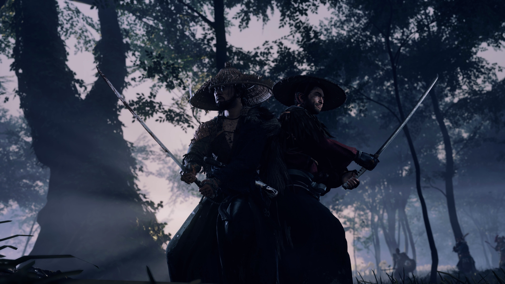

+++
title = "Les exclusivités PlayStation, des jeux PC comme les autres"
date = 2024-11-11T16:06:32+01:00
draft = false
author = "Mickael"
tags = ["XXL"]
type = "une"
image = "https://nostick.fr/articles/vignettes/novembre/playstation-jeux-pc.jpg"
+++

Il n'y a pas que la PlayStation dans la vie. Les budgets des jeux ne cessant de gonfler, tout comme les exigences des actionnaires, Sony a initié il y a quelques années une stratégie visant à porter ses grosses exclusivités sur PC, où les joueurs sont nombreux et avides de nouveautés. En 2020, *Horizon Zero Dawn* faisait donc ses premiers pas sous Windows, suivi par bon nombre d'autres (ex-) exclusivités PlayStation. Pour un succès qui ne coule pas toujours de source.

Les premières aventures d'Aloy ont ainsi recueilli 56 557 joueurs connectés simultanément sur Steam à la sortie de *Horizon* (chiffres [SteamDB](https://steamdb.info)). *Days Gone*, qui n'est pas la franchise PlayStation la plus connue, a suivi l'année suivante avec 27 450 joueurs simultanés. Fort heureusement *God of War* a relevé le niveau en janvier 2022 avec 73 529 joueurs en simultané, suivi par *Marvel's Spider-Man Remastered* en août de la même année (66 436 joueurs).

Parmi la vingtaine de portages PlayStation sur PC, relevons aussi *Miles Morales* avec 13 539 joueurs, *Last of US Part I* avec 36 469 joueurs, *Ratchet & Clank* avec 8 757 joueurs (la franchise est moins populaire)… Ces données sont représentatives de l'attrait des jeux PlayStation sur Steam ; certains d'entre eux sont aussi sortis sur l'Epic Games Store où aucune donnée n'est disponible (mais les ventes sur la boutique d'Epic demeurent modestes).

On en arrive à 2024 où Sony n'a pas chômé. Il y a d'abord eu le bang de *Helldivers II* en février, qui a tout explosé avec un record à 458 709 joueurs ! Le co-op en ligne développé par Arrowhead est l'exemple même du jeu service que Sony veut multiplier… et le seul à l'heure actuelle : faut-il remuer le couteau dans la plaie, [*Concord* s'est salement planté](https://nostick.fr/articles/2024/octobre/3110-concord-chronologie-desastre/).

Le Director's Cut de *Ghost of Tsushima*, en mai, a fait une excellente impression également, avec 77 154 joueurs en simultané. Puis *God of War Ragnarök* a quelque peu marqué le pas avec 35 615 joueurs, moitié moins que le premier opus. Ensuite, c'est la fête à la grimace entre *Until Dawn*, sorti début octobre et qui n'a regroupé que [2 607 joueurs simultanés](https://nostick.fr/articles/2024/octobre/0810-remake-until-dawn-peine-a-trouver-son-public/), puis [*Horizon Zero Dawn Remastered* qui fait encore moins avec 2 538 joueurs simultanés](https://nostick.fr/articles/2024/novembre/0411-remaster-horizon-zero-dawn-attire-pas-les-foules/).

Les circonstances sont différentes pour ces deux jeux. Le premier, un remaster que personne ne voulait vraiment, a été lancé pour faire monter la sauce autour du [film](https://en.wikipedia.org/wiki/Until_Dawn_(film)) qui doit sortir au printemps prochain. Les bugs et les crashs subis par les joueurs confirment que le projet a été monté et mené à la va-vite.

L'accroc d'*Until Dawn* est une chose. Celui d'*Horizon Zero Dawn* est beaucoup plus inquiétant. *Horizon* est une des franchises phare de PlayStation, que le constructeur cherche à étendre, comme le confirme le lancement le 14 novembre de *Lego Horizon Adventures* sur PS5 et PC, mais aussi sur Switch. Sony veut atteindre un maximum de monde et faire d'Aloy une mascotte, au même titre qu'*Astro Bot*.

Si Sony voulait faire du remaster une sorte de tremplin vers la future aventure Lego, c'est plutôt loupé. Cette nouvelle version  ne s'imposait pas réellement, sachant que le jeu original de 2017 est encore très beau, sans avoir besoin d'une config' de fou. Ironiquement, il y avait plus de joueurs en simultané sur le jeu original que sur le remaster peu après son lancement… Et ce, malgré l'option à 10 € permettant à ceux qui possédent le jeu d'origine de récupérer la version remastered.

 

L'épreuve de vérité sera la sortie du [portage de *Spider-Man 2*, prévu pour le 30 janvier 2025](https://nostick.fr/articles/2024/octobre/1810-marvel-spider-man-2-pc-janvier-2025-playstation/). La suite des aventures du tisseur (enfin, des deux tisseurs) sortira sur PC 15 mois seulement après l'exclu PS5 ; Sony n'avait jamais été aussi rapide pour lancer un de ses gros jeux sur PC. 

Que nous apprennent tous ces chiffres ? Qu'il n'y a pas vraiment de schéma, en fait. Les quatre premiers jeux ont certes cartonné, mais c'est un succès en trompe l'œil : trois des quatre titres sont tout simplement les plus grosses franchises PlayStation. L'attente était énorme de la part des joueurs PC, et puis Sony a bien fait les choses en soignant les portages.

Malgré les déceptions *Until Dawn* et *Horizon Remastered*, rien ne dit que le prochain portage PC d'un jeu PlayStation sera un flop. On peut même penser qu'au vu du pedigree de *Spider-Man 2*, le pic de joueurs connectés en simultané sur Steam sera bien plus imposant.

Une des raisons qui explique le coup de mou relatif des derniers portages est probablement l'obligation de se connecter à un compte PSN. Ce n'est pas la mort, mais c'est une friction supplémentaire entre le joueur et son jeu (et ça revient souvent dans les évaluations négatives de Steam).

Le constructeur avait tenté d'imposer la connexion PSN peu de temps après la sortie de *Helldivers II*, [puis a reculé devant la bronca](https://nostick.fr/articles/2024/mai/0505-sony-fait-plonger-helldivers-2-en-enfer/). Mais le compte est devenu définitivement obligatoire sur les jeux suivants.

Hiroki Totoki, le président de Sony Interactive Entertainment (SIE), a [assuré](https://www.irwebmeeting.com/sony/fast/20241108/f5KHiS63/202503_2q_02_en/index.html) devant les investisseurs que la connexion avec le PSN était nécessaire pour s'assurer que chaque joueur puisse apprécier les jeux en toute sécurité. Un argument qui tombe complètement à plat, sachant que ça n'était pas obligatoire jusqu'à *Ragnarök*. 

« *Nous avons beaucoup appris (…) La manière d'aborder les problèmes liés au PC, par exemple les comptes PlayStation que nous avons proposés, cela tend parfois à susciter des réactions* », euphémise-t-il. « *Pour les jeux services, afin de d'assurer un bon déroulement du jeu et pour que chacun puisse en profiter en toute sécurité, nous devons créer un environnement favorable à cela, et bien sûr permettant de jouer librement* ». Pour les jeux en ligne, l’explication tient encore la route, mais pour les jeux en solo le dirigeant ne donne aucun raison qui tienne la route.

La vraie raison, c’est que Sony tente de connecter les deux bouts de son écosystème (PS5 et PC) pour en faire un tout cohérent facile à intégrer dans des résultats financiers. Mais la plateforme PlayStation Network limite aussi le nombre de joueurs potentiel : dans plus de cent pays, il est impossible de créer un compte PSN… Alors certes, il ne s'agit pas des territoires les plus populeux mais tout de même, c'est toujours des clients en moins.

## PlayStation sur les traces de Microsoft ?

Herman Hulst, le co-CEO de Sony Interactive Entertainment (SIE), avait [établi](https://x.com/tomwarren/status/1795966798942158935) en mai dernier la stratégie de l'entreprise pour les jeux PC. Les jeux services type *Concord* sortiront simultanément sur PC et PS5. Les jeux *first party*, ces grandes aventures solo qui font la réputation de la plateforme, sortiront sur PC après la PS5 « *pour pousser les joueurs PC à jouer aux suites sur une console PlayStation* », a-t-il ajouté.

Est-ce que cette stratégie est réaliste ? Difficile à dire, puisque les suites finissent elles aussi par sortir sur PC (*God of War Ragnarok*, *Spider-Man 2*) ! Avec tout ça, les joueurs PlayStation peuvent se demander si Sony n'aurait pas dans l'idée de s'inspirer de ce que tente très maladroitement de faire Microsoft : [devenir un éditeur multiplateforme](https://nostick.fr/articles/2024/octobre/3110-xbox-vend-plus-jeux-moins-conosles/) jetant l'exclusivité par dessus bord pour vendre davantage de copies.

On n'en est pas encore là. PlayStation mène la course en tête sur le marché des consoles de salon, et de loin. [Il se vend toujours pas mal de PlayStation 5](https://nostick.fr/articles/2024/novembre/0811-astro-bot-petit-robot-grandes-retombees-sony/), et il reste encore bon nombre de possesseurs de PS4 à convaincre (mais il faut sortir des jeux !). Qu'on se rassure, Hideaki Nishino, l'autre co-CEO de SIE, l'a encore affirmé en septembre dernier : [les consoles PlayStation restent au cœur du business](https://nostick.fr/articles/2024/septembre/1809-sony-coeur-playstation/). Jusqu'à quand ?
