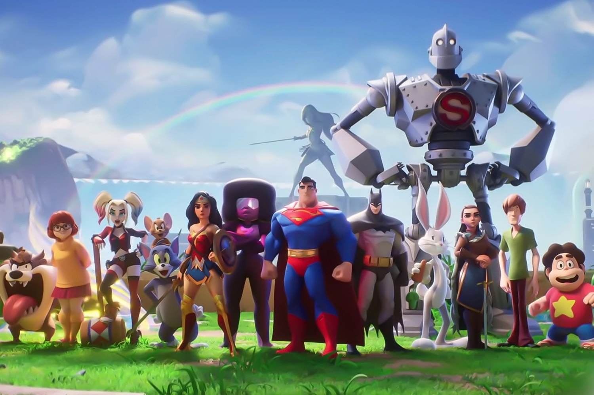

+++
title = "MultiVersus à deux doigts se ramasser la tronche"
date = 2024-11-11T07:30:32+01:00
draft = false
author = "Mickael"
tags = ["Actu"]
image = "https://nostick.fr/articles/vignettes/novembre/novembre/multiversus.jpg"
+++

 

Ça ne sent pas la rose du côté de *MultiVersus*. Le clone de *Smash* dans lequel les héros de DC se mettent sur la tronche ne rencontre pas le succès escompté par [ces andouilles de Warner Bros.](https://nostick.fr/articles/2024/mars/warnerbros/) Durant les derniers résultats trimestriels du groupe, le CEO David Zaslav et son directeur financier Gunnar Wiedenfels ont [reconnu](https://www.ign.com/articles/warner-bros-admits-multiversus-underperformed-contributing-to-another-100-million-hit-to-revenue-in-its-games-business) que le jeu avait plus que contribué aux 100 millions de dollars de dépréciation  enregistrée par l’entreprise durant ce trimestre. Et c’est *MultiVersus* qui est le principal responsable…

En tout, WB a dû inscrire une perte de valeur à hauteur de 300 millions de dollars cette année, car il est aussi responsable du flop *Suicide Squad*. Ces dépréciations qui réduisent la valeur comptable de l’ « actif » jeu vidéo sont généralement liées à des ventes décevantes et de mauvaises performances. « *L’activité [jeux] est actuellement en deçà de son potentiel* », a expliqué Zaslav pour apaiser le courroux des actionnaires.

*MultiVersus* a connu une gestation étrange. Le free-to-play multiplateformes a été proposé sous la forme d’un bêta test entre 2022 et 2023, où il a enregistré un pic de plus de 150 000 joueurs en simultané sur Steam. WB a ensuite pris la décision incroyablement stupide de fermer purement et simplement le jeu, puis de le ressortir en mai dernier, le temps de laisser complètement retomber la hype. Le pic sur Steam pour cette nouvelle version a péniblement atteint les 1 700 joueurs…

Il n’y a plus guère d’espoir pour *MultiVersus*, dont le studio Player First Games a été racheté cet été par les visionnaires de chez WB. Et pour lequel on craint désormais le pire. Il n’est pas certain que le mode « Fighter Road », qui permet de décrocher les principaux héros un par un gratuitement, suffira à rameuter les joueurs.

Devant ces fours à répétition qui commencent à coûter cher, Warner Bros. a décidé de réduire la voilure et de concentrer ses efforts de développement sur quatre franchises : DC (en particulier Batman), *Hogwarts Legacy*, *Mortal Kombat* et *Game of Thrones*. «  *Nous avons traversé certaines des pires périodes — et cela n'a pas été facile pour le secteur des jeux vidéo — mais nous avons quatre jeux [franchises ?] vraiment puissants* », a affirmé le CEO.

WB en a fini de vouloir lancer « *10, 12, 15, 20 jeux différents* », ce qui sera probablement un soulagement pour beaucoup. Si maintenant on pouvait éviter les décisions imbéciles comme de coller Rocksteady sur un jeu service multijoueur, un grand pas aura été accompli.