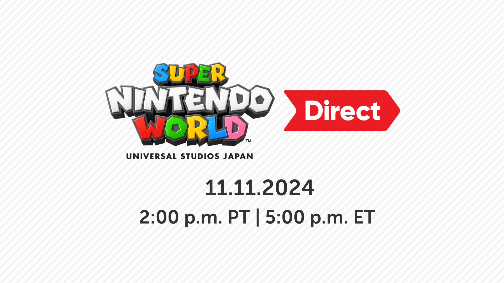

+++
title = "Un nouveau Nintendo Direct ! Mais toujours pas pour la Switch 2"
date = 2024-11-11T00:01:32+01:00
draft = false
author = "Mickael"
tags = ["Actu"]
image = "https://nostick.fr/articles/2024/novembre/1111-nouveau-nintendo-direct-pas-switch-2/nintendo-direct.jpg"
+++

 

Après l’Alarmo, après l’app Music, après le remaster de *Xenoblade Chronicles X* ([et pas mal d’autres trucs](https://nostick.fr/articles/2024/novembre/0211-backlog-concord-sims-4-nintendo-ubisoft/#la-grosse-info-de-la-semaine--le-vrai-faux-direct-de-nintendo)), Nintendo avait encore une dernière surprise dans son grand sac de l’Avent : un [Direct](https://x.com/NintendoAmerica/status/1855732265096978871) ! Il aura lieu ce 12 novembre, à 23h heure de Paris (si je ne me suis pas encore planté dans mes comptes horaires).

Mais hélas, ne croyez pas qu’il s’agira de la présentation tant attendue de vous-savez-quoi. Nintendo veut dévoiler au monde l’espace Donkey Kong Country du Super Nintendo World, sis au parc Universal Studios, au Japon. Le tout durera 10 minutes. Bon, c’est sûr qu’on aurait préféré le dévoilement de la Switch 2, dont [l’annonce est toujours programmée avant la fin mars 2025](https://nostick.fr/articles/2024/novembre/0511-switch-2-toujours-annoncee-5-mois/).

Le Direct ne donnera aucune information sur les jeux, comme l’avait été la vidéo de cet été dédiée à la présentation du musée Nintendo. Mais on prendra ce qu’il y aura et puis ce sera bien pratique pour préparer la prochaine visite au Japon !