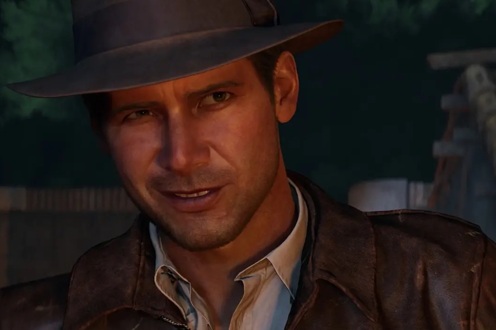

+++
title = "Indy joue du fouet et de sa jugeote  dans une longue vidéo de gameplay pour le Cercle Ancien"
date = 2024-11-12T08:01:32+01:00
draft = false
author = "Mickael"
tags = ["Trailer"]
image = "https://nostick.fr/articles/2024/novembre/1211-indy-fouet-jugeote-video-gameplay/indy.jpg"
+++

 

Taper sur des nazis, c’est la joie : cette simple évidence est toujours bonne à rappeler, surtout en cette période où la confusion règne chez les esprits les plus faibles et chez les abrutis. C’est pourquoi on célèbrera comme il se doit l’arrivée d’*Indiana Jones et le  Cercle Ancien* le 9 décembre prochain sur PC et Xbox Series S/X (ce sera le printemps prochain sur PS5). 

Le jeu se déroule en 1937, entre les deux premiers épisodes de la saga de Steven Spielberg. Le professeur Jones part récupérer un artefact volé qui l’emmènera tout autour du monde. Le titre est développé par MachineGames, à qui l’on doit quelques excellents épisodes de *Wolfenstein*, autant dire qu’ils s’y connaissent en nazis. Et le titre s’annonce plutôt bien à en croire cette vidéo de gameplay d’une quinzaine de minutes.

 

La vidéo a un petit peu de tout pour tout le monde : de la baston, des traversées, de la résolution d’énigmes, de l’infiltration aussi. Indy pourra ainsi planquer des corps hors de la vision de gardes afin de ne pas éveiller les soupçons. On y verra également le système de points qui permet à notre héros de gagner des capacités. On a bien hâte de jouer du fouet.