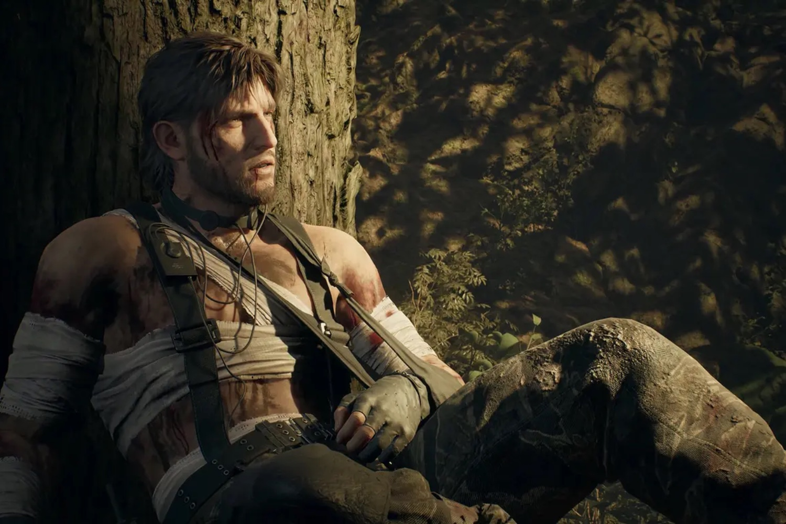

+++
title = "Konami a peur que les jeunes générations oublient Metal Gear Solid"
date = 2024-11-12T08:00:32+01:00
draft = false
author = "Mickael"
tags = ["Actu"]
image = "https://nostick.fr/articles/2024/novembre/naked-snake.jpg"
+++

 

Ami jeune, as-tu déjà entendu parler de cette chose étrange qu’est *Metal Gear Solid* ? Cette question, on se l’est posée du côté de chez Konami et la réponse a dû l’effrayer : les jeunes générations n’ont aucune idée de ce que sont cet univers, cette saga et son héros. « *C’était basiquement notre mission, notre devoir, de nous assurer que la série continue à vivre auprès des plus jeunes* », a [expliqué](https://www.gamesradar.com/games/metal-gear/metal-gear-solid-delta-exists-because-konami-was-starting-to-get-worried-that-the-younger-generation-of-gamers-arent-familiar-with-the-metal-gear-series-anymore/) le producteur Noriaki Okamura au magazine *Play*.

Et c’est ce qui explique aussi pourquoi l’éditeur a lancé le chantier de *Metal Gear Solid Delta: Snake Eater*, le remake du 3e épisode de 2004. Il respectera à la lettre les tribulations de Naked Snake à l’époque, mais avec un luxe de détails grâce à l’Unreal Engine 5.

Il y a une certaine logique à commencer par cet opus qui fait office de préquelle à la saga de Hideo Kojima. Le jeu se déroule en 1961, avant les événements de *Metal Gear*. Snake doit crapahuter dans la jungle communiste pour aller récupérer un savant russe, saboter une superarme expérimentale, et assassiner son ancien boss. 

Et puis bon ça tombe plutôt bien car de l’aveu même de Konami, faire un remake des deux premiers *Metal Gear Solid* [serait très compliqué](https://nostick.fr/articles/2024/octobre/0310-remake-difficile-premier-metal-gear-solid/) en raison  du matériel supplémentaire à concevoir. L’éditeur a aussi promis de ne pas faire n’importe quoi avec ce remake, on attendra de voir car [il a beaucoup à se faire pardonner](https://nostick.fr/articles/2024/septembre/1209-metal-gear-solid-volume-2-prendre-son-temps/). 

