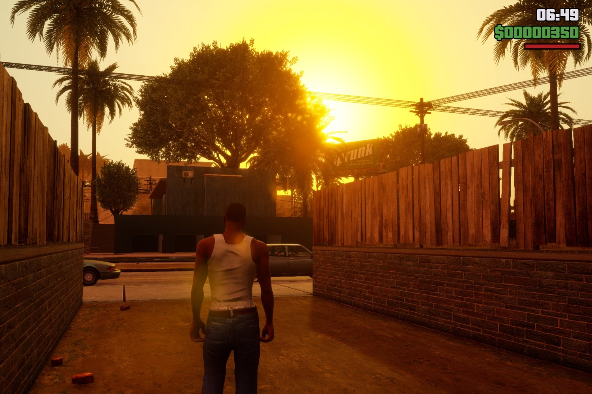

+++
title = "Rockstar donne enfin le lustre qui manquait à GTA Trilogy Definitive Edition sur consoles et PC"
date = 2024-11-12T09:57:32+01:00
draft = false
author = "Mickael"
tags = ["Actu"]
image = "https://nostick.fr/articles/vignettes/novembre/GTA-edition-definitive.jpg"
+++

On n'attendait plus grand chose de l'édition définitive de la trilogie GTA, sortie sur PC et toutes les consoles en 2021. Rockstar et le studio Grove Street Games chargé des remasters ont bâclé le développement des trois jeux, avec des bugs en pagaille et des changements qui altèrent les versions originales de *Grand Theft Auto 3*, *Vice City* et *San Andreas*. 

L'éditeur a tenté de rectifier le tir avec des correctifs, sans trop convaincre. La dernière mise à jour remonte à il y a deux ans… et surprise, en voici une nouvelle qui rapproche finalement l'édition « définitive » des jeux d'origine !

Il se trouve en fait que les trois « nouveaux » jeux ont reçu les améliorations apportées à la version mobile de cette même édition. Disponibles depuis la fin de l'année dernière, d'abord au sein du catalogue de jeux Netflix, les jeux mobiles sont en effet beaucoup plus convaincants techniquement parlant. Les ombres, la lumière, les reflets… La réalisation est plus respectueuse des jeux d'origine.

Rockstar avait expliqué à l'époque que le nouveau mode « éclairage classique » restitue l'ambiance et l'apparence du ciel. Divine surprise : ces améliorations sont maintenant aussi disponibles dans les versions consoles et PC de la trilogie ! Et comme le souligne *[IGN](https://www.ign.com/articles/gta-trilogy-definitive-edition-gets-surprise-update-on-console-and-pc-adds-visual-features-that-were-exclusive-to-mobile-versions)*, c'est effectivement mieux :



Dans les coulisses, il semble que Rockstar a fait du ménage : Grove Street Games a tout simplement disparu du générique (les versions mobiles ont été développées par Video Games Deluxe).