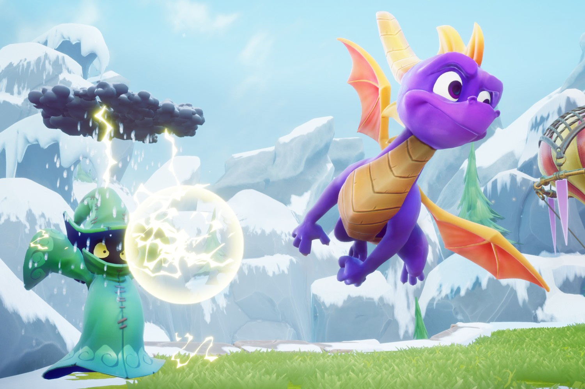

+++
title = "Spyro Reignited Trilogy déboule finalement sur le Game Pass"
date = 2024-11-12T07:30:32+01:00
draft = false
author = "Mickael"
tags = ["Actu"]
type = "telex"
+++

 

Microsoft n’a pas spécialement gâté les joueurs en (ne) les inondant (pas) de jeux Activision Blizzard sur le Game Pass. Alors OK, il y a eu des *Call of Duty* (dont *Black Ops 6*), *Diablo 4*, des *StarCraft*, mais un peu plus d’un an après le chèque à 69 milliards de dollars, certains trouvent le temps un peu long. Manifestement, Xbox a décidé de s’inspirer de la stratégie de Nintendo qui balance de nouveaux jeux rétro sur le Switch Online à un train de sénateur.

On ne va pas faire la fine bouche avec la dernière [livraison](https://news.xbox.com/en-us/2024/11/11/spyro-reignited-trilogy-xbox-game-pass/) : il s’agit en effet de *Spyro Reignited Trilogy*, qui sera disponible dans les prochaines heures sur tous les Game Pass – voire dès à présent. Il s’agit évidemment du remake des trois jeux *Spyro* de 1998, 1999 et 2000, une compile développée par Toys for Bob et lancée en 2018. Toys for Bob qui travaille en solo pour le compte de Microsoft, d’ailleurs.