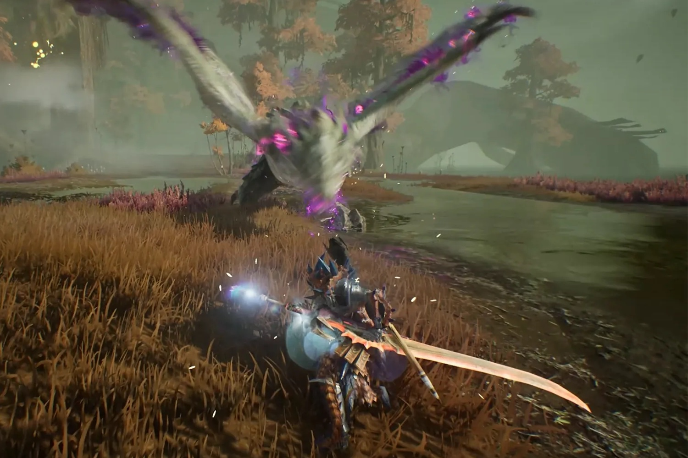
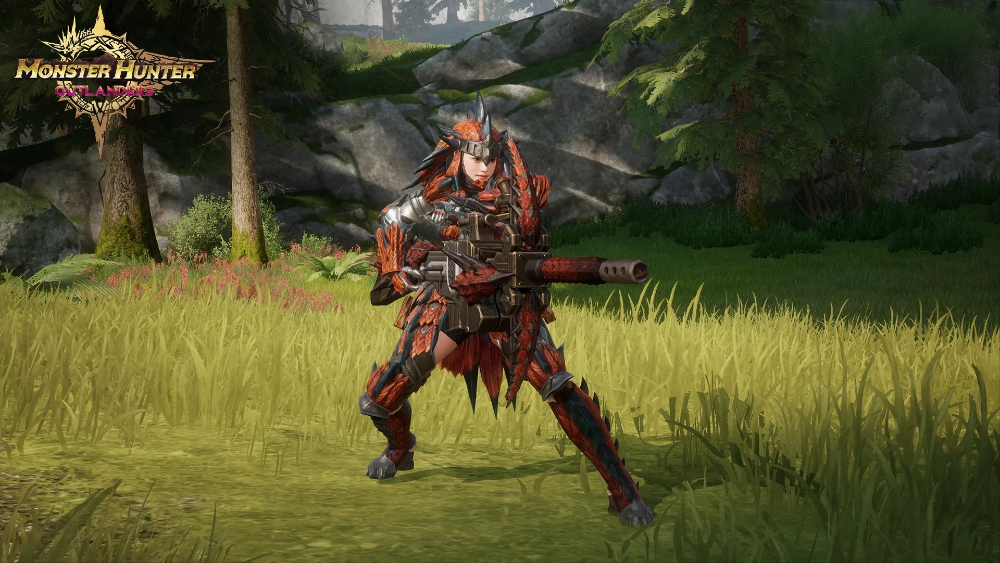

+++
title = "Avec Monster Hunter Outlanders, partons chasser de la créature sur smartphones"
date = 2024-11-13T08:30:32+01:00
draft = false
author = "Mickael"
tags = ["Actu"]
image = "https://nostick.fr/articles/vignettes/novembre/monster-hunter-outlanders.jpg"
+++

Les joueurs sur smartphones n'échapperont pas à la déferlante *Monster Hunter* ! Capcom a en effet annoncé un partenariat avec TiMi pour développer un jeu mobile basé sur la franchise. Et au vu du pedigree du studio, à qui l'on doit *Pokémon Unite* et *Call of Duty: Mobile*, il faut s'attendre à du lourd. Plus en tout cas que *Monster Hunter Now*, le simili-clone pas fou-fou de *Pokémon GO* développé avec Niantic (créateur du même *Pokémon Go*).

*[Monster Hunter Outlanders](https://monsterhunteroutlanders.com/en/index.html)*, tel est le nom de ce nouveau jeu, sera un survival en monde ouvert à pratiquer en solo ou en co-op (jusqu'à 4 joueurs). A priori, il sera question de chasser des créatures, d'explorer un monde sauvage et aussi de ramasser des ressources. Bref, *Monter Hunter* quoi, mais sur l'écran du smartphone et avec des micro-transactions à gogo, certainement.

 

Malheureusement, les deux larrons n'offrent aucune date de sortie si ce n'est que plusieurs tests et bêtas auront lieu avant la version finale. Autant dire qu'on jouera à *Monster Hunter Wilds* bien avant, celui-ci étant attendu le 28 février prochain.