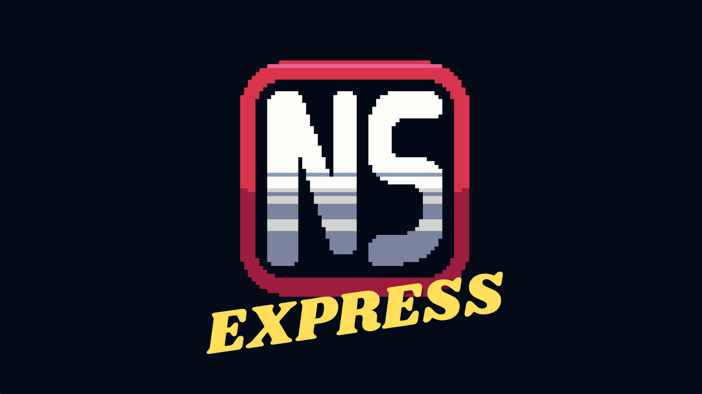

+++
title = "Abonnez-vous à notre nouvelle newsletter Nostick Express !"
date = 2024-11-13T11:47:32+01:00
draft = false
author = "Mickael"
tags = ["Actu"]
image = "https://nostick.fr/articles/2024/novembre/0711-nostick-express-rendezvous-du-jeudi/nstckexpress.png"
+++

 

L'actualité va trop vite, vous n'avez plus le temps de suivre ? Pas de panique. Notre nouvelle newsletter *Nostick Express* propose chaque jeudi matin de faire un point rapide sur l'actu du début de semaine. [Abonnez-vous](https://reloaded.nostick.fr/nostick-express-la-switch-2-sera-retrocompatible-les-specs-de-la-ps5-pro/), c'est gratos !

Bien sûr, vous connaissez *[Nostick Reloaded](https://reloaded.nostick.fr)*, notre newsletter du dimanche gratuite et pas chiante qui revient sur les actus et les sorties de la semaine. Mais avez-vous entendu parler de *Nostick Express* ? C'est notre nouvelle infolettre publiée chaque jeudi matin. Tout aussi gratuite et tout aussi pas chiante, elle propose un premier point rapide sur l'actualité depuis lundi.

Vous allez me dire, il suffit de lire *Nostick.fr* pour être au courant. Oui mais tout le monde ne passe pas forcément par le site, et puis *Express* nous permet aussi de revenir sur des actus qui nous aurait échappées. Comme ça, tout le monde est content !

- Si vous n'êtes pas encore abonné à *Nostick Express*, qu'attendez-vous ? [C'est par ici](https://reloaded.nostick.fr/nostick-express-la-switch-2-sera-retrocompatible-les-specs-de-la-ps5-pro/).
- Si vous êtes abonné à *Nostick Reloaded* mais pas encore à *Express*, rendez-vous sur [le site de la newsletter](https://reloaded.nostick.fr), touchez le bouton « Mon compte » en haut à droite, puis sur l'option « Gérer » des emails.

 
