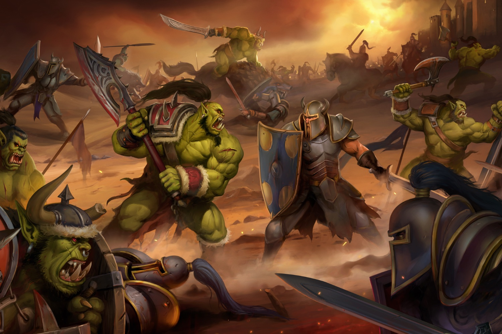

+++
title = "Des remasters pour Warcraft I et II, et une grosse mise à jour pour Warcraft III"
date = 2024-11-13T12:27:32+01:00
draft = false
author = "Mickael"
tags = ["Actu"]
image = "https://nostick.fr/articles/vignettes/novembre/warcraft.jpg"
+++

Les joueurs qui ont usé leur fond de culotte sur *Warcraft* vont pouvoir ressortir leurs frusques d'il y a 30 ans. Blizzard a en effet annoncé des versions remastérisées des deux premiers volets de la saga mythique, ainsi qu'une grosse mise à jour pour *Warcraft III Reforged*.

 

*Warcraft* I et II bénéficient d'un ripolinage graphique de bon aloi, sans pour autant complètement dénaturer les STR originaux. Une option permet de toute façon de revenir aux graphismes de l'époque. L'interface a été améliorée, tout comme l'expérience globale avec des fonctions « quality of life ». *Warcraft II* conserve son mode multi avec toutes les maps originales.

*Warcraft III Reforged*, moins apprécié des fans, propose de son côté un correctif 2.0 avec des améliorations pour faciliter la vie des joueurs et une mise à jour graphique avec trois modes d'affichage et la possibilité de mélanger des bouts provenant de ces trois modes. Le tout est proposé dans un [bundle](https://us.shop.battle.net/fr-fr/product/warcraft-remastered-battle-chest) vendu une quarantaine d'euros avec des bonus ; chaque jeu est aussi vendu à la pièce. Dispo sur PC et sur Mac (mais uniquement le 3e volet pour les Mac).
