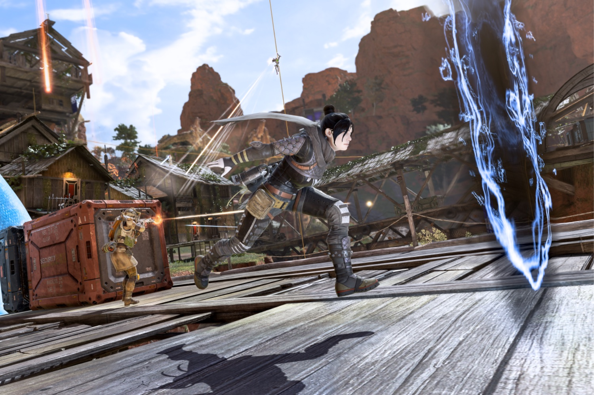

+++
title = "Retour aux origines pour Fortnite, Apex Legends et Overwatch 2"
date = 2024-11-13T08:07:32+01:00
draft = false
author = "Mickael"
tags = ["Actu"]
image = "https://nostick.fr/articles/vignettes/novembre/apex-legends2.jpg"
+++

Alors que le monde devient de plus en plus cinglé et que l'avenir de la planète a de quoi faire flipper avec les dinguos au pouvoir, c'est assez normal de vouloir retrouver le bon goût sucré des choses du passé, quand la vie semblait plus simple (même si bon, ça n'était pas forcément le cas). Le business de la nostalgie marche très fort, il n'y a qu'à voir la folie autour des consoles rétro, sans oublier les remakes/remasters/reboots de franchises oubliées.

 

Et ça marche aussi chez les jeux services ! Coup sur coup (sur coup), les trois plus gros représentants du genre ont annoncé le retour de maps et de mécanismes d'origine. *Apex Legends* [propose](https://www.ea.com/games/apex-legends/news/from-the-rift-season-updates?isLocalized=true) ainsi jusqu'au 19 novembre de revivre le jeu tel qu'il était à ses débuts, avec les armes old school, les héros, les capacités, les règles et la map de 2019. L'événement Launch Royale permettra de débloquer des Legends et des récompenses spécifiques.

 

*Overwatch 2* [reprend](https://overwatch.blizzard.com/en-us/news/24146047/) de son côté la formule de son prédécesseur — que beaucoup aurait préféré conserver à la place de sa suite — via des événements Classic qui comprendront les 21 héros des anciens temps (mai 2016 ! La préhistoire quoi), 12 maps originales et des capacités oubliées. Le tout avec le gameplay 6v6 sans limite de la première version. Qui sait, peut-être que ça donnera à Blizzard l'envie de garder tous ces vieux machins dans  *Overwatch 2*, au-delà de la date limite du 2 décembre.

Mais rendons à César ce qui lui appartient : c'est *Fortnite* qui a lancé la mode il y a un an, avec son événement « OG » qui avait tout cartonné, rameutant des millions de joueurs nouveaux comme les anciens qui s'étaient éloignés du jeu. Le battle royale d'Epic va non seulement [proposer](https://x.com/FortniteGame/status/1856351379838701691) de nouveau ce mode à partir du 6 décembre, mais il sera en plus permanent. Les joueurs retrouveront donc la carte originale, tout comme les équipements et les saisons de la belle époque.