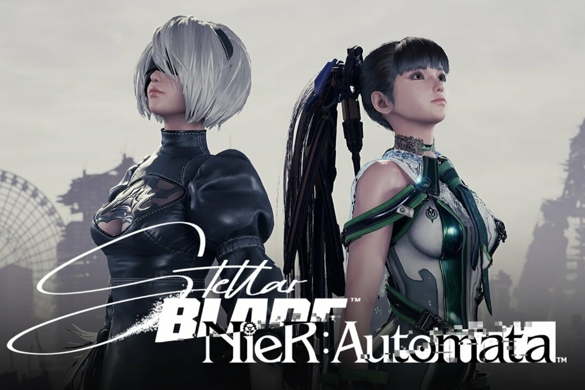

+++
title = "Stellar Blade sortira sur PC en 2025"
date = 2024-11-13T08:47:32+01:00
draft = false
author = "Mickael"
tags = ["Actu"]
image = "https://nostick.fr/articles/vignettes/novembre/stellar-blade.jpg"
+++

Ça ne faisait plus trop de doute désormais, mais voilà la bonne nouvelle confirmée pour les fans d'Eve, sculpturale héroïne de *Stellar Blade*. Le jeu d'action/aventure du studio coréen Shift  Up, une exclusivité PS5 jusqu'à présent, sortira bel et bien sur PC en 2025.

Le portage a été [confirmé](https://www.inven.co.kr/webzine/news/?news=300823) durant la présentation des résultats trimestriels de l'entreprise. Shift Up veut tirer profit de l'appétit des joueurs PC pour les expériences Solo à la *Black Myth: Wukong*. « *Nous nous attendons à avoir plus encore plus de succès sur PC que sur consoles* », d'après une traduction approximative.

 

En attendant d'en savoir plus, *Stellar Blade* va accueillir l'univers (et l'héroïne) de *NieR Automata* dans un DLC qui sera livré le 20 novembre, uniquement sur PS5 donc. Attention, il faudra avoir progressé dans *Stellar Blade* avant d'accéder aux nouveautés de l'extension. Pour le studio, il est essentiel de continuer à alimenter le jeu de contenus nouveaux histoire de maintenir les ventes à un bon niveau. Et on imagine qu'un lancement sur PC ne fera que du bien à la licence.