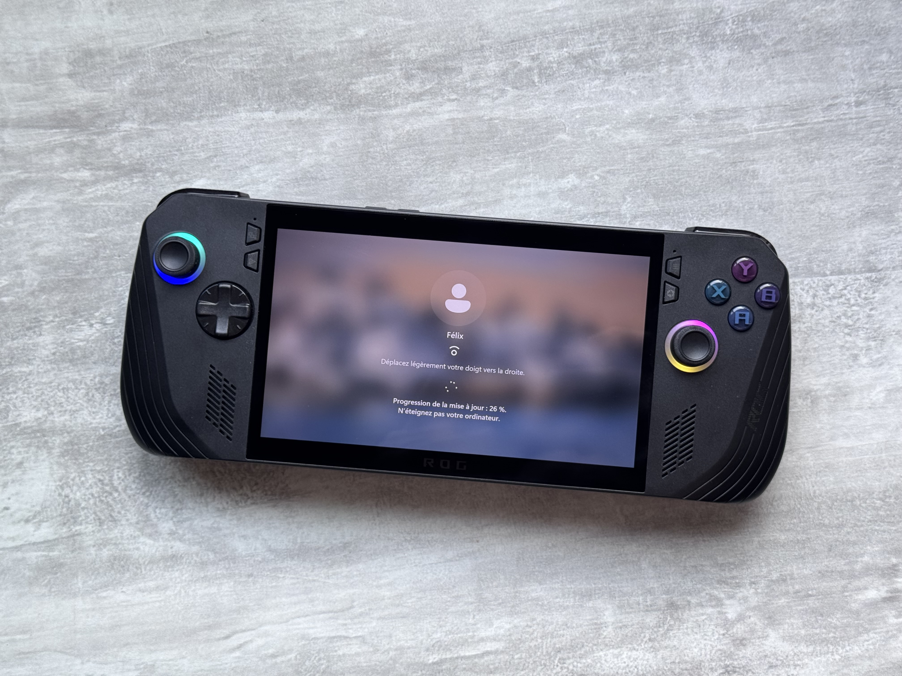
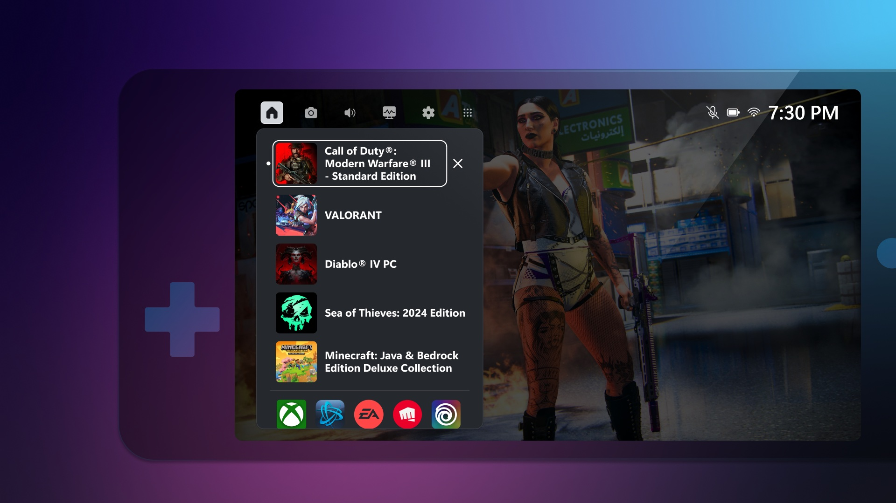

+++
title = "La Xbox portable n'arrivera pas avant plusieurs années"
date = 2024-11-13T10:07:32+01:00
draft = false
author = "Mickael"
tags = ["Actu"]
image = "https://nostick.fr/articles/vignettes/novembre/rogallyx.jpeg"
+++

 

Il n'y aura pas de Xbox portable sous les sapins à Noël, et probablement pas non plus à Noël 2025 ! Non pas parce que la planète aura explosé d'ici là (enfin, qui sait avec le merdier actuel), mais parce qu'un tel appareil ne verra le jour que dans quelques années, a expliqué Phil Spencer, le grand patron de Xbox.

« *Tout le monde s'attend à ce que nous fassions quelque chose* », convient-il à *[Bloomberg](https://www.bloomberg.com/news/articles/2024-11-13/microsoft-s-gaming-chief-is-still-looking-for-acquisitions-sees-future-growth)*. Microsoft travaille sur des prototypes tout en réfléchissant aux possibilités ouvertes par ce marché bouillonnant. « *À plus long terme, j’aimerais que nous fabriquions des appareils* », indique-t-il. « *Je pense que notre équipe pourrait apporter une réelle innovation, mais nous voulons être guidés par ce que nous apprenons et par les évolutions actuelles* ».

Dans l'immédiat, il s'agit d'améliorer l'app Xbox pour qu'elle fonctionne mieux sur les consoles PC portables actuelles. Il est grand temps en effet de faire quelque chose qui tienne la route pour les petits écrans. L'éditeur planche avec les développeurs et studios tiers afin de garantir la compatibilité de leurs jeux avec la plateforme Xbox.

 

Statu quo donc pour ce qui concerne la Xbox portable. Mais Microsoft a d'autres chats à fouetter, par exemple sur les plateformes mobiles. Le lancement de la boutique en ligne prévu en juillet est tombé à l'eau, l'éditeur ayant besoin de temps pour se mettre au carré avec les développeurs — y compris ceux de *Candy Crush* et *Call of Duty Mobile*, deux jeux récupérés via l'acquisition d'Activision.

La situation juridique et réglementaire autour de l'App Store et du Play Store étant très mouvante, il est encore difficile de trouver un équilibre. Microsoft pourrait proposer une boutique accessible directement sur le web, mais ça ne suffira pas. « *Un magasin en ligne permettrait à quelqu'un de ne pas avoir à passer par l'App Store pour essayer d'installer quelque chose, mais il faut tout de même un moyen de trouver ce magasin* », détaille Spencer. « *Le principe du "si on le construit, ils viendront" ne fonctionnera pas* ». 

La patience est donc une vertu, même si le dirigeant voit les choses avancer dans le bon sens avec plus de choix pour les utilisateurs et pour les créateurs. Enfin, concernant les exclusivités Xbox qui deviennent multiplat', Spencer ne s'interdit rien : « *Je ne vois pas vraiment de ligne rouge dans notre catalogue* », même s'il est encore trop tôt pour prendre une décision sur le prochain *Halo*.

