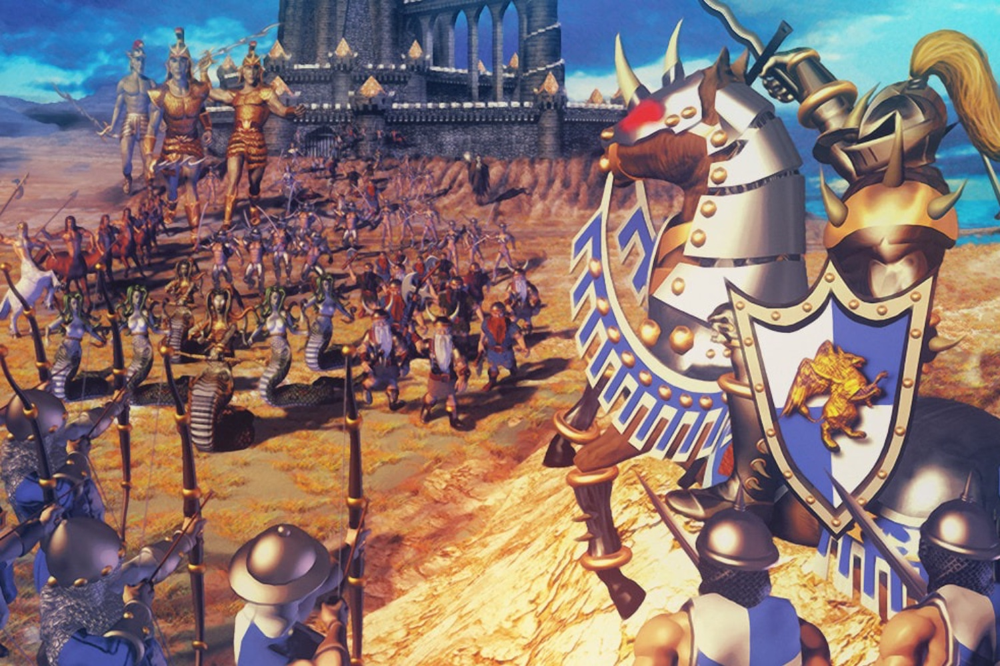

+++
title = "GOG sauve vos vieux jeux de l'oubli"
date = 2024-11-14T07:07:32+01:00
draft = false
author = "Mickael"
tags = ["Actu"]
image = "https://nostick.fr/articles/vignettes/novembre/heroes.jpg"
+++

 

Les bonnes nouvelles se faisant plutôt rares en ce moment, saluons l'excellente initiative de GOG (Good Old Game) qui a lancé un « [programme de préservation](https://www.gog.com/en/gog-preservation-program) » des jeux. Il s'agit de maintenir la compatibilité des jeux PC pour qu'ils puissent continuer de fonctionner sur les plateformes modernes et celles à venir.

Le programme compte déjà une centaine de jeux classiques mis à jour, améliorés et testés pour rouler sur nos PC, parmi lesquels *Heroes of Might and Magic 3*, le bundle *Resident Evil* et *Diablo+Hellfire*. Et bien sûr, sans DRM. GOG investit ses deniers et ses ressources pour assurer le support continu de ces jeux.

 

La dernière mise à jour pour *Heroes of Might and Magic 3* contint par exemple des correctifs pour la localisation en français, ainsi que la compatibilité vérifiée avec Windows 10 et 11. Celle pour *Resident Evil* inclue les localisations des trois jeux, dont le français, un rendu DirectX, des options d'affichage supplémentaires et tout un tas de trucs en plus. Et *Diablo* a récemment bénéficié d'une meilleure stabilité.

« *En préservant ces titres emblématiques, GOG vous aide à protéger et revivre les souvenirs qui vous ont marqué, sans DRM et avec un support technique dédié* », explique l'entreprise. La plupart des jeux du catalogue préservé sont d'ailleurs en promo en ce moment, si votre backlog a un peu de place…

GOG se désole de voir que 87 % des jeux créés avant 2010 ne sont plus accessibles nul part. Un drame pour l'industrie qui perd la mémoire, et pour les joueurs qui se voient privés de véritables trésors vidéo-ludiques. [Une pétition est toujours en cours au niveau européen](https://nostick.fr/articles/2024/aout/0208-stop-killing-games-petition-europe-tuer-jeux/) pour exiger des éditeurs la mise en place d'un système permettant de continuer de jouer à leurs jeux, même après la fin du support officiel. Par ici les [signatures](https://citizens-initiative.europa.eu/initiatives/details/2024/000007_fr) !