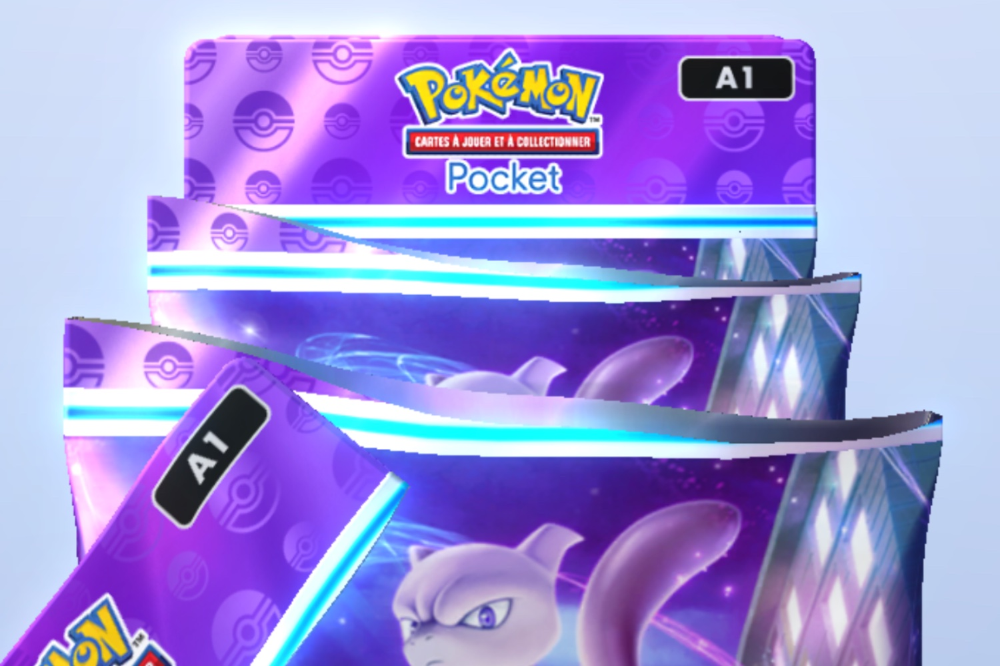
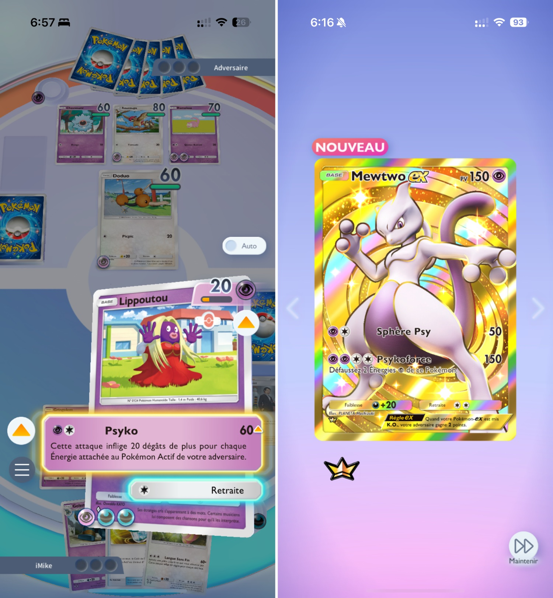

+++
title = "Pokémon JCC Pocket : les échanges possibles en janvier"
date = 2024-11-14T07:37:32+01:00
draft = false
author = "Mickael"
tags = ["Actu"]
image = "https://nostick.fr/articles/vignettes/novembre/pokemon-pocket-2.jpg"
+++

On peut s'en réjouir ou le déplorer, mais le carton intergalactique de cette fin d'année n'est autre que *Pokémon JCC Pocket* ! Le jeu pour smartphones a [dépassé](https://nostick.fr/articles/2024/novembre/0911-backlog-pokemon-pocket-beyond-astra-ps5-pro-switch-2/#le-chiffre-de-la-semaine--30-millions) le cap des 30 millions de téléchargements en deux semaines, il engrange quelque chose comme [3 millions de dollars](https://mobilegamer.biz/pokemon-tcg-pocket-is-earning-over-3m-per-day-with-over-12m-banked-to-date/) par jour (!), et il n'est absolument pas question de relâcher la pression du côté de la Pokémon Company.

L'équipe en charge du développement du jeu a [posté](https://x.com/PokemonTCGP/status/1856819952713453683) une feuille de route dans laquelle on apprend que de nouveaux boosters feront leur apparition avant la fin de l'année. Il est temps : beaucoup de joueurs ont fait le tour des cartes de la série « Puissance génétique » (et je ne parle pas uniquement de moi). 

Surtout, la fonction d'échange de cartes va commencer à apparaitre à partir de janvier prochain, mais seule une sélection de cartes pourra passer d'un joueur à un autre. Le jeu étendra progressivement cette sélection, sous une forme qu'on ignore encore. L'échange sera-t-il « gratuit » ou s'adossera-t-il à une des nombreuses monnaies du jeu ? Il y en a déjà plus d'une dizaine, alors pourquoi ne pas en ajouter une supplémentaire…

En dehors de cette fonction d'échange attendue de pied ferme, Pokémon Pocket va proposer sous peu de nouvelles fonctions encore inédites. Tout cela est très excitant, surtout pour les accros et oui, là aussi je parle pour moi (mon code ami : 0731305501319478).

Voilà qui laisse un peu de temps pour compléter sa collection de cartes. La Pokémon Company n'a d'ailleurs pas voulu confirmer ni infirmer la légende urbaine selon laquelle les boosters avec des coins pliés contenaient des cartes plus intéressantes que d'autres. « *Bien que Pokémon Pocket s'inspire de l'expérience d'ouverture des packs de cartes physiques du JCC Pokémon, nous ne pouvons pas partager de détails pour le moment* », a indiqué l'entreprise à *[Polygon](https://www.polygon.com/pokemon/477709/tcg-pocket-devs-pack-choice)*. Moi je dis, ça marche mais vous croyez ce que vous voulez.