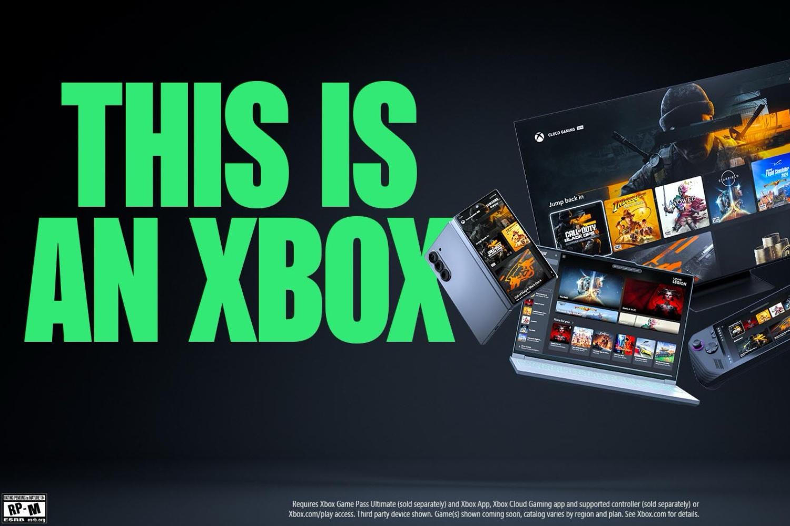
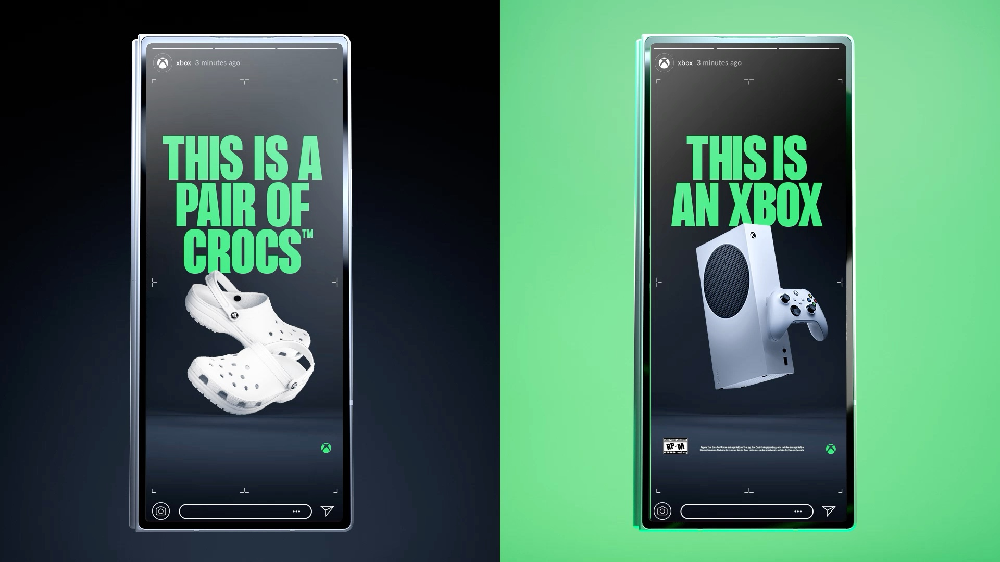

+++
title = "Allons bon, tout est une Xbox maintenant"
date = 2024-11-14T10:47:32+01:00
draft = false
author = "Mickael"
tags = ["Actu"]
image = "https://nostick.fr/articles/2024/novembre/1411-tout-est-une-xbox-maintenant/xbox-pub.jpg"
+++

La Xbox, ce n'est pas une console. Enfin si, mais pas seulement. En fait, tout ce qui a un écran *est* une Xbox, [assène](https://news.xbox.com/en-us/2024/11/14/this-is-an-xbox/) Microsoft dans une nouvelle (et visiblement massive) campagne de pub. Le constructeur met sur le même plan la console avec un smartphone, un ordinateur portable, une télé connectée, une console PC portable, avec un message simple : « *This is an Xbox* ».

 

Microsoft est même allé jusqu'à signer des partenariats avec des marques comme Samsung ou Crocs dans des campagnes communes plutôt amusantes. Il y a même une nouvelle [collection](https://gear.xbox.com/pages/xbox) de t-shirts et d'étuis pour smartphones… ainsi qu'un [quizz](https://www.xbox.com/en-US/what-is-xbox) pour savoir comment distinguer une Xbox.

Ces dernières années, Microsoft a multiplié les applications permettant d'accéder au Xbox Cloud Gaming sur à peu près tous les appareils imaginables. Le service de jeux en streaming se décline dans une version web pour les navigateurs, et des applications pour les télés Samsung, les clés Fire TV, et même le casque Quest de Meta.

Les consoles Xbox ne vont pas disparaitre (d'ailleurs, la campagne de pub n'oublie pas les Series S/X), mais comme on l'a vu avec Amazon et l'app Game Pass sur les sticks Fire, le cloud gaming [ça fonctionne rudement bien](https://nostick.fr/articles/2024/juillet/2907-xbox-cloud-gaming-fire-tv-stick-test/) — pour peu qu'on ait une bonne connexion Wi-Fi, évidemment. Il ne reste plus qu'à étendre la compatibilité du streaming avec les jeux de sa bibliothèque Xbox, [Microsoft y travaille](https://nostick.fr/articles/2024/octobre/1110-abonnes-xbox-cloud-gaming-stream-jeux/). Et aussi, pourquoi pas, lancer un nouveau palier du Game Pass entièrement dévolu au streaming, moins cher que l'Ultimate.