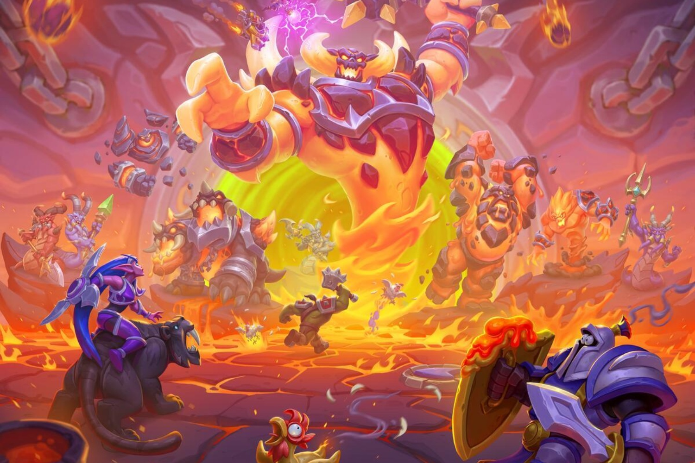

+++
title = "Warcraft Rumble va passer des mobiles au PC"
date = 2024-11-14T08:47:32+01:00
draft = false
author = "Mickael"
tags = ["Actu"]
image = "https://nostick.fr/articles/vignettes/novembre/warcraft-rumble.jpg"
+++

L'an dernier, le lancement de *Warcraft Rumble* avait été mi-figue mi raisin. Certes, c'était le premier strat' temps réel de Blizzard depuis des plombes, mais au désespoir de nombreux joueurs, c'est aussi un [jeu mobile](https://warcraftrumble.blizzard.com/fr-fr/). L'éditeur corrige le tir à l'occasion du 30e anniversaire de *Warcraft* : *Rumble* va également sortir sur PC, avec une première bêta programmée pour le 10 décembre !

 

De ce qu'on peut en voir, la version PC sera un décalque de son modèle, c'est à dire que l'espace de jeu est vertical (il se joue au format portrait sur smartphone). Cela signifie que sur l'écran du PC, il y a de larges bandes sur les côtés. Mais bon, c'est toujours mieux que de pas pouvoir y jouer. Et puis ce sera gratuit.

On peut ne pas spécialement apprécier les jeux mobiles, néanmoins *Rumble* n'avait pas été si mal accueilli par la critique (bon OK, 70 sur [MetaCritic](https://www.metacritic.com/game/warcraft-rumble/)). Ce n'est pas la première fois que Blizzard transpose ses jeux mobiles sur les PC. *Diablo Immortal* a eu droit à ce traitement en 2022.