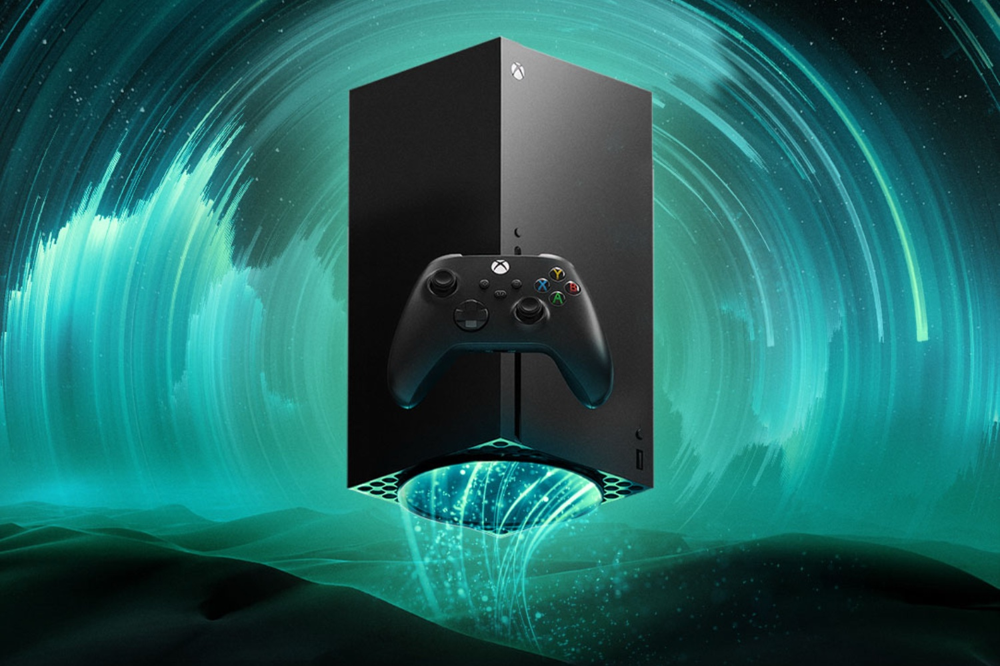

+++
title = "La Xbox Series X Pro n'arrivera sans doute jamais"
date = 2024-15-11T10:47:32+01:00
draft = false
author = "Mickael"
tags = ["Actu"]
image = "https://nostick.fr/articles/vignettes/novembre/xbox-series-x.jpg"
+++

Il n'y aura probablement pas de Xbox Series X Pro. Phil Spencer, le grand manitou de Microsoft Gaming fait la tournée des popotes ces derniers jours auprès de la presse US en distillant les petites confidences sur la feuille de route de Xbox. Et si [une console portable est dans les tuyaux,](https://nostick.fr/articles/2024/novembre/1311-xbox-portable-pas-avant-plusieurs-annes/), ce ne serait pas le cas d'une version « pro » pour les consoles de salon.

Dans son interview à *[Rolling Stones](https://www.rollingstone.com/culture/rs-gaming/xbox-console-future-cloud-ceo-phil-spencer-1235166597/)*, Phil Spencer n'a pas complètement écarté cette possibilité, mais à lire ses déclarations, ça semble mal parti. « *Nous n’avons pas besoin de lancer du nouveau matériel juste pour le principe* », affirme-t-il. « *Un nouvel appareil apporte-t-il vraiment une expérience unique à l’écran ? Ce n’est plus comme à l’époque où l’on est passé de la Xbox originale à la 360, avec le passage de la définition standard à la haute définition. Aujourd’hui, il est plus difficile de mettre en avant des bénéfices évidents* ».

Le dirigeant ne vise pas spécifiquement la PS5 Pro, mais c'est tout comme. La nouvelle console de Sony apporte certes des améliorations au niveau du ray-tracing, de la définition et du framerate. Mais ces bénéfices ne sont pas forcément visibles dans tous les jeux, sans oublier qu'il faut avoir sous les yeux une bonne télé (et être assis pas trop loin).

Phil Spencer a aussi taclé le prix de la PS5 Pro, toujours sans la citer, cette fois chez *Bloomberg*. « *Pour toucher de nouveaux joueurs, nous devons faire preuve de créativité et nous adapter à de nouveaux modèles économiques, de nouveaux appareils et de nouvelles façons d’accéder aux jeux. Ce n’est pas avec des consoles à 1 000 $ que nous allons élargir le marché* », a-t-il expliqué. La PS5 Pro coûte 700 $ (800 € chez nous…) sans lecteur Blu-Ray.

La bonne nouvelle, c'est que Xbox n'a pas l'intention de lancer une console hors de prix ! Ça n'est sans doute pas une coïncidence, cette déclaration cadre pile poil avec [le lancement de la campagne « This is an Xbox »](https://nostick.fr/articles/2024/novembre/1411-tout-est-une-xbox-maintenant/) où tout est une Xbox : smartphone, télé connectée, ordinateur… Pas besoin de se saigner aux quatre veines pour acheter une console, du coup.