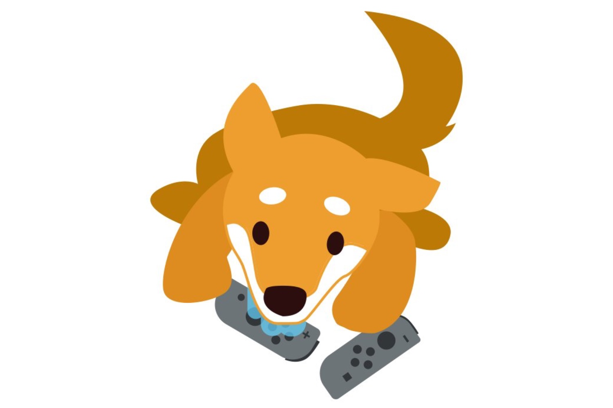

+++
title = "Nintendo prévient : le pipi de chien est dangereux pour la santé de votre Switch"
date = 2024-11-15T06:50:32+01:00
draft = false
author = "Mickael"
tags = ["Actu"]
image = "https://nostick.fr/articles/vignettes/novembre/chien-nintendo.jpg"
+++

Votre chat ou votre chien a pris l'habitude de baver ou de faire pipi sur votre Switch ? Ce n'est pas une bonne idée (et d'abord, comment a-t-il pris cette habitude ?). Nintendo a rappelé que la salive et l'urine ne sont pas bonnes pour la console, elles peuvent provoquer un mauvais fonctionnement « *en raison de l'exposition à l'eau* ».

On croit rêver, mais non ce n'est pas le 1er avril. Le message de prévention a été [posté](https://x.com/nintendo_cs/status/1855808929940570587) par Nintendo Japon, qui prévient les propriétaires d'animaux de compagnie de ne pas laisser la Switch sans surveillance quand ils trainent autour. Le danger est qu'ils prennent la console pour un jouet… ce qu'elle est, quelque part.

Personnellement, j'ai beaucoup de mal à imaginer mes chats se soulager sur la Switch. En revanche, et comme Nintendo le souligne discrètement, le message de prévention s'adresse surtout aux chiens. Les plus gros ont parfois tendance à baver plus que de raison, voire à croquer dans tout ce qui bouge.

Quoi qu'il en soit, même si le message est bizarre, il n'est pas inutile de rappeler que les animaux et les appareils électroniques font rarement bon ménage à part quand ils ont été conçus pour. À quand une Switch pour les chats ?
