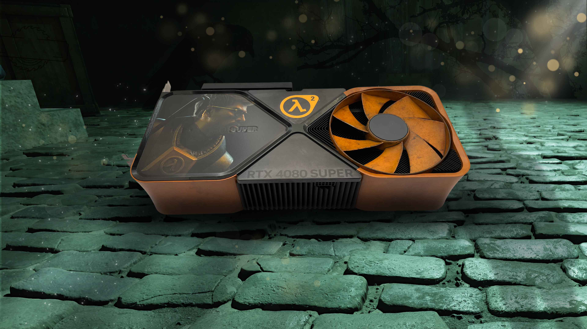

+++
title = "NVIDIA donne des nouvelles du joli remaster Half-Life 2 RTX"
date = 2024-11-15T07:10:00+01:00
draft = false
author = "Félix"
tags = ["Actu"]
image = "https://nostick.fr/articles/2024/novembre/1511-nvidia-half-life-2-rtx/hl2.jpg"
+++

 

Alors qu’une mise à jour anniversaire de *Half-Life 2* semble [sur le point d’arriver](https://nostick.fr/articles/2024/novembre/0711-valve-anniversaire-hl2/), NVIDIA lance les hostilités en donnant des nouvelles de son remaster complet faisant la part belle au ray-tracing. Annoncé l’année dernière, le projet n’a pas encore de date de sortie mais a désormais [une page Steam](https://store.steampowered.com/app/2477290/HalfLife_2_RTX/) déployée en parallèle d’une vidéo de présentation.

 

*Half-Life 2 RTX* est un projet lancé par plusieurs moddeurs du jeu d’origine visant à faire la retape de la technologie [RTX Remix](https://www.nvidia.com/fr-fr/geforce/rtx-remix/), qui sert à ajouter du ray-tracing dans de vieux jeux. Le projet ne s’arrête pas là étant donné que les multiples assets (objets, textures) vont être revus pour l’occasion tandis que la gestion des lumières sera logiquement améliorée. Les développeurs promettent que cette version revisitée restera fidèle à l’original, sans changer le gameplay ou l’emplacement des différents objets. 

Ce n’est pas la première version « RTX » de vieux jeux que l’on voit passer : *[Portal with RTX](https://store.steampowered.com/app/2012840/Portal_with_RTX/)* a également été développé en partenariat avec NVIDIA, tout comme une version revue de *[Quake II](https://store.steampowered.com/app/1089130/Quake_II_RTX/)*. Notons que le fondeur ne s’arrête pas là pour célébrer l’anniversaire de *Half-Life 2* et vient de lancer un concours pour gagner une RTX 4080 au logo du jeu. Vous pouvez tenter d’en récupérer une sur [Twitter](https://x.com/NVIDIAGeForce), [TikTok](https://www.tiktok.com/@nvidiageforce?lang=en), [Facebook](https://www.facebook.com/NVIDIAGeForce/) ou [Instagram](https://www.instagram.com/nvidiageforce/?hl=en) en likant et commentant le post qui va bien. 

 
