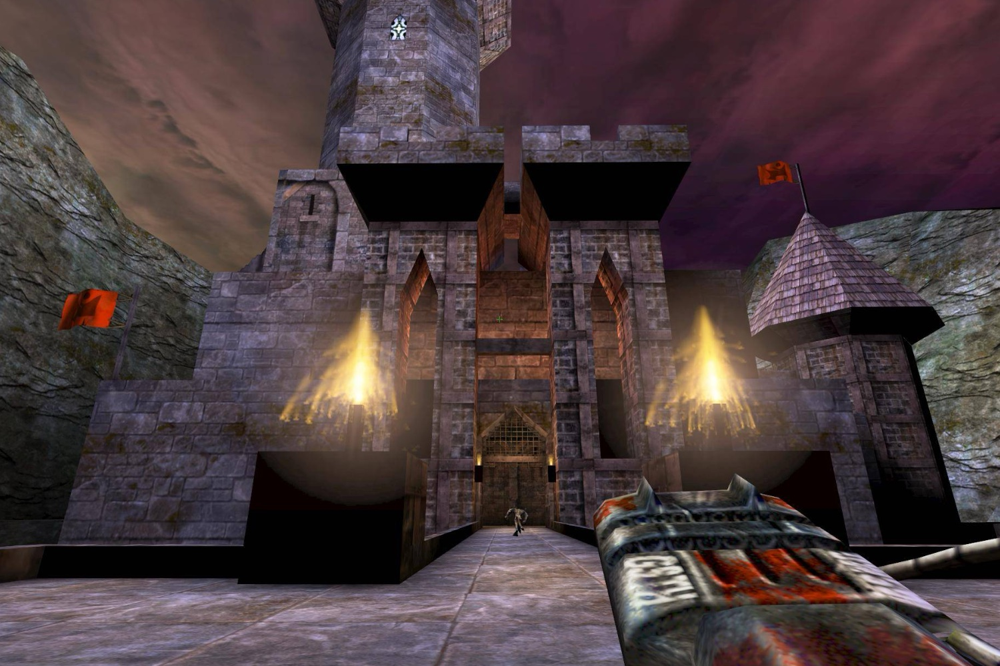

+++
title = "Unreal et Unreal Tournament jouables pour toujours et à jamais"
date = 2024-11-15T08:47:32+01:00
draft = false
author = "Mickael"
tags = ["Actu"]
image = "https://nostick.fr/articles/vignettes/novembre/unreal.jpg"
+++

Encore une bonne nouvelle sur le front de la préservation des jeux vidéo. Après [l'initiative de GOG hier](https://nostick.fr/articles/2024/novembre/1411-gog-sauve-jeux-oubli/) qui s'engage à maintenir le fonctionnement d'une centaine de jeux anciens sur les machines d'aujourd'hui, c'est au tour d'Epic d'y aller de sa bonne action. L'éditeur a en effet autorisé Internet Archive à conserver pour toujours et à jamais *Unreal* et *Unreal Tournament* !

 

Les deux jeux de 1998 et 1999 sont évidemment des classiques du FPS à l'héritage particulièrement riche. On leur doit l'Unreal Engine évidemment, conçu spécialement pour le premier jeu. *Tournament* est probablement plus connu car il intègre un mode multi. Epic a développé plusieurs suites ayant connu un succès monstre.

Le groupe de fans Old Unreal a [créé](https://www.resetera.com/threads/epic-games-gives-the-thumbs-up-to-archive-org-copies-of-unreal-gold-and-unreal-tournament-goty-free-to-download-for-all.1035414/) des installeurs qui vont télécharger les ISO sur Internet Archive et les installer sur votre PC avec les patchs de compatibilité : [ici pour *Unreal*](https://www.oldunreal.com/downloads/unreal/full-game-installers/), [là pour *Unreal Tournament*](https://www.oldunreal.com/downloads/unrealtournament/full-game-installers/). Pour jouer en ligne, il faudra réaliser quelques manipulations supplémentaires.

Sinon, les fichiers sont disponibles directement sur Internet Archive, [ici pour Unreal](https://archive.org/download/gt-unreal-1998/Unreal.iso), [là pour Unreal Tournament](https://archive.org/download/ut-goty/UT_GOTY_CD1.iso)), mais il va falloir sortir l'huile de coude pour que ça fonctionne. Le plus beau dans toute cette histoire, c'est que ces jeux sont maintenant gratuits et jouables jusqu'à la fin des temps. Ça écorche un peu de le dire, mais merci Tim Sweeney !