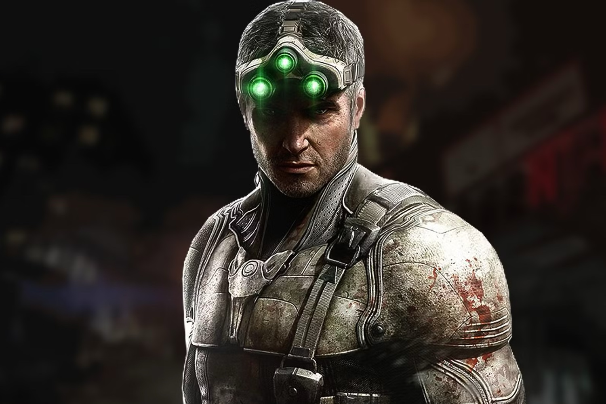
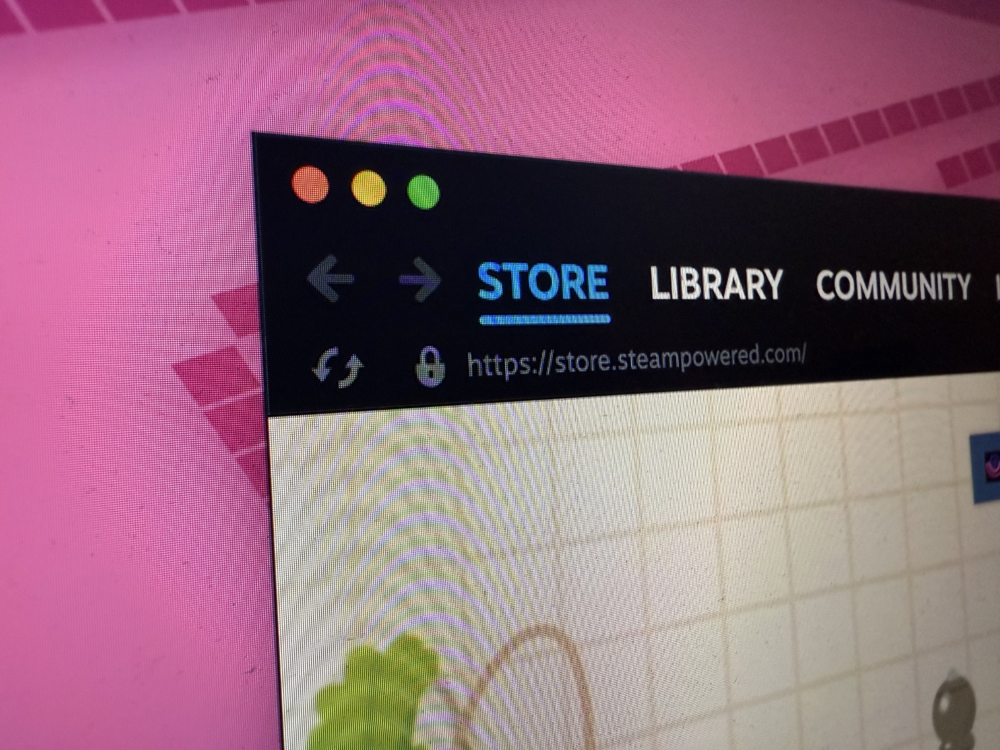
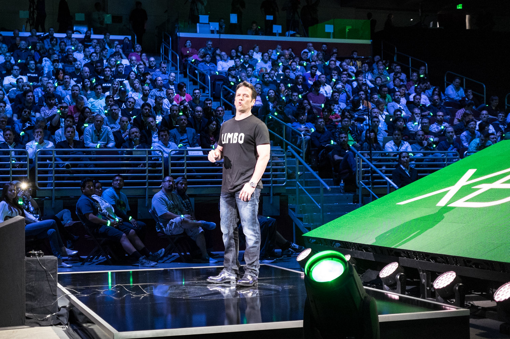

+++
title = "On vide le backlog de la semaine : le tout petit Noël des consoliers, les nazis OKLM chez Steam, Xbox prêt à tout claquer…"
date = 2024-11-16T08:00:32+01:00
draft = false
author = "Mickael"
tags = ["XXL"]
image = "https://nostick.fr/articles/vignettes/novembre/splinter-cell.jpg"
+++

L’actualité du jeu vidéo ne s’arrête pas à la poignée d’articles publiés sur *Nostick* ! Histoire de rattraper le retard accumulé, voici un retour rapide sur quelques unes des infos les plus importantes (ou insignifiantes) de la semaine.

## La grosse info de la semaine : l'étrange Noël des consoliers

Les consoliers ont fait contre mauvaise fortune bon cœur en dévoilant cette semaine leurs promos pour le Black Friday et pour Noël. Une PS5 et des Xbox un peu moins chères (aux États-Unis, du moins), des bundles et des rabais sur les jeux chez Nintendo. Rien de foufou donc : la fin de l'année s'annonce relativement calme pour les joueurs et leur portefeuille, ce dont personne ne se plaindra vraiment.

 

Outre Atlantique, Sony a généreusement retranché 70 $ sur le prix de la PS5 sans lecteur Blu-Ray, soit 380 $ au lieu de 450 $ (hors taxes évidemment). Une stratégie intéressante, puisque le constructeur s'adresse tout autant aux joueurs fortunés avec la PS5 Pro à 700 $ (800 € chez nous 😭) qu'aux plus petits budgets. 

Voilà qui permettra de donner un coup de pouce aux ventes de PlayStation durant les fêtes, sachant qu'elles ont reculé au troisième trimestre ([6,2 millions d'unités](https://nostick.fr/articles/2024/novembre/0811-astro-bot-petit-robot-grandes-retombees-sony/), soit 2 millions de moins qu'il y a un an). Le rebond attendu concernera surtout la PS5 de base, car on imagine mal la PS5 Pro faire des ravages sous les sapins.

Pas de miracle de Noël à attendre pour le catalogue de jeux : en dehors de *Lego Horizon Adventures* sorti le 14 novembre (et aussi dispo sur PC et Switch), on ne peut pas dire que Sony se soit beaucoup foulé en cette fin d'année. On pourrait même étendre ce constat à 2024 tout entier, exception faite d'*Astro Bot*. Mais si les ventes du jeu de plateformes sont honorables (1,5 million de copies en 9 semaines), on est loin d'un *God of War*, *Last of Us* ou *Spider-Man*.

PlayStation peut compter sur un catalogue robuste de jeux tiers, *FF7 Rebirth* et *Black Myth: Wukong* en tête, mais ce sont des jeux sortis au premier semestre…

 

Pour ne rien arranger, Nintendo ne devrait pas mettre le feu aux ventes de consoles cette fin d'année. C'est entendu, le constructeur a bien l'intention de vendre des palettes entières de Switch, comme en témoigne l'offensive publicitaire du 1er novembre durant durant lequel l'entreprise a balancé deux [spots](https://www.youtube.com/watch?v=twrEnAwUFmM) de [Noël](https://www.youtube.com/watch?v=yt3todgjYpo) plus une troisième réclame « [feel good](https://www.youtube.com/watch?v=fADbVPqhFg0) » pour *Animal Crossing*.

Pour éviter de baisser les prix de la Switch, Nintendo multiplie les bundles avec un jeu et/ou du Switch Online pour cacher la misère. Mais on ne va pas se mentir : après sept ans dans les rayons, la console hybride commence à montrer son âge. Et les rumeurs d'un nouveau modèle imminent n'aident pas à convaincre les acheteurs qu'il leur faut une Switch potentiellement obsolète dans trois ou quatre mois.

Nintendo fait le dos rond : la purée de pois actuelle, qui dure depuis quelques mois maintenant, n'est pas bonne pour le commerce. [Les ventes ont plongé de plus de 30 %](https://nostick.fr/articles/2024/novembre/0511-switch-2-toujours-annoncee-5-mois/) entre le premier semestre fiscal 2024 et le précédent. Et contrairement à Sony qui peut se reposer sur de solides ventes de jeux, chez Nintendo l'absence de blockbusters se fait ressentir : quasiment -28 % au premier semestre fiscal. Résultat, Nintendo a revu ses prévisions à la baisse pour l'exercice 2024/2025.

 

Difficile d'imaginer une période de fêtes aussi peu excitante que celle que nous allons traverser cette année ! Et ce n'est pas Microsoft qui va donner un coup de pouce au marché. Il y a bien ce rabais de 50 $ sur les Xbox Series S/X, mais qui voudrait sincèrement acheter une Xbox ? C'est le constructeur lui-même qui l'affirme : [tout est une Xbox maintenant](https://nostick.fr/articles/2024/novembre/1411-tout-est-une-xbox-maintenant/), que ce soit un smartphone, une télé connectée ou une console PC portable. Alors pourquoi s'embarrasser d'une console ?

Microsoft se rêve désormais en éditeur multiplateforme… avec un certain succès au vu [des ventes de Xbox anémiques](https://nostick.fr/articles/2024/octobre/3110-xbox-vend-plus-jeux-moins-conosles/). Ce sont les jeux qui portent le business, et pour le coup Xbox est en position de force avec une fin d'année en feu d'artifice : *Call of Duty: Black Ops 6*, *Flight Sim 2024*, *Stalker 2*, *Indiana Jones et le Cercle Ancien*… Il y aura un jeu pour tous les goûts ou presque, sur PC et Xbox, mais aussi sur PS5 (*Black Ops* dès maintenant, et *Indy* au printemps).

2025 sera une autre paire de manches. Non seulement Nintendo aura lancé le successeur de la Switch (enfin, on l'espère…), mais *GTA 6* devrait aider à vendre de la console. Mais on n'y est pas encore !

## Les relous de la semaine : Steam à la cool avec les nazis

Pas la peine d'aller chercher très loin les commentaires haineux sur ~~Twitter~~ Steam. Ce n'est malheureusement pas une surprise : la boutique en ligne de Valve a un gros problème de modération, les nazis y ont leur rond de serviette et ils ne s'en privent pas. L'Anti-Defamation League (ADL), une organisation internationale qui lutte contre l'antisémitisme, la haine et les discriminations, a [analysé](https://www.adl.org/resources/report/steam-powered-hate-top-gaming-site-rife-extremism-antisemitism) des centaines de millions de profits et de commentaires Steam, et le résultat donne mal au ventre.

L'organisation a dénombré 1,8 million de contenus haineux, notamment des symboles suprémacistes blancs et antisémites. 1,5 million d'utilisateurs et près de 75 000 groupes ont utilisé ces symboles, ces mots-clés ou ces contenus extrémistes. 830 000 profils d'utilisateurs et de groupes utilisent des avatars contenant des symboles de haine. Des milliers de profils célèbrent des auteurs d’attentats, avec des avatars ou des références à des manifestes extrémistes et à des attaques.

Il arrive à Steam de [supprimer](https://kotaku.com/valve-is-quietly-deleting-hate-groups-but-it-isnt-solv-1823849767) des comptes problématiques, mais ces interventions sont rares et principalement motivées par des pressions externes ou médiatiques. Il n'y a pas de stratégie systémique pour modérer le contenu de ces abrutis. Cette étude de l'ADL devrait mettre un bon coup de pied aux fesses de Valve pour faire son boulot.

## Le petit rigolo de la semaine : la fuite en avant délirante de Phil Spencer et de Xbox

Depuis l'acquisition d'Activision l'an dernier, Microsoft a supprimé 2 500 postes dans sa pléthorique division Gaming, [dont 650 rien qu'en septembre dernier](https://nostick.fr/articles/2024/septembre/1209-microsoft-vire-650-personnes/). Le groupe a aussi fermé plusieurs studios, dont Tango Gameworks ([repêché après coup par Krafton](https://nostick.fr/articles/2024/aout/1208-krafton-a-la-rescousse-de-tango/)) et Arkane Austin.

Pas de quoi pavoiser donc, ce d'autant que les résultats du chèque à 69 milliards de dollars se font attendre pour les joueurs — [pour les résultats financiers, tout va très bien merci](https://nostick.fr/articles/2024/octobre/3110-xbox-vend-plus-jeux-moins-conosles/). Mais il ne faut surtout pas que ça dérange ce bon Phil Spencer, le patron de Microsoft Gaming. Dans son [interview chez *Bloomberg*](https://nostick.fr/articles/2024/novembre/1311-xbox-portable-pas-avant-plusieurs-annes/), il a benoîtement déclaré que oui, l'entreprise ne s'interdisait rien en matière d'acquisition future.

Et tout particulièrement dans le secteur mobile. On l'oublie parfois, mais l'achat d'Activision permet à Microsoft de devenir un poids lourd du secteur, avec *Candy Crush* de King, ou encore *Call of Duty Mobile*. Et c'est pourquoi Microsoft reste à l'affût des opportunités sur le marché. Et pourquoi pas acheter de nouveaux studios de jeux mobiles ? 

Rien n'est « *imminent* », a-t-il immédiatement ajouté. Il faut dire que les régulateurs à la concurrence verraient certainement d'un œil mauvais une nouvelle concentration sur le marché du jeu vidéo. Ce qui est fou dans cette stratégie de fuite en avant, c'est que parmi les studios fermés cette année, se trouve Alpha Dog Games justement spécialisé dans… les jeux mobiles !

## Le retour de la boîte à baffes chez Ubisoft !

Ubisoft a vraiment, mais vraiment, très mal pensé la fin de carrière de *The Crew*. La simulation automobile arcade, lancée en 2014, n'est désormais plus du tout jouable depuis le mois de mars, l'éditeur ayant débranché les serveurs : pour un jeu qui nécessite une connexion à internet, c'est la mort assurée.

Ubisoft pensait probablement que cette fermeture n'allait provoquer que quelques remugles chez les derniers joueurs qui n'étaient pas encore passés à *The Crew 2* ou *The Crew Motorfest*. Ce d'autant que l'entreprise s'était engagée à rembourser les joueurs ayant acheté récemment ce premier opus.

 

Mais [ça ne se passe pas du tout comme sur des roulettes](https://nostick.fr/articles/2024/avril/1204-ubisoft-efface-the-crew-partout/). La fermeture de *The Crew* a été le catalyseur d'une pétition européenne pour [empêcher les éditeurs de « tuer » leurs jeux](https://nostick.fr/articles/2024/aout/0208-stop-killing-games-petition-europe-tuer-jeux/) (elle est toujours en cours, alors [allez la signer](https://citizens-initiative.europa.eu/initiatives/details/2024/000007_fr) !).

Et voilà maintenant que la justice s'en mêle. En Californie, deux joueurs ont [porté](https://www.polygon.com/gaming/476979/ubisoft-the-crew-shut-down-lawsuit-class-action) plainte contre Ubisoft, en espérant que ça se transforme en recours collectif. Les plaignants n'auraient pas acheté *The Crew*, dont ils possèdent la version physique, s'ils avaient su que les serveurs pouvaient fermer et donc les empêcher d'y jouer.

Ils filent la métaphore du flipper pour illustrer leur point de vue : « *Imaginez que vous achetiez un flipper et que, des années plus tard, vous entriez dans votre salle de jeux pour y jouer et découvrir que toutes les palettes ont disparu, que la bille et les bumpers sont partis, et que l'écran qui affichait fièrement votre meilleur score a été enlevé* ». Hé oui, moi aussi ça me rendrait fou.

Évidemment, la justice va mettre un certain temps pour instruire le dossier, et rien ne dit qu'un procès en bonne et due forme sera organisé (ce genre de dossier s'arrange généralement en coulisse). En tout cas, les deux joueurs réclament une compensation financière et des dommages et intérêts.

Ubisoft a semble-t-il senti le vent du boulet quand, il y a quelques mois, il annonçait que *The Crew 2* et *Motorfest* hériteront d'un mode hors ligne. Mais rien pour *The Crew*…

## On n'a pas eu le temps cette semaine, mais on pense à eux

 

*The Rogue Prince of Persia*, toujours proposé en accès anticipé sur [Steam](https://store.steampowered.com/news/app/2717880/view/4508758658863071521), revoit tout du sol au plafond : le deuxième chapitre du roguelike ajoute plus de biomes, de boss, un nouveau chapitre, des ennemis supplémentaires et une nouvelle direction artistique. Oui, le Prince n'a plus la peau bizarrement violette ! Cette grosse mise à jour sera livrée le 21 novembre, et le développement du jeu se poursuivra en 2025, promet le studio Evil Empire.

Il y a eu pas mal d'infos sur *World of Warcraft* qui nous ont échappées cette semaine, mais on ne pouvait décemment pas passer à côté de la plus importante. Les joueurs du MMO vont finalement pouvoir [habiter](https://blizzard.gamespress.com/en-CA/World-of-Warcraft#?tab=Press-releases-0&scrollto=) dans leur propre maison ! Ça faisait plus de 20 ans qu'ils attendaient ça… Mais il faudra attendre l'extension « Midnight » qui n'arrivera que dans un an ou deux. De quoi rêver à son petit intérieur douillet…

## osef

Le film adapté de *Splinter Cell* [tombe](https://thedirect.com/article/splinter-cell-tom-hardy-movie-exclusive) à l'eau.

## Dans le reste de l'actu déchaînée

- Nintendo a décidé de tout annoncer… sauf la Switch 2 ! Le constructeur a dévoilé durant un Direct la nouvelle zone d'attraction du Super Mario World consacrée à Donkey Kong, au Japon. On aurait préféré un nouveau jeu DK, [mais enfin](https://nostick.fr/articles/2024/novembre/1111-nouveau-nintendo-direct-pas-switch-2/).
- La PS5 Pro n'a pas fait beaucoup de bruit durant son lancement, il faut dire que son prix a refroidi pas mal les ardeurs. Mais chez Sony, on se dit content [alors ça va finalement](https://nostick.fr/articles/2024/novembre/1111-lancement-ps5-pro-clous-ps4-pro/).
- *MultiVersus*, le clone de *Smash* de chez Warner Bros, est à la peine et fait perdre beaucoup d'argent à WB. Bien fait ? On fait le point [dans cette actu](https://nostick.fr/articles/2024/novembre/1111-multiversus-deux-doigts-ramasser-la-tronche/).
- Les portages PC des exclusivités PlayStation font toujours l'événement, mais leur popularité sur Steam varie grandement d'un jeu à l'autre. Essayons d'y voir plus clair [dans ce dossier](https://nostick.fr/articles/2024/novembre/1111-exclusivites-playstation-jeux-pc-comme-autres/).
- Konami a peur que les jeunes générations oublient *Metal Gear Solid*. C'est la raison d'être du remaster grand luxe de *MGS 3: Snake Eater*. On s'en reparle [dans cette actu](https://nostick.fr/articles/2024/novembre/1211-konami-peur-jeunes-oublient-metal-gear-solid/).
- Xbox fait chauffer *Indiana Jones et le Cercle Ancien*, et la vidéo de gameplay partagée cette semaine fait sacrément envie ! [C'est à voir par ici](https://nostick.fr/articles/2024/novembre/1211-indy-fouet-jugeote-video-gameplay/).
- Ce n'est pas le Steam Deck 2, mais cette version de la console PC portable de Valve avec une robe blanche a une fière allure. À découvrir [dans cette actu](https://nostick.fr/articles/2024/novembre/1112-steam-deck-oled-blanc/).
- L'édition définitive de la trilogie GTA sur consoles et PC n'est pas un chef d'œuvre, loin de là. Mais les nouveautés venues des versions mobiles et proposées dans une mise à jour changent pas mal les choses. [Par ici les modifs](https://nostick.fr/articles/2024/novembre/1211-rockstar-luste-gta-definitive-edition/).
- Les fans de ~~boobs~~ jiggle physics sont aux anges : *Stellar Blade* va sortir sur PC l'année prochaine ! [On vous dit tout ici](https://nostick.fr/articles/2024/novembre/1311-stellar-blade-pc-2025/).
- Coup sur coup (sur coup), les trois plus gros représentants du genre du jeu service ont annoncé le retour de maps et de mécanismes d’origine : retour vers le passé pour *Apex Legends*, *Overwatch 2* et *Fortnite*. [Les détails dans cette actu](https://nostick.fr/articles/2024/novembre/1311-retour-origines-fortnite-apex-legends-overwatch-2/).
- *Monster Hunter* poursuit sa collecte de joueurs, cette fois sur les mobiles avec *Outlanders* qui promet un monde ouvert à explorer sur smartphones. [Ça se passe par ici](https://nostick.fr/articles/2024/novembre/1311-monster-hunter-outlanders-partons-chasser-creature-smartphones/) !
- GOG et Epic ont fait avancer la cause de la préservation des jeux vidéo cette semaine : le premier [promet](https://nostick.fr/articles/2024/novembre/1411-gog-sauve-jeux-oubli/) de maintenir en vie une centaine de jeux rétro, le second a [refilé](https://nostick.fr/articles/2024/novembre/1511-unreal-tournament-jouable-toujours/) *Unreal* et *Unreal Tournament* à Internet Archive.
- Toujours dans le même domaine, Blizzard a lancé des remasters pour les deux premiers *Warcraft* et une grosse mise à jour pour *Warcraft III*. [Plus d'infos par là](https://nostick.fr/articles/2024/novembre/1311-remasters-warcraft-mise-jour/). Et tant qu'on y est, l'éditeur a aussi [annoncé](https://nostick.fr/articles/2024/novembre/1411-warcraft-rumble-mobile-pc/) la version PC de *Warcraft Rumble* !
- *Pokémon Pocket*, c'est la sensation mobile du moment avec des bazillions de téléchargements et des brouettes de dollars. Mais pour le moment, toujours pas d'échange de cartes entre joueurs… [Ça va bientôt changer](https://nostick.fr/articles/2024/novembre/1411-pokemon-jcc-pocket-echanges-janvier/).
- Le saviez-vous ? Le pipi de chien est dangereux pour votre Switch ! [Et c'est Nintendo qui le dit](https://nostick.fr/articles/2024/novembre/1511-nintendo-pipi-chien-dangereux-switch/)…
- *Half-Life 2*, c'est très bien, mais *Half-Life 2 RTX* s'annonce encore mieux ! [Jetons un œil par ici](https://nostick.fr/articles/2024/novembre/1511-nvidia-half-life-2-rtx/).
- *Half-Life 2* fête ses 20 ans, hé oui comme le temps file ! Et pour fêter ça, Valve a balancé une énorme mise à jour avec des tas de trucs en plus et même un documentaire [à apprécier par ici](https://nostick.fr/articles/2024/novembre/1511-valve-grosse-mise-a-jour-half-life-2/) !