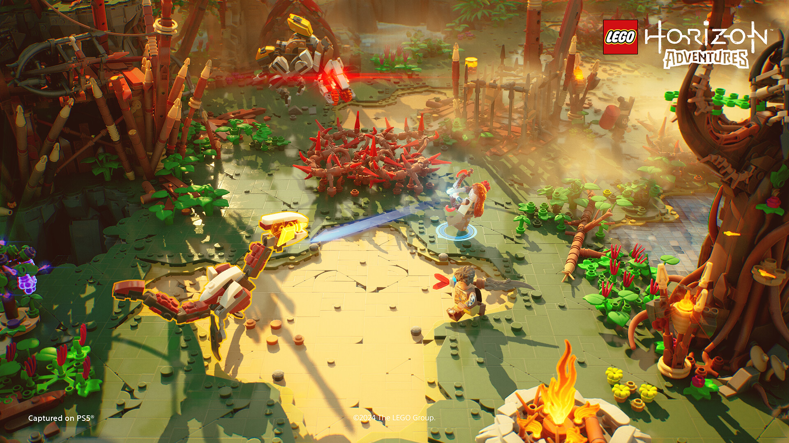
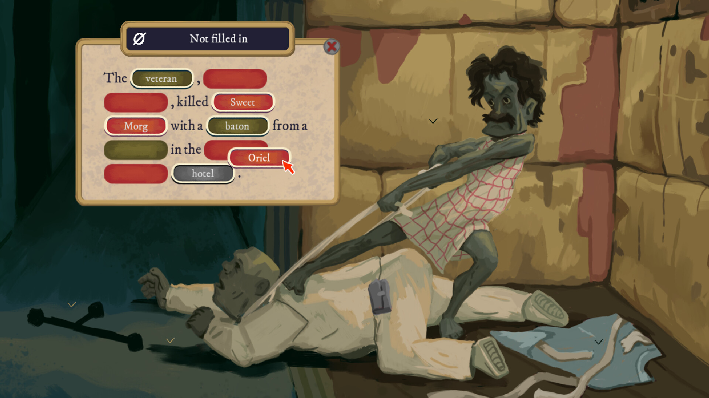

+++
title = "Lego Horizon Adventures, The Rise of the Golden Idol : le récap des sorties de la semaine (17/11)"
date = 2024-11-17T06:00:02+01:00
draft = false
author = "Félix"
tags = ["C’est dispo"]
image = "https://nostick.fr/articles/2024/novembre/1711-les-sorties-de-la-semaine/lego.jpg"
+++

Entre la garderie, les courses et ce lumbago qui vous a pourri la fin de semaine, vous n’avez peut-être pas eu le temps de vous intéresser aux nouveautés du moment. Qu’à cela ne tienne : voici les sorties de ces derniers jours qui ont retenu notre attention. 

## Ça casse pas des briques

Le crossover que personne n’avait demandé ***Lego Horizon Adventures*** est sorti cette semaine. Comme on pouvait s’y attendre, le titre reprend l’histoire d’*Horizon Zero Dawn* et la réinterprète en mode Lego avec des décors faits de briques. Si la formule est similaire à celles des adaptations *Star Wars* / *Harry Potter* où l’on parcoure les niveaux en cassant tout ce qui bouge, elle se veut plus linéaire en effaçant l’aspect monde ouvert. Les séances de plateformes se mélangent à des combats sympas et demandant un peu plus de technique que d’habitude. Malheureusement, ce nouveau titre n’est visiblement pas le haut du panier des jeux Lego : les testeurs déplorent le manque d’objets destructibles ainsi qu’un certain manque de prise de risque pour un jeu dont on ne comprend pas bien quel public il vise. En promo et en coop dans quelque temps à la limite, mais sinon, nul besoin de vous jeter dessus. Dispo pour 70 balles [sur PC](https://store.steampowered.com/app/2428810/LEGO_Horizon_Adventures/), PS5 et Switch.

## Le diable au corps

***‌Sorry We're Closed*** est un jeu d’horreur indé à gros polygones qui tente de se démarquer par son gameplay original : des angles de caméras fixes pour de combats se déroulant en vue FPS. On y incarne Michelle, persécutée par un étrange démon la maudissant d’un « troisième œil » qu’elle peut activer afin de révéler le monde surnaturel autour d’elle. En pratique, on va sociabiliser la journée avant d’explorer des donjons la nuit dans une ambiance baroque visuellement surprenante. Le jeu s’inspire pêle-mêle de *Persona*, *Silent Hill*, mais également de *Paradise Killer* ou de *Killer7* pour un gloubiboulga aussi unique que sexy. Tout n’est pas parfait mais l’univers bizarre et les personnages hauts en couleur ont l’air de valoir le détour si la patte graphique et le style chelou ne vous ont pas rebutés. 24,50 € [sur Steam](https://store.steampowered.com/app/1796580/Sorry_Were_Closed/?l=french), où une démo est disponible pour les curieux. 

 

## Divine idole 

Sortez votre loupe, votre pipe et votre carnet de notes : la série ***Golden Idol*** est de retour ! Ce second opus se déroule à l’ère presque moderne des années 70 et nous invite à résoudre une vingtaine d’affaires prenant la forme de tableaux quasiment statiques sur lesquels il va falloir cliquer de fond en comble. On débloque ainsi un paquet de mots-clés à glisser dans un texte à trou pour résoudre le mystère (et montrer qu’on a compris ce qui se passait). Si les premières scènes se règlent facilement, la difficulté monte crescendo avec son lot de faux indices et autres twists. Cette suite est visiblement réussie, avec un mystère global sympa et des affaires très satisfaisantes à résoudre. Cela reste un type de jeu à réserver à ceux qui aiment se creuser les méninges et qui parlent anglais, la traduction dans la langue de Molière ayant pas mal de lacunes d’après les testeurs français. Dispo [sur PC](https://store.steampowered.com/app/2716400/The_Rise_of_the_Golden_Idol/) et toutes les consoles (même les vieilles et la Switch) pour 19,50 €. Notons qu’il y a une démo et que c’est également sur iOS/Android pour les abonnés Netflix.

##  Pas mal non ? C’est français

Le jeu d’aventure de 1994 ***Little Big Adventure*** a cette semaine eu droit à un remake édité par Microids. Le joueur y incarne Twinsen, un petit bonhomme parti à la recherche de sa fiancée devant parcourir une planète colorée sous le joug d’un dictateur savant fou. On y alterne phases d’exploration et séquences de combats faisant appel à la célèbre « balle magique » qui s’améliore au fil du temps. Le titre reste en 3D isométrique, mais gagne une nouvelle direction artistique plus cartoon tandis que le gameplay a été modernisé. La bande-son a été réorchestrée par le compositeur de l’œuvre originale, et cette version 2024 dispose d’un tout nouveau doublage français. Bref, un remake qui a l’air bien fini et qui a reçu un accueil globalement positif : c’est l’occasion de vous y mettre si vous n’avez jamais touché à l’original, d’autant plus qu’il y a une démo sur Steam. Comptez 30 € pour le jeu complet [sur PC](https://store.steampowered.com/app/2318070/Little_Big_Adventure__Twinsens_Quest/), Switch et consoles (y compris les vieilles). Attention pour les pécéistes, car cette *‌Twinsen’s Quest* a visiblement été pensée pour être parcourue à la manette.

 

## Mais aussi

Si vous avez toujours rêvé de gérer une ferme mais que le taux de suicide chez les agriculteurs vous inquiète, pourquoi ne pas investir dans le tout frais ***Farming Simulator 25*** ? Cet opus ajoute une IA améliorée, de nouvelles options de véhicules et des cartes exclusives pour [50 balles sur Steam](https://store.steampowered.com/app/2300320/Farming_Simulator_25/) et PS5/Xbox. Les fans de *Half-Life* n’ayant pas eu leur dose avec la mise à jour anniversaire du second épisode pourront se tourner vers [**la démo de *Project Borealis***](https://store.steampowered.com/app/2215490/Project_Borealis_Prologue/), un fan-game quali proposant d’explorer un Ravenholm sous la neige. Le classique ***Dragon Quest III*** est de retour dans une version « HD-2D » visuellement splendide et qui a l’air réussie pour peu que vous ne soyez pas rebuté par le tarif costaud de 60 € [sur Steam](https://store.steampowered.com/app/2701660/DRAGON_QUEST_III_HD2D_Remake/), consoles ou Switch. Moins intéressant, terminons avec la sortie d’**[un nouveau *Tetris*](https://store.steampowered.com/app/3180240/Tetris_Forever/)** qui ajoute quelques modes de jeux et un documentaire, ce qui semble assez peu pour un machin vendu 34 balles.