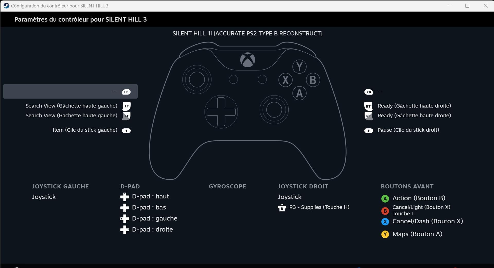
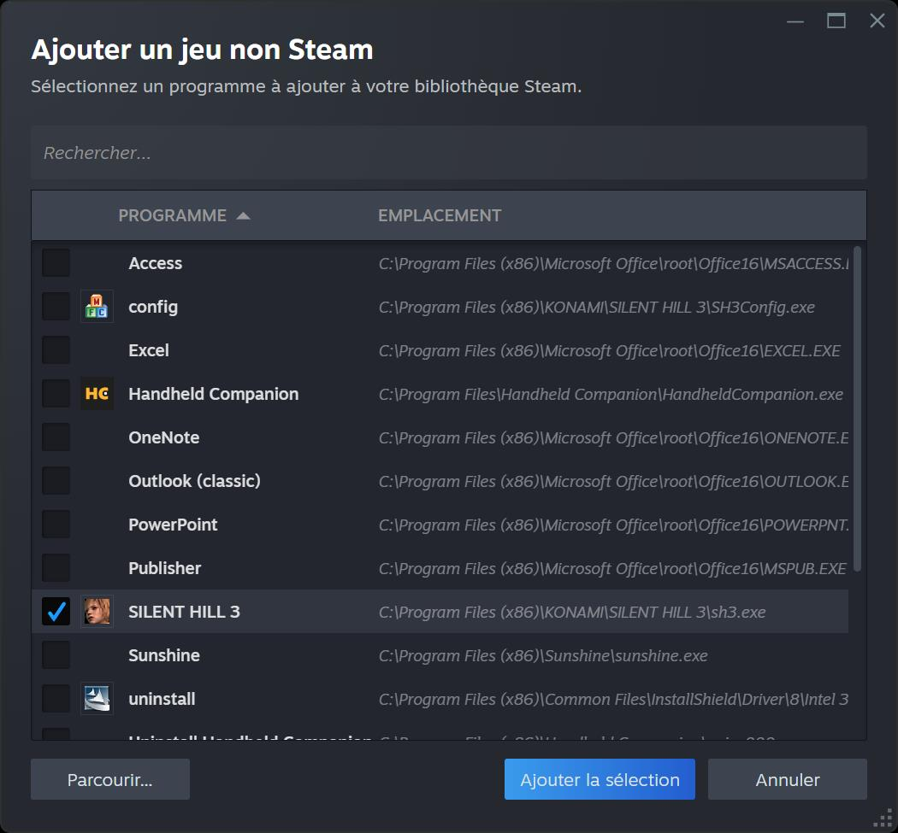
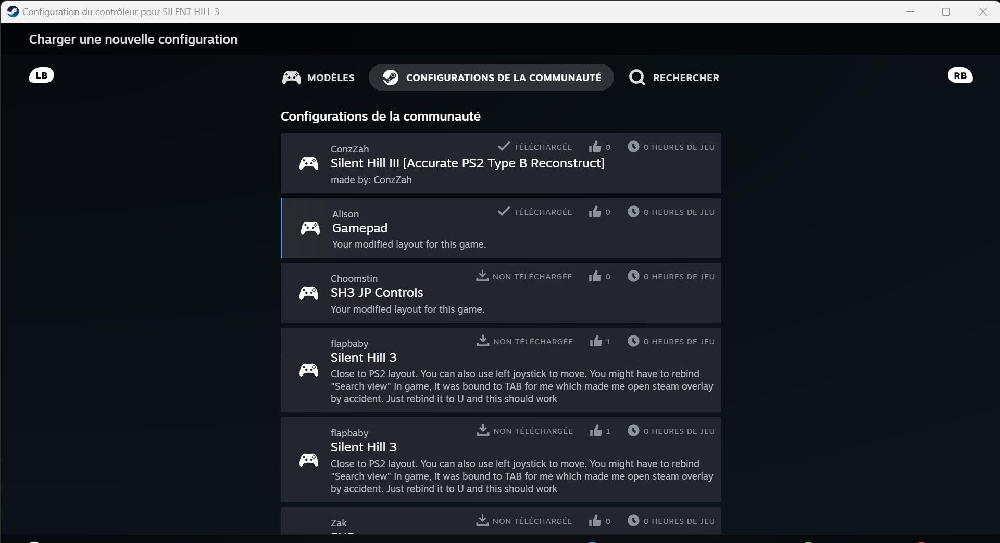

+++
title = "Tuto : utiliser une manette sur ses vieux jeux PC grâce à Steam Input"
date = 2024-11-18T10:00:32+01:00
draft = false
author = "Félix"
tags = ["Actu"]
image = "https://nostick.fr/articles/vignettes/novembre/steaminput.png"
+++

J’ai récemment terminé le remake de *Silent Hill 2* et décidé de continuer sur ma lancée en attaquant le troisième opus, qui date de 2003. Problème : la version PC ne prend pas en charge les manettes nativement alors que je souhaitais y jouer sur ROG Ally. Que faire pour jouer à un vieux jeu PC avec un pad moderne ? Heureusement, ce n’est pas si compliqué.

Après une recherche sur Reddit, je me suis retrouvé avec quelques utilitaires assez complexes permettant de rebinder manuellement ses touches. Une option qui fonctionne, mais assez chronophage et pas très pratique au quotidien (il faut lancer un soft au démarrage de Windows). J’ai finalement trouvé une pirouette en passant par Steam. Le launcher de Valve donne la possibilité d’ajouter des jeux « non-Steam », ce qui est par exemple pratique pour éviter d’avoir à aller chercher le raccourci en mode Big Picture. De plus, cette fonction permet d’activer Steam Input et donc des contrôles à la manette… même sur les versions PC qui n’ont pas été initialement pensés pour.

Pour en profiter, il vous faudra lancer Steam et cliquer en bas à gauche sur le bouton « Ajouter un jeu » (non-Steam, donc). Une fois le fichier .exe faisant office de launcher sélectionné, le titre sera ajouté à votre bibliothèque. Il faut ensuite trouver l’icône en forme de manette sur sa fiche avant d’appuyer sur « Activer Steam Input ». 

Vous pouvez alors changer plusieurs paramètres, et surtout aller piocher dans les différentes configurations créées par la communauté. Cela fonctionne étonnamment bien : Steam m’en propose 8 pour *Silent Hill 3*, un jeu qui n’a pourtant jamais été vendu sur la boutique de Valve. Il est ensuite possible de la modifier si un aspect ne vous plait pas, et pourquoi pas de partager votre version retravaillée avec la communautée.

Il faudra ensuite bien penser à lancer votre jeu via Steam. La manette devrait être reconnue du premier coup. Si cela ne fonctionne pas, n’hésitez pas à tester d’autres configurations dans celles de la communauté ou à modifier les différentes touches (les menus sont assez intuitifs). Et si cela ne marche pas avec votre pad ou que vous êtes allergique à Steam, des utilitaires comme [Xpadder](https://xpadder.com/?x=hi&c=FR&l=fr) ou [JoyToKey](https://joytokey.net/en/) devraient faire votre bonheur pour peu que vous mettiez la main à la pâte.
