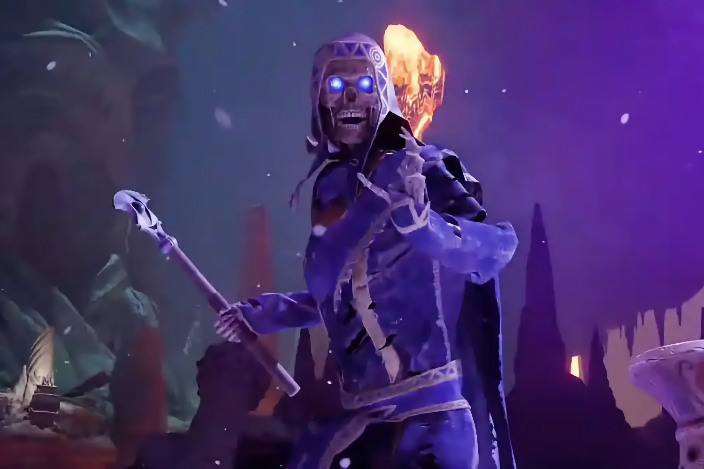

+++
title = "Qui veut jouer à Avowed en avance ?"
date = 2024-11-18T08:10:32+01:00
draft = false
author = "Mickael"
tags = ["Actu"]
image = "https://nostick.fr/articles/vignettes/novembre/avowed.jpg"
+++

Les fans hardcore de *Avowed* (une telle chose existe-t-elle ?) pourront claquer [100 €](https://www.xbox.com/fr-FR/games/store/edition-premium-davowed/9NFHQ2719J83/0017) pour l'édition Premium du jeu. Celle-ci contient le jeu lui-même bien évidemment, deux packs de skins, un artbook numérique, la bande originale, et jusqu'à 5 jours d'accès anticipé — soit à partir du 13 février prochain. Les gueux et les abonnés Game Pass devront attendre le lancement officiel le 18 février.

 

La hype autour du prochain jeu d'Obsidian est-elle si forte que Xbox se soit senti obligé de commercialiser un accès anticipé ? Sans doute pas. Ce n'est pas que le RPG soit dénué d'intérêt, bien au contraire, mais on est loin de *Starfield* qui lui aussi avait donné lieu à quelques jours d'avant première pour les plus impatients et les plus fortunés.

Pour Microsoft, il s'agit surtout d'essayer de grappiller quelques billets verts supplémentaires, alors que le titre sera dispo sur les formules « day one » du Game Pass. Étrangement, *Call of Duty: Black Ops 6* n'est pas passé à la casserole, peut-être en raison du manque de temps pour mettre en place l'option.

*Avowed*, qui devait sortir en 2024, a finalement été repoussé à février en raison du nombre de gros jeux AAA au catalogue de Xbox cette fin d'année. Mais la date choisie, avec ou sans accès anticipé, n'est pas non plus un cadeau : février 2025 sera en effet bourré de titres majeurs, entre *Monster Hunter Wilds*, *Kingdom Come: Deliverance 2*, *Like a Dragon* à Hawaï, *Assassin's Creed Shadows*…