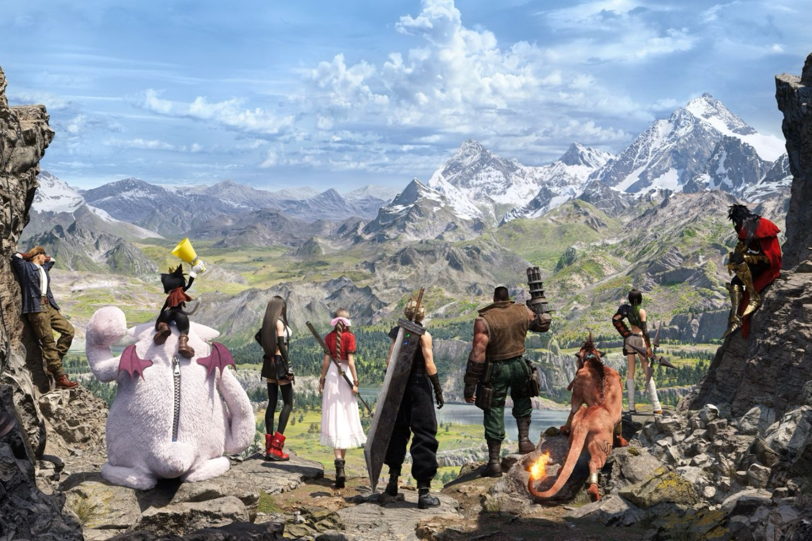

+++
title = "Le scénario du prochain Final Fantasy 7 est bouclé"
date = 2024-11-18T08:07:32+01:00
draft = false
author = "Mickael"
tags = ["Actu"]
image = "https://nostick.fr/articles/vignettes/novembre/FF7-rebirth.jpg"
+++

 

Après *Remake* (2020) et *Rebirth* (2024), les fans de *Final Fantasy 7* attendent de pied ferme le troisième volet de la trilogie (*Revolution* ?) qui réinvente le RPG séminal de 1997 à la sauce moderne. Patience ! Square Enix vient tout juste de boucler le travail sur le scénario, ont annoncé le directeur du jeu Naoki Hamaguchi et son producteur, Yoshinori Kitase.

À l'occasion de la G-CON 2024 qui s'est déroulée en Corée du Sud, les deux responsables de *FF7* ont [déclaré](https://www.4gamer.net/games/638/G063881/20241115058/) que le développement du jeu en lui-même allait débuter. Et il y a du pain sur la planche, car l'équipe ne manque pas d'ambition : « *Dans Final Fantasy 7 Rebirth, la carte était déjà immense* », rappelle Yoshinori Kitase. « *Mais dans le troisième opus, le Highwind (le fameux vaisseau aérien) fera son grand retour, ce qui donnera une nouvelle perspective pour explorer le monde* ».

Et il n'est pas question de faire les choses à moitié avec le système de vaisseau aérien : « *On a de l'ambition pour relever ce défi, pour que les joueurs puissent véritablement survoler la carte en toute liberté* ». Cette ambition se nichera-t-elle aussi dans les plateformes qui accueilleront le jeu ? Square Enix a été déçu par les chiffres de ventes de *FF7 Rebirth* et de *FF16*, des exclusivités PS5, et a changé de stratégie pour s'ouvrir à un maximum de joueurs.

Si l'éditeur suit la même logique que pour les deux premiers volets, alors ce troisième opus pourrait sortir en 2028 ou quelque chose comme ça. On peut gager qu'il sera compatible PS5 et probablement avec la PS6 qui devrait être lancée aux alentours de la même période. Mais le contrat d'exclusivité avec PlayStation sera-t-il toujours valide ? Square Enix a opéré ces derniers mois un rapprochement avec Xbox, alors peut-être que…