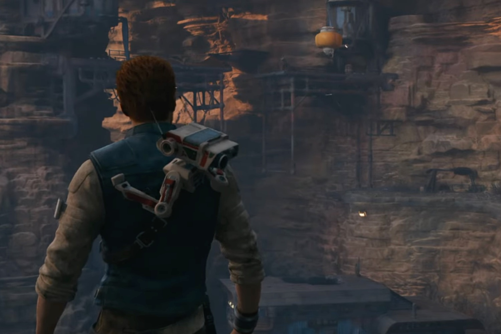

+++
title = "Sérieux problèmes graphiques pour plusieurs jeux avec la PS5 Pro"
date = 2024-11-18T10:47:32+01:00
draft = false
author = "Mickael"
tags = ["Actu"]
image = "https://nostick.fr/articles/vignettes/novembre/jedi-survivor.jpg"
+++

Il y a quelque chose de pourri au royaume de la PS5 Pro. Les forts en thème de *Digital Foundry* sont tombés sur des bizarreries graphiques dans *Star Wars Jedi Survivor*. Le mode performance de la nouvelle console affiche en effet des scintillements aussi inattendus qu'inélégants. C'est particulièrement visible dans les zones où il y a de la végétation.



«  *En comparant les deux versions côte à côte, on remarque à quel point le jeu semble instable avec le PSSR en mode Performance* », selon Oliver Mackenzie. «  *Je dirais même que le résultat est nettement moins bon que l’ancien mode Performance* ». Oups. 

Lot de consolation : les effets de ray-tracing du mode performance de la PS5 Pro sont au rendez-vous (ils avaient été retirés de ce mode sur la PS5 et sur Xbox Series X à la faveur d'une précédent mise à jour), même s'ils se montrent assez subtils. Et *Jedi Survivor*, tristement célèbre depuis son lancement pour ses nombreux problèmes, n'est pas le seul jeu qui souffre de cet étrange symptôme sur la PS5 Pro. 

Sur Reddit, un joueur de *Silent Hill 2* [montre](https://www.reddit.com/r/silenthill/comments/1gn0flc/this_is_ps5_pro_enhanced_this_is_false/) à quel point ces scintillements peuvent être perturbants : le sol est complètement bousillé par ces effets disgracieux. Il faut toutefois relever que le patch « PS5 Pro Enhanced » n'a pas encore été livré pour le titre de Konami.

Selon *Digital Foundry*, le coupable serait le PSSR, le système d'upscale de la PS5 Pro qui utilise l'intelligence artificielle pour reconstruire les détails manquants lorsque l'image est agrandie dans une résolution plus élevée. Cependant, si l'image d'origine manque de détails, l'IA a des limites et peut produire des résultats incohérents d'une image à l'autre, ce qui explique ces scintillements.

Le gros hic actuellement, c'est le silence radio des principaux intéressés : ni Sony, ni Konami, ni personne n'a donné signe de vie malgré les nombreux signalements des joueurs.

**Mise à jour 19/11 —** EA est au courant des problèmes de *Jedi Survivor* sur PS5 Pro et [mène](https://x.com/EAStarWars/status/1858635462577172846) son enquête. Mais aucune annonce pour une éventuelle mise à jour, pour le moment.