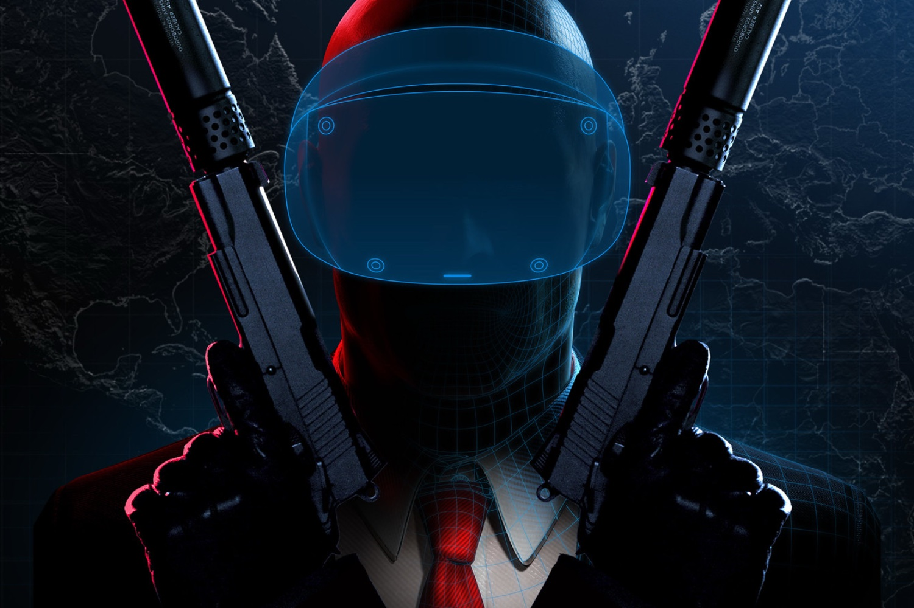

+++
title = "C'est Noël aussi pour les jeux VR : Mare, Trombone Champ, Alien: Rogue Incursion…"
date = 2024-11-19T08:47:32+01:00
draft = false
author = "Mickael"
tags = ["Actu"]
image = "https://nostick.fr/articles/vignettes/novembre/hitman.jpg"
+++

On se moque parfois des jeux en réalité virtuelle qui déçoivent, soit parce qu'ils n'ont pas grand chose d'autre à offrir qu'une démo technique, ou parce que c'est toujours un peu la même chose. Mais les prochaines semaines risquent d'être assez intéressantes à suivre avec pas mal de propositions qui sortent de l'ordinaire. 

PlayStation, qui tente de fourguer un maximum de sa camelote PSVR2 avant Noël (et probablement la fin de la commercialisation ?), a [fait](https://blog.playstation.com/2024/11/18/ps-vr2-new-alien-rogue-incursion-details-mare-out-today-release-dates-for-hitman-world-of-assassination-and-more/) le point sur les prochaines sorties qui ne concernent d'ailleurs pas que son casque. C'est le cas de *[Mare](https://www.lonekitegames.com)* qui n'est pas franchement nouveau, puisqu'il est dispo sur SteamVR depuis mars 2022 et sorti sur iOS (mais pas en VR) en janvier 2023.

 

*Mare*, développé par Lonekite Games, est un jeu d'exploration et un casse-tête où il faudra découvrir les secrets de terres étranges et d'un piaf mécanique.

Probablement plus crétin, le phénomène *Trombone Champ: Unflattened!* se fera entendre le 26 novembre sur SteamVR, Meta Quest et PSVR2. Oui, il s'agit bien de la simulation de trombone — le seul instrument autorisé en enfer — mais en réalité virtuelle. Qui ne voudrait pas vivre ça ?

 

La PSVR2 va aussi accueillir *[Masters of Light](https://wearecoven.com)* le 18 décembre. Le jeu de Coven, dispo sur Quest 2/3 depuis un moment, est une sorte de jeu de boxe virtuel où on balance des sorts magiques. Ça n'a pas l'air mal, et surtout ça permettra de suer un peu !

 

Quoi de mieux pour le réveillon de Noël que de dîner tranquillement avec un xénomorphe ? À moins que ce ne soit vous le dîner… C'est le programme d'*[Alien: Rogue Incursion](https://alienrogueincursion.com)*, qui sortira le 19 décembre sur PSVR2 et SteamVR (début 2025 pour le Quest 3).

 

Évidemment, un jeu Alien en VR, ça donne sérieusement envie et, espérons-le, les chochottes. Le joueur se retrouve sur la planète Purdan où pullulent nos amis extra-terrestres ayant un petit problème d'agressivité.

Enfin, il faudra se montrer un petit peu patient pour la version PSVR2 de *Hitman World of Assassination*, qui devait sortir en décembre mais que le développeur IO Interactive a repoussé au 27 mars.

 

Le titre, qui reprend les trois premiers volets de *Hitman*, vous glisse dans la peau meurtrière de l'Agent 47. Le joueur devra imiter les gestes de l'assassin silencieux pour allumer la télé, pirater des ordinateurs, balancer du gaz mortel ou tuer des gens (virtuellement, s'entend).