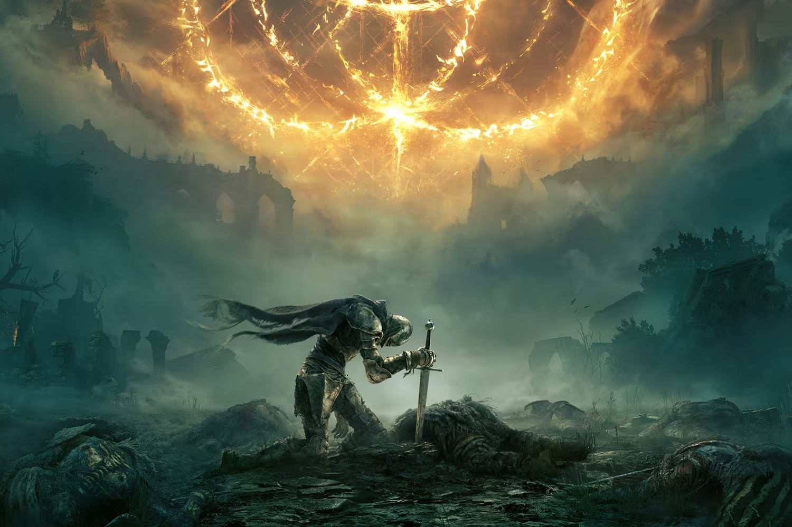

+++
title = "Sony voudrait bien avaler FromSoftware (Elden Ring)"
date = 2024-11-19T10:47:32+01:00
draft = false
author = "Mickael"
tags = ["Actu"]
image = "https://nostick.fr/articles/vignettes/novembre/elden-ring.jpg"
+++

Sony prépare un gros coup. Le groupe [préparerait](https://www.reuters.com/markets/deals/sony-talks-buy-media-powerhouse-behind-elden-ring-sources-say-2024-11-19/) en effet l'achat de Kadokawa, un groupe japonais méconnu du grand public mais qui est la maison-mère de plusieurs studios de jeux vidéo, dont un certain FromSoftware. Oui, le créateur d'*Elden Ring*, *Armored Core* et des jeux *Souls* ! 

Sony a déjà un pied dans la maison, puisque le géant japonais possède 2 % du capital de Kadokawa ainsi qu'un petit morceau de FromSoftware qui roule sur l'or en ce moment, après le succès d'*Elden Ring* (25 millions de copies vendues) et de son extension « Shadow of the Erdtree » (5 millions en trois jours). Une acquisition pure et simple aurait de sérieuses conséquences pour le marché tout entier, au vu du succès des franchises du studio sur toutes les plateformes.

Et ça n'est pas tout. Kadokawa possède également Spike Chunsoft, Gotcha Gotcha Games et Acquire, à qui l'on doit tout récemment *Mario & Luigi : L'Épopée fraternelle*. Si la transaction devait aller au bout, ce qui pourrait être le cas dans quelques semaines, Nintendo devra se trouver un autre studio pour la suite des aventures du duo (si jamais c'était dans les tuyaux).

À l'origine, Kadokawa (fondé en 1945) était un éditeur mais l'entreprise s'est diversifiée dans les animes, la gestion d'événements, et bien sûr les jeux. Sony pourrait d'ailleurs s'intéresser autant aux jeux qu'à la propriété intellectuelle détenue par sa proie comme *Delicious in Dungeon* ou encore *Re:Zero*.