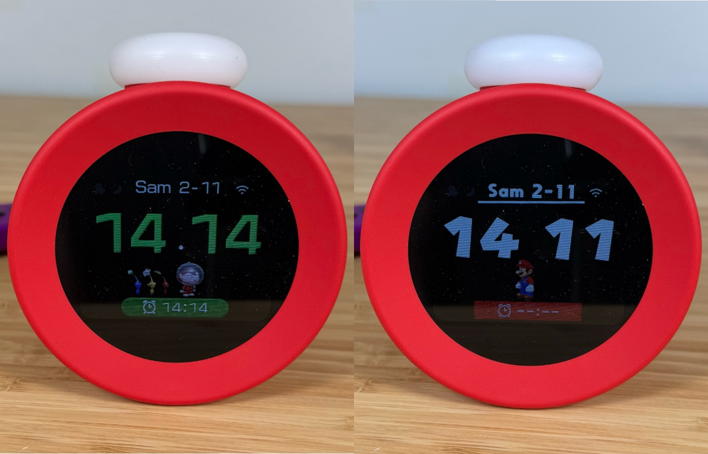

+++
title = "Test d'Alarmo : le réveil de Nintendo mise tout sur le fun à gros prix"
date = 2024-11-19T17:07:32+01:00
draft = false
author = "Mickael"
tags = ["Test"]
type = "une"
image = "https://nostick.fr/articles/vignettes/novembre/alarmo.jpg"
+++

**Se lever chaque matin, c'est compliqué pour tout le monde. Alors pourquoi ne pas laisser Nintendo s'occuper de ce moment pénible ? L'Alarmo, le dernier des produits déroutants du constructeur, est un réveil amusant, pas inintéressant d'un point de vue technologique, mais vendu trop cher.**

Cela faisait des années que Nintendo planchait sur un mystérieux appareil « Quality of Life™ » lié de près ou de loin au sommeil. Mais alors que tout le monde avait oublié l'existence de ce projet farfelu, l'entreprise — jamais avare en surprise — l'a rappelé à notre bon souvenir [le mois dernier](https://nostick.fr/articles/2024/octobre/0910-pas-de-switch-2-reveil-alarmo-nintendo/). L'Alarmo, puisque tel est son nom, est donc… un réveil, mais oui, dont la mission est de réveiller le dormeur grâce à des sons et des musiques tirés de ses jeux.

## Le réveil de chez Wish

Tout de suite, on a envie de dire : mais pourquoi ? Et malheureusement, la première impression qui se dégage de l'Alarmo n'est pas très engageante. Le plastique du réveil fait un peu cheap, les mouvements des boutons n'inspirent aucune confiance, l'écran qui dans la com' de Nintendo semble bien rond est en fait bêtement rectangulaire… À cela s'ajoute l'absence d'adaptateur secteur : pas terrible pour un produit vendu 100 €.

Et la configuration initiale n'est guère plus engageante. L'écran LCD de 2,8 pouces ayant oublié d'être tactile, il faut tout se coltiner avec le gros bouton-molette du dessus — la saisie du mot de passe Wi-Fi est un sacré challenge, pour peu qu'il soit un peu long et compliqué. 

Mais reléguer l'Alarmo au rang d'arnaque serait injuste. Nintendo a en effet pensé son affaire, d'abord en intégrant un capteur de mouvement qui se révèle particulièrement précis. Ce capteur qui balance ses ondes radio millimétriques (mmWave) sur la fréquence des 24 GHz, a pour mission principale de couper l'alarme lorsque l'utilisateur bouge du lit.

Mais gare : il faut se lever au complet pour éteindre complètement le réveil ! Il est impossible de prendre l'Alarmo en traître, en bougeant un peu pour lui faire croire qu'on est debout : l'appareil va se faire entendre quelques minutes plus tard, à un volume plus élevé. Pas question de traîner au lit, vous êtes prévenu.

Ce capteur, qu'on peut retrouver dans le monde automobile pour des technologies de conduite autonome ou encore dans des drones, a une deuxième utilisation pratique : l'écran, habituellement éteint quand il n'y a aucun mouvement, se réveille d'un simple geste de la main. Utile pour connaitre l'heure en plein milieu de la nuit sans avoir à déplacer le bras vers la table de chevet, au risque de faire tomber un truc par terre et de réveiller toute la maisonnée.

Le capteur a deux autres avantages. Avec ses ondes radio, il fonctionne de jour comme de nuit, ce qui tombe plutôt bien. Et surtout, ce n'est pas une caméra : de quoi rassurer tous ceux qui craignent pour la confidentialité de ce qui peut se passer sous la couette 👀. Dans le même ordre d'idée, il n'y a aucun micro dans l'appareil.

Revers de la médaille, le composant détecte *tous* les mouvements, y compris ceux du chat et du chien qui dorment ou font la fête sur le lit, ou encore le compagnon qui partage votre nuit. Afin d'éviter les faux positifs, Nintendo recommande de remplacer la détection des mouvements par un appui sur la molette centrale pour couper l'alarme. Le capteur reste cependant toujours actif pour enregistrer les mouvements et allumer l'écran la nuit en cas de besoin.

Il ne suffit pas d'écraser le bouton pour avoir la paix. En fait, c'est l'équivalent du bouton Mute, l'alarme retentira de nouveau quelques minutes plus tard à moins de demander explicitement l'arrêt du réveil. Le bouton-molette, qui intègre une LED RGB participe également à la fête en s'illuminant de mille couleurs.

## Debout là-dedans

Trois types d'alarmes sont proposés : 

- mode énergique pour un réveil vigoureux, et si Alarmo détecte que vous traînez encore au lit au bout de 20 minutes, l'intensité de l'alarme va augmenter ;
- mode modéré avec une sonnerie qui commence doucement mais qui augmente en intensité progressivement (elle sera au plus fort au bout de 20 minutes) ;
- mode tranquille avec une sonnerie pas trop forte et qui n'augmente pas en intensité.

L'alarme en elle-même consiste en une musique tirée d'un des cinq jeux disponibles : *Super Mario Odyssey*, *Splatoon 3*, *Pikmin 4*, *Zelda: Breath of the Wild* et *Ring Fit Adventure*. Les cadrans de l'horloge s'adaptent d'ailleurs au choix du jeu, ce qui est plutôt sympa. Chacun d'entre eux compte 7 sonneries, et hélas on ne peut pas les écouter histoire de se faire une idée. Si vous voulez avoir la surprise, il est possible de laisser le hasard choisir la sonnerie et/ou le jeu.

 

La musique s'accompagne d'une image tirée du jeu ; ce n'est pas une vidéo ni une animation malheureusement, mais une simple image à l'écran. Dès qu'Alarmo repère un geste, l'image rétrécit jusqu'à disparaitre dans un nuage de poussière. Elle reviendra au bout de quelques minutes avec son alarme si le réveil détecte que vous n'êtes pas levé ; mieux encore, l'image pourra être différente avec un personnage un peu plus « persuasif » (comme Bowser, par exemple).

L'Alarmo permet également de sélectionner les jours où l'alarme ne doit pas retentir, en revanche il n'est pas possible de choisir une heure de réveil pour un jour spécifique. Il faudra donc bien penser à régler l'alarme la veille, au risque d'une mauvaise surprise. Bon à savoir : si Alarmo ne détecte personne dans la zone de détection du lit, il ne sonnera tout simplement pas. 

 

Nintendo a d'ores et déjà prévu de livrer de nouvelles alarmes  pour deux jeux supplémentaires : *Mario Kart 8 Deluxe* et *Animal Crossing*. Le réveil utilisant le Wi-Fi (sur la bande unique des 2,4 GHz), il peut se brancher à internet pour récupérer ces contenus — mais il faudra au préalable connecter son compte Nintendo, ce qui passe par un code QR à flasher sur son smartphone. Pas besoin de saisir le mot de passe du compte depuis Alarmo, ouf !

## Un réveil pas très joueur

Alarmo comprend trois fonctions périphériques. La première est probablement la plus étonnante : Alarmo affiche chaque matin un graphique des mouvements enregistrés dans la nuit. Cela permet de savoir si on a beaucoup bougé, par exemple. On aussi droit à des relevés de l'heure d'éveil, et de la durée du sommeil. 

Toutes ces informations, également disponibles dans un historique, ne sont guère utiles en tant que telles et Nintendo aurait été mieux avisé de plancher sur un vrai suivi du sommeil, et peut-être était-ce son intention. En l'état, l'intérêt de ces données est faible, ce d'autant que l'écran tout petit ne permet pas vraiment de bien apprécier (ou même lire) les graphiques.

L'appareil propose également un carillon horaire qui sonne donc toutes les heures, uniquement entre l'heure de réveil et celle de coucher. Les réveils se trouvant habituellement dans les chambres, le carillon risque de sonner pour rien (on ne traîne pas toute la journée dans la chambre, enfin, la plupart du temps !) mais c'est une attention sympathique qui ne coûte pas cher.

Avant de se mettre au lit, Alarmo peut aussi produire des sons relaxants pour aider l'utilisateur à s'endormir. Il faut au préalable régler une heure de coucher, puis aller au lit après cette heure. La musiquette cessera au bout de cinq minutes.

Sous son allure de réveil Aliexpress, Alarmo est plus complexe et riche qu'il n'y parait. D'ailleurs, chaque matin il envoie une notification pour lire une astuce ou en apprendre davantage sur une fonction — il y a même un bouton dédié entièrement à ces notifications !

L'expérience du réveil le matin (ou à n'importe quel moment de la journée, chacun vit sa vie) est-elle réellement améliorée par rapport à la grisaille habituelle ? Après deux semaines avec l'Alarmo, je suis toujours étonné d'entendre des musiques de *Super Mario* ou de *Splatoon* ! C'est peut-être que ça fonctionne bien finalement, vu que je me réveille très vite. Bonus appréciable : l'iPhone n'est plus sur la table de nuit pour sonner le réveil.

Je regrette par contre que Nintendo ne fasse pas grand chose de ce capteur de mouvements. Lors de la configuration initiale, la calibration de l'Alarmo nécessite de diriger Mario avec des gestes. Cela fonctionne rudement bien et on ne peut s'empêcher de penser à ce que donnerait un « vrai » jeu avec une telle technologie. Après tout, depuis la Wii, Nintendo est fan de motion gaming.

Les concepteurs du réveil ont expliqué qu'[ils ne voulaient pas « gamifier » le sommeil des utilisateurs](https://nostick.fr/articles/2024/octobre/1210-backlog-silent-hill-2-roblox-little-big-planet-3-alarmo-balatro/#la-grosse-info-de-la-semaine--nintendo-sonne-lalarme), ce qui est louable, mais on sent que ce capteur a beaucoup de potentiel pour d'autres usages. Le retrouvera-t-on au cœur de la Switch 2 ? Pour le reste, et malgré les bonnes idées, on a tout à fait le droit de penser que le prix demandé est franchement abusé au vu de la qualité matérielle du produit.

*Alarmo est vendu [99 €](https://www.nintendo.com/fr-fr/Hardware/Le-reveil-musical-de-Nintendo-Alarmo/Le-reveil-musical-de-Nintendo-Alarmo-2670177.html). À l'heure actuelle, seuls les abonnés NSO peuvent l'acheter ; il sera disponible pour tous mi-janvier.*

 

