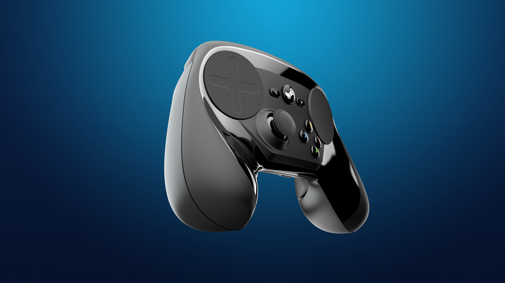

+++
title = "Valve a visiblement un deuxième Steam Controller dans les tuyaux"
date = 2024-11-19T19:28:32+01:00
draft = false
author = "Félix"
tags = ["Actu"]
image = "https://nostick.fr/articles/vignettes/novembre/elden-ring.jpg"
+++

Wow wow wow, on arrête tout : Valve s’apprêterait à lancer un Steam Controller 2 ! L’info a été repérée par le fouineur Brad Lynch, qui [estime](https://x.com/SadlyItsBradley/status/1858925211363553316) que la manette a pour nom de code « Ibex ». Le projet serait bien avancé et en cours de préparation pour la production de masse, ce qui laisse à penser qu’une annonce ne devrait plus trop tarder. 

Pour ceux qui n’auraient pas suivi, le [Steam Controller](https://store.steampowered.com/app/353370/Steam_Controller/) est une manette signée Valve lancée en 2015 et enterrée en 2019. Elle avait un design pour le moins surprenant avec deux trackpads cliquables et un unique joystick. Si le produit n’a pas vraiment cartonné, il a pavé la voie aux commandes du Steam Deck, qui dispose lui aussi de petits trackpads bien pratiques pour certains jeux PC.

Ce n’est pas tout, et Brad Lynch a également déniché des références liées à une nouvelle manette… pensée pour la VR ! Celle-ci ressemblerait « à une baguette » et aurait pour nom de code interne Roy. Les rumeurs assurent depuis des années que Valve prépare un casque d’entrée de gamme pour prendre la relève de son Index, sorti en 2019. La boîte à Gaben a déposé plusieurs brevets par rapport au système de serre-tête d’un nouveau modèle, qui devrait mettre l’accent sur le confort. Difficile d’en savoir plus pour le moment, mais Brad Lynch avait déniché il y a plus de deux ans maintenant des références directes à [ce « Deckard »](https://www.youtube.com/watch?v=ovlbXVwoN8s). Le projet semble donc toujours en préparation, mais comme d’hab chez Valve, on prend son temps.