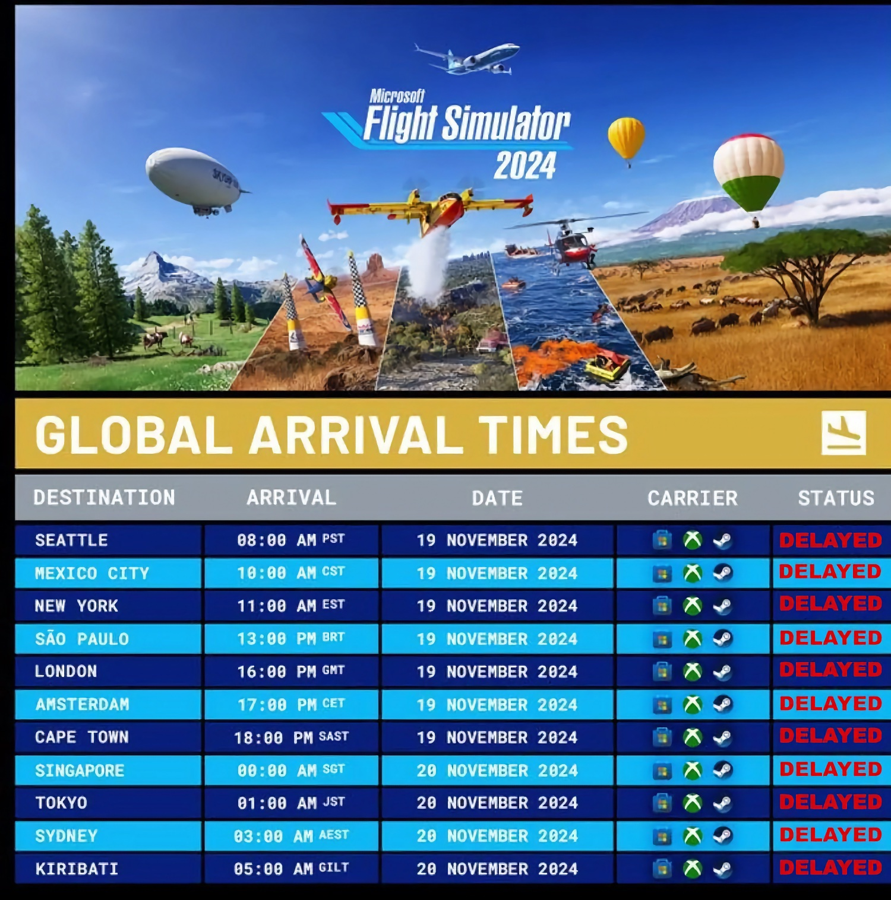

+++
title = "Décollage catastrophique pour Flight Simulator 2024"
date = 2024-11-20T08:07:32+01:00
draft = false
author = "Mickael"
tags = ["Actu"]
image = "https://nostick.fr/articles/vignettes/novembre/flight-sim-2024-5.jpg"
+++

Pour bien des pilotes en herbe, c'était le lancement de l'année. Malheureusement, *Flight Simulator 2024* s'est crashé avant même de pouvoir décoller ! La simulation de coucous de Microsoft, qui ajoute pour cette nouvelle édition un système de missions, est sortie hier, le 19 novembre. Et les serveurs n'ont pas tenu le choc sous la pression.

De nombreux joueurs sont restés coincés devant des écrans de chargement interminables, dépassant parfois les deux heures. Pire encore, après cette longue attente, la jauge de chargement se bloque à 97 %. Évidemment, ça se moque sur les internets, vous savez comment sont les gens.

 @ DRGAMESX")

Moins réjouissant pour Microsoft, les joueurs frustrés ont pris d'assaut les commentaires de [Steam](https://store.steampowered.com/app/2537590/Microsoft_Flight_Simulator_2024/) pour dire tout le mal qu'ils pensaient de ces problèmes de connexion. Résultat : le jeu écope d'évaluations « *extrêmement négatives* ». Difficile de leur en vouloir.

Microsoft a réagi par le biais du support de *Flight Sim*, qui [reconnait](https://x.com/MSFS_Support/status/1858932444260421714) le problème des temps de chargement initiaux très longs du nouveau jeu. « *Avec un grand nombre d'utilisateurs lançant simultanément le simulateur, nos serveurs reçoivent une quantité importante de requêtes* », explique le support qui conseille à tous ceux dont le chargement ne progresse plus passé 90 % de… redémarrer le jeu. Et dans les autres cas, il est recommandé de « *patienter* » !

 

Nul doute que Microsoft va mettre un point d'honneur à régler le problème fissa. Ceci étant, ça n'augure rien de bon pour l'architecture mise en place par l'éditeur : pour fournir des maps plus détaillées sans alourdir le poids du jeu (50 Go de base), *Flight Sim 2024* télécharge à la volée de nombreux éléments depuis le nuage, sans mauvais jeu de mots. Les serveurs tiendront-ils le coup ?

Et dire que c'est jour de lancement de *STALKER 2* aujourd'hui…