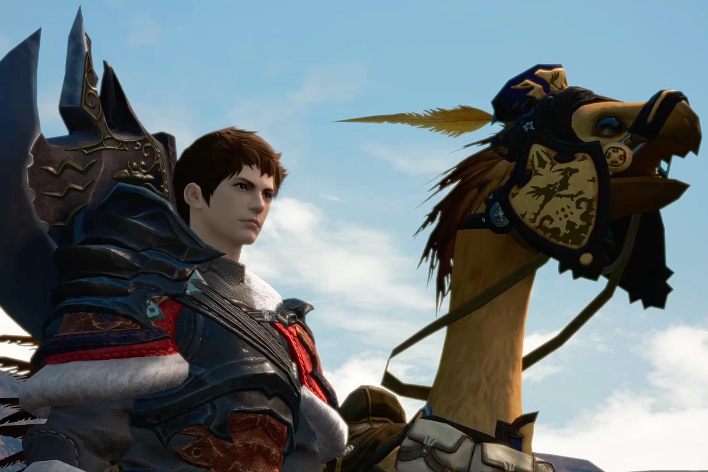

+++
title = "Final Fantasy XIV va se jouer sur les mobiles"
date = 2024-11-20T10:47:32+01:00
draft = false
author = "Mickael"
tags = ["Actu"]
image = "https://nostick.fr/articles/vignettes/novembre/ff14-mobile.jpg"
+++

Après la Xbox au mois de mars, *Final Fantasy XIV* va s'étendre à une nouvelle plateforme et pas la moindre, puisqu'il s'agit des mobiles. Le MMORPG de Square Enix, devenu au fil des ans une référence dans le domaine malgré un lancement très difficile en 2013, se [déclinera](https://ffxivmobile.com/web202409/index.html#/) sur smartphones sous la forme d'une « *extension* » du jeu dans un format « *adapté aux mobiles* ». 

 

La question de la cross-progression reste en suspens. Naoki Yoshida, directeur et producteur du jeu original, explique que la déclinaison mobile est « *la sœur de FFXIV* » qui a l'ambition de « *reproduire toute la grandeur de l’histoire originale et des mécaniques de combat, mais cette fois sur mobile* ».

Qu'on se rassure, les activités de pêche et les courses de chocobos restent au programme, tout comme les variations météo et le cycle jour/nuit. *Final Fantasy XIV* mobile est développé par LightSpeed, une filiale du géant Tencent à qui l'on doit la version mobile de PUBG. Hideaki Itsuno, le directeur de *Dragon's Dogma*, a récemment rejoint les rangs du studio. Pas de date de lancement encore, mais des tests seront organisés en Chine.