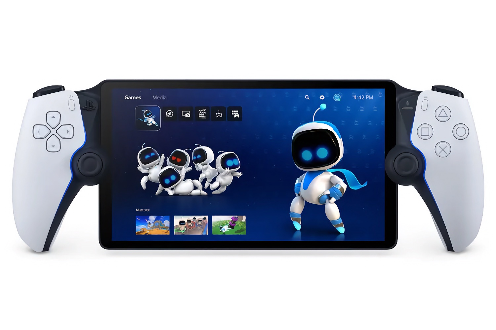
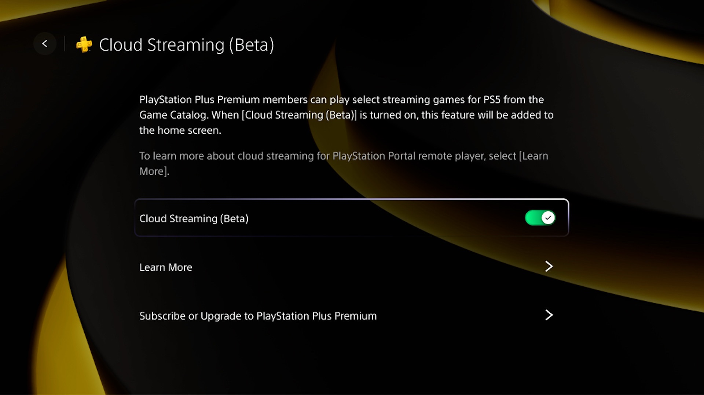

+++
title = "Le Portal peut désormais accéder à des jeux PS5 directement dans le cloud PlayStation"
date = 2024-11-20T08:47:32+01:00
draft = false
author = "Mickael"
tags = ["Actu"]
image = "https://nostick.fr/articles/vignettes/novembre/portal-playstation.jpg"
+++

Beaucoup ont regardé le Portal comme une poule devant un couteau : à quoi sert ce truc ? La tablette PlayStation encadrée par deux moitiés de manette DualSense permet de jouer aux jeux PS5 de sa console à distance, pour peu qu'on ait un bon Wi-Fi à la maison. Ça peut être pratique pour libérer la télévision familiale ou pour se payer une petite partie d'*Astro Bot* sur les toilettes !

Mais voilà, le Portal n'est pas un produit autonome… du moins à son lancement. Les choses ont quelque peu changé, et Sony donne finalement une nouvelle dimension à l'appareil : les abonnés PlayStation Plus Premium pourront streamer une sélection de jeux du catalogue PS Plus dans le nuage, comme *Miles Morales*, *Monster Hunter Rise* ou *Ratchet & Clank: Rift Apart* (120 jeux  PS5 en tout).

Plus besoin de faire tourner le jeu sur sa PS5 ! Pour en profiter, il faut installer la dernière mise à jour du logiciel de la tablette (toutes les infos sont [ici](https://blog.playstation.com/2024/11/19/the-playstation-portal-remote-player-experience-to-evolve-with-new-system-update/)).

Attention, toutes les fonctions PS Plus ne seront pas au rendez-vous, à l'instar des essais de jeux, l'audio 3D, ou encore les micro-transactions. De même, les jeux PS3 et PS4 ne sont pas supportés. Bref, c'est une bêta quoi. En termes de connexion, Sony recommande un minimum de 7 Mbps pour un stream 720p, et 13 Mbps pour du 1080p (l'écran ne monte pas plus haut). Le cloud gaming est disponible en France, en Belgique, en Suisse et au Canada, et ailleurs dans le monde.

C'est donc un début, mais prometteur pour le Portal. Sony avait inauguré le streaming de jeux sur les PS5 [l'an dernier](https://blog.playstation.com/2023/10/16/ps5-streaming-for-playstation-plus-premium-members-launches-starting-today-in-japan-europe-and-north-america-to-follow/), ce qui évite ainsi de devoir télécharger le titre au complet avant de pouvoir y jouer.
