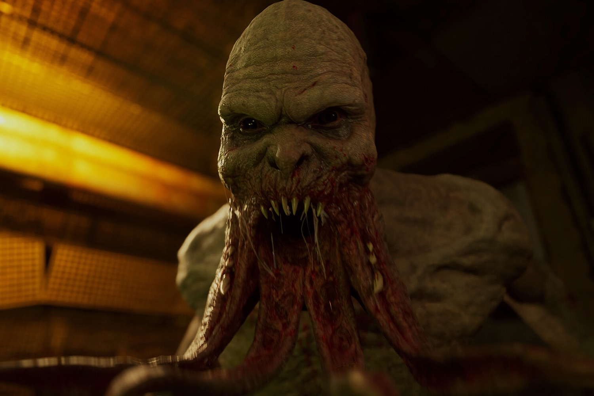
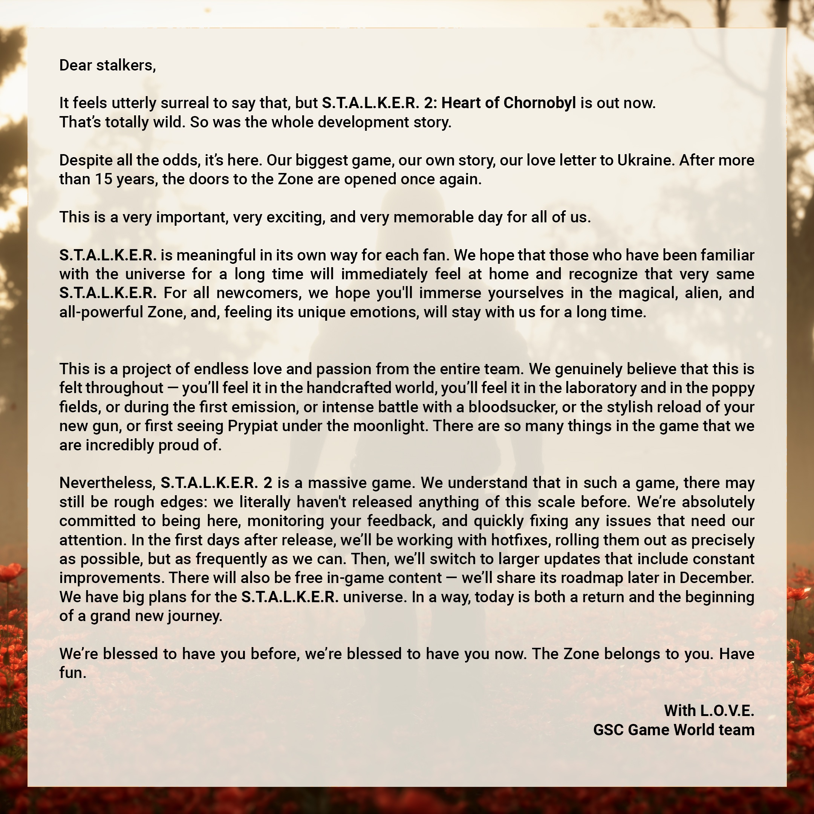

+++
title = "STALKER 2 pédale dans la choucroute radioactive, le studio promet des améliorations rapides"
date = 2024-11-21T09:27:32+01:00
draft = false
author = "Mickael"
tags = ["Actu"]
image = "https://nostick.fr/articles/vignettes/novembre/stalker-2.jpg"
+++

On ne compte plus le nombre de reports essuyés par *STALKER 2* tout au long de son développement chaotique, entre pandémie et invasion russe, mais peut-être que le jeu aurait gagné à cuire encore un peu plus longtemps. Tel qu'il est sorti hier, le nouveau FPS du studio ukrainien GSC Game World n'est pas dans un très bon état. Cela se reflète sur la note Metacritic, où le titre se coltine un petit [74](https://www.metacritic.com/game/stalker-2-heart-of-chornobyl/) de la part des testeurs.

 

La virée à Tchernobyl est un véritable cauchemar, et pas uniquement parce que le jeu est conçu comme ça. Entre des bugs en pagaille et de gros problèmes techniques, on ne peut pas dire que les premiers joueurs aient été bien reçus. C'est d'autant plus dommage que *STALKER 2* est graphiquement splendide et l'histoire que le titre développe a l'air intéressante.

GSC a entendu les premières critiques et [admet](https://x.com/stalker_thegame/status/1859265478276894856) pudiquement « *quelques aspérités* ». Les testeurs avaient d'ailleurs reçu une énorme mise à jour de 140 Go deux jours avant la sortie du jeu… Trop tard pour changer les notes chez beaucoup d'entre eux !

« *C’est tout simplement la première fois qu’on sort quelque chose d’aussi grand* », se défend le studio, qui s'engage à corriger rapidement les bugs. Des correctifs vont être mis en ligne aussi vite que possible, et « *aussi souvent que nécessaire* ». Ensuite, GSC livrera « *des mises à jour plus conséquentes, avec des améliorations régulières* ». Du contenu gratuit viendra enrichir le jeu, le planning sera publié en décembre.

Voilà qui est rassurant, mais c'est vrai que ce faux départ est un peu décourageant. Et ce qui n'arrange rien, c'est que c'est la deuxième exclusivité Xbox de la semaine qui rencontre de sérieux problèmes pour son lancement [avec *Flight Simulator 2024*](https://nostick.fr/articles/2024/novembre/2011-decollage-catastrophe-flight-simulator-2024/), et pour des raisons bien différentes. Quand ça veut pas…