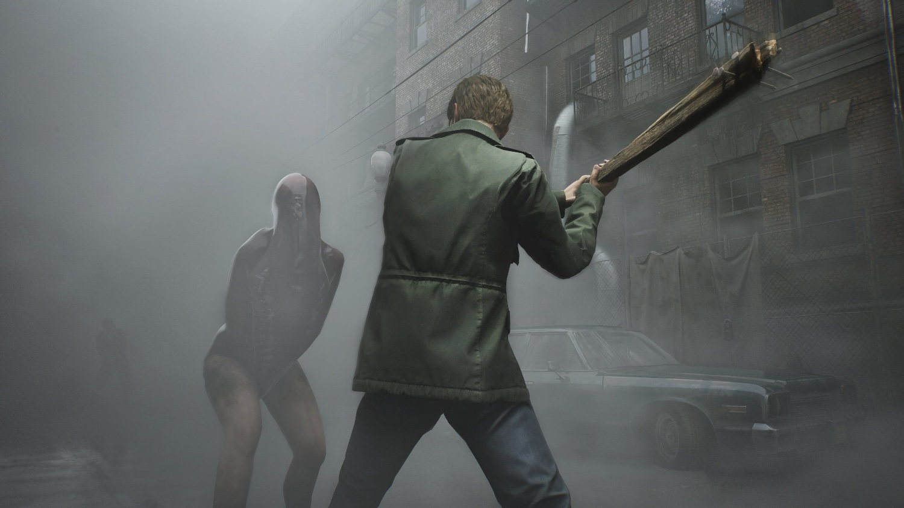
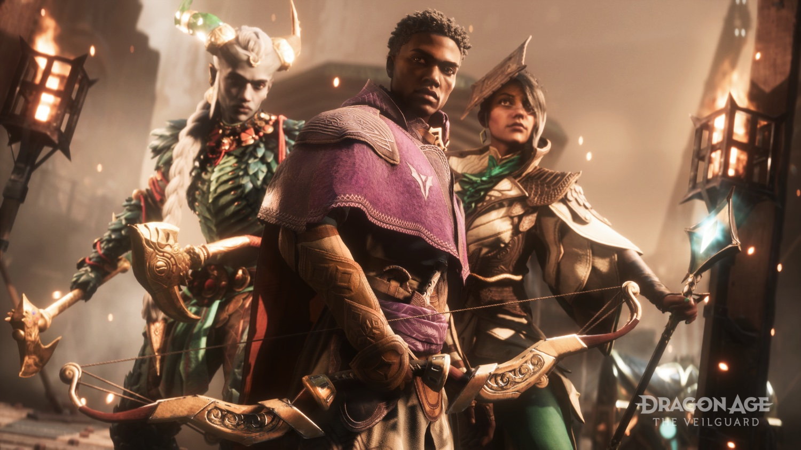

+++
title = "Et à la fin, c'est Call of Duty qui gagne"
date = 2024-11-21T05:47:32+01:00
draft = false
author = "Mickael"
tags = ["Actu"]
image = "https://nostick.fr/articles/vignettes/novembre/cod.jpg"
+++

 

Octobre a été le plus gros mois de l'année pour les sorties de jeux AAA, pensez donc on a eu droit bien sûr au dernier *Call of Duty*, à *Dragon Age: The Veilgard*, un nouveau *Super Mario Party*, au remake de *Silent Hill 2*… Il revient maintenant aux joueurs de séparer les gagnants des perdants, en votant avec leur portefeuille. Et si les premiers résultats en Europe [montrent](https://bsky.app/profile/did:plc:2ygx75jrl7xrel6qudnmgxio/post/3lbeuqz7gak2l) une progression importante des ventes (+12,4 %, selon les données GSD), tout le monde n'a pas été logé à la même enseigne.

*Silent Hill 2* prend une honorable 6e place, mais le jeu de la Bloober Team accuse tout de même des ventes en recul de 57 % par rapport à *Resident Evil 4* et de 31 % en comparaison de *Dead Space*, deux autres remakes sortis l'an dernier. La mode des jeux d'horreur est-elle terminée ? À moins que les joueurs en aient ras la casquette du genre ? En tout cas, ce n'est pas la qualité du jeu qui est en cause ici.

Décevant également, les chiffres de ventes de *Dragon Age: The Veilguard* : elles sont un cran en-deçà d'autres jeux de rôle comme *Dragon's Dogma 2* (-18 %) et *Final Fantasy 7: Rebirth* (-21 %). Là aussi, ce n'est pas un problème de qualité, le jeu de BioWare a été bien reçu par la critique. Le cas *Super Mario Party Jamboree* est un peu particulier : si les chiffres GSD se rapportent aux ventes numériques et physiques de jeux, Nintendo ne précise pas les ventes démat'. Quoi qu'il en soit, le jeu se positionne à la 5e place, avec des volumes en retrait de 6 % par rapport au précédent titre de la franchise à succès, *Superstars* (2021).

Enfin, le champion toutes catégories du mois d'octobre et probablement de l'année (en termes de ventes en tout cas) est *CoD: Black Ops 6*, qui malgré sa présence dans le Game Pass « day one », enregistre une hausse de 5 % de ses ventes par rapport à *Modern Warfare 3* à la réception calamiteuse l'année dernière. En revanche, c'est beaucoup moins que *Modern Warfare 2* qui affichait des ventes 28 % plus importantes en 2022.

Si on se concentre uniquement sur la PlayStation, *Black Ops 6* affiche des ventes 26 % supérieures à *MW3*, et 2 % de plus que *MW2*. Les joueurs PlayStation n'ont pas soudainement viré leur cuti pour s'acheter une Xbox ou un PC et s'abonner au Game Pass.

Tous ces chiffres ne concernent, rappelons-le, que l'Europe. Mais cela donne déjà une bonne idée du paysage du jeu vidéo en cette fin d'année.