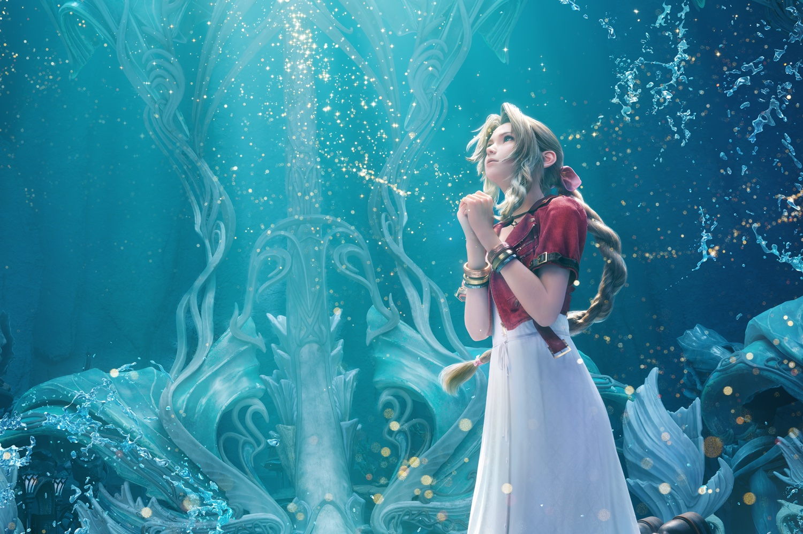

+++
title = "Il n'y aura pas de DLC pour Final Fantasy 7: Rebirth"
date = 2024-11-21T12:47:32+01:00
draft = false
author = "Mickael"
tags = ["Actu"]
image = "https://nostick.fr/articles/vignettes/novembre/ff7-rebirth-aerith.jpg"
+++

Combien d'heures de jeux dans *Final Fantasy 7: Rebirth* ? 100 ? 200 ? Des milliers ? Et vous en voudriez encore plus ?! Malheureusement, il faudra se contenter de ce que Square Enix aura offert dans le jeu ! Naoki Hamaguchi, le directeur du jeu, a [annoncé](https://www.dailystar.co.uk/tech/gaming/final-fantasy-7-rebirth-wont-34152228) au *Daily Star* qu'il n'y aura pas de DLC, contrairement à *FF7 Remake* qui avait hérité de l'amusante extension « INTERmission » avec Yuffie.

« *On entend bien le souhait des fans, toutes ces voix qui demandent ce genre de contenu* », a-t-il déclaré. « *Je comprends tout à fait, mais pour moi, ce que les fans veulent vraiment, ce n’est pas forcément du contenu additionnel. Ce qu’ils attendent surtout, c’est la troisième partie de la série, et le plus vite possible* ».

Les fans caressaient le rêve secret d'un DLC pour *Rebirth*, au vu du précédent établi par *Remake*, et puis parce que le même Naoki Hamaguchi avait fait miroiter la possibilité de contenus additionnels autour du jeu de cartes *Queen's Blood*, une des innombrables activités de *Rebirth*. Certains espéraient même un jeu au complet vendu à part. Le producteur ne n'étant pas exprimé sur ce point précis, il reste peut-être un peu d'espoir.

Quoi qu'il en soit, Squeenix est maintenant lancé à fond de train dans le développement du dernier épisode du remake de *FF7*. [Il parait que le script est terminé…](https://nostick.fr/articles/2024/novembre/1811-scenario-prochain-final-fantasy-7-boucle/)