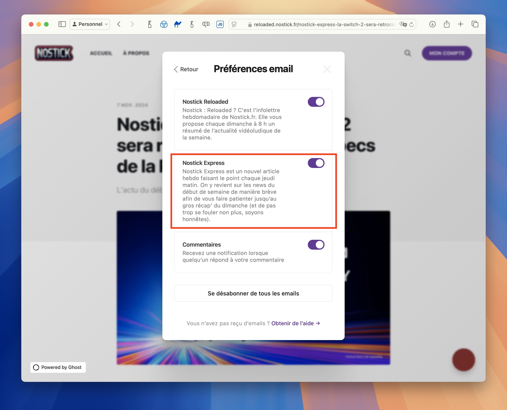

+++
title = "Le récap' du début de semaine, c'est dans notre nouvelle newsletter Nostick Express !"
date = 2024-11-21T06:53:32+01:00
draft = false
author = "Mickael"
tags = ["Actu"]
image = "https://nostick.fr/articles/2024/novembre/0711-nostick-express-rendezvous-du-jeudi/nstckexpress.png"
+++

 

L’actualité va trop vite, vous n’avez plus le temps de suivre ? Pas de panique. Notre nouvelle newsletter *Nostick Express* propose chaque jeudi matin de faire un point rapide sur l’actu du début de semaine. [Abonnez-vous, c’est gratos](https://reloaded.nostick.fr/nostick-express-la-switch-2-sera-retrocompatible-les-specs-de-la-ps5-pro/) !

Cette semaine, notre récap' du début de semaine revient sur tout ça :

- *Control 2* et les ventes que doit réaliser Remedy pour être rentable ;
- les jeux achetés sur la boutique Xbox maintenant jouables sur Xbox Cloud Gaming ;
- les cartes du monde ultra-précises créées par Niantic grâce aux joueurs de *Pokémon Go* ;
- les actus que vous avez peut-être ratées ;
- et notre revue de presse du web !

Pour lire tout ça, hop direction *[Nostick Express](https://reloaded.nostick.fr/nostick-express-la-switch-2-sera-retrocompatible-les-specs-de-la-ps5-pro/)*. Si vous êtes déjà abonné à notre infolettre du dimanche *Nostick Reloaded*, il vous suffit d'activer l'abonnement à *Nostick Express* dans les réglages de la newsletter ([par ici](https://reloaded.nostick.fr/)). Il suffit de toucher/cliquer le bouton « Mon compte » en haut à droite, puis sur l'option « Gérer » des emails :

