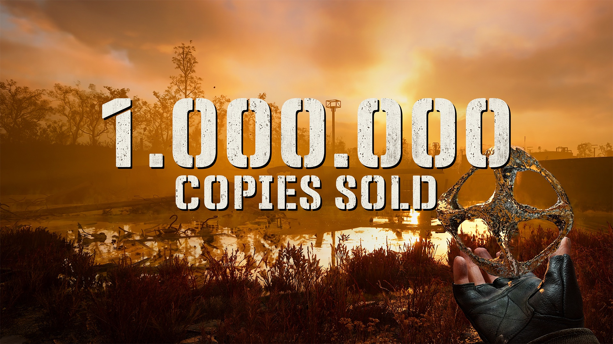

+++
title = "Carton plein pour STALKER 2, malgré les bugs"
date = 2024-11-22T10:44:32+01:00
draft = false
author = "Mickael"
tags = ["Actu"]
type = "telex"
+++

Le lancement pas facile de *STALKER 2* cette semaine n'a pas empêché les amateurs du genre de se précipiter sur le FPS de GSC Game World. Un million de copies ont déjà été [vendues](https://x.com/stalker_thegame/status/1859930792564285907) en moins de 48 heures, et le nombre de joueurs est encore plus important grâce au Game Pass où le jeu est dispo depuis le premier jour.

« *Pas étonnant qu'on se sente un peu à l'étroit dans la Zone* », s'amuse le studio. « *Ce n'est que le début de notre aventure inoubliable. Le cœur de Tchernobyl irradie plus fort que jamais avec chacun d'entre nous* ». C'est une excellente nouvelle pour le studio qui ne l'a pas eu facile durant le développement, et pour cause : GSC est basé en Ukraine.

Et *STALKER 2* est très loin d'en avoir terminé. Le jeu, une exclusivité Xbox aussi disponible sur PC, [pourrait](https://www.pushsquare.com/news/2024/11/stalker-2s-technical-troubles-likely-fixed-by-the-time-it-comes-to-ps5) sortir sur PS5 (ou [peut-être pas](https://gamingbolt.com/no-plans-for-s-t-a-l-k-e-r-2-on-ps5-game-pass-one-of-the-reasons-behind-xbox-console-exclusivity-says-dev)), et il sera débarrassé [des bugs et des problèmes techniques du lancement](https://nostick.fr/articles/2024/novembre/2111-stalker-2-choucroute-radioactive-studio-promet-ameliorations/), espérons-le. Les développeurs ont promis des correctifs réguliers et du contenu supplémentaire.