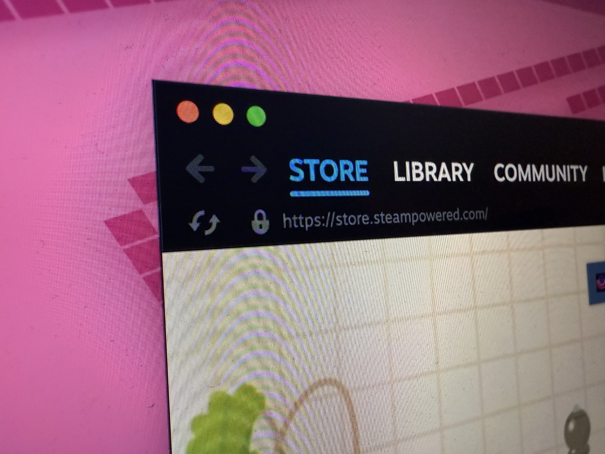

+++
title = "Steam met la pression sur les Season Pass pour protéger les joueurs"
date = 2024-11-22T08:47:32+01:00
draft = false
author = "Mickael"
tags = ["Actu"]
image = "https://nostick.fr/articles/vignettes/novembre/steam.jpg"
+++

Steam serre la vis aux éditeurs et développeurs qui promettent du contenu supplémentaire payant sans livrer la marchandise. La boutique a [modifié](https://partner.steamgames.com/doc/store/seasonpass) sa politique qui définit désormais précisément ce qui peut être qualifié d'extension ou de DLC dans un Season Pass, et la manière d'en faire la promotion.

« *Vous vous engagez à fournir du contenu futur* », peut-on lire dans les nouvelles directives. « *Lors du lancement d’un Season Pass, vous devrez définir un calendrier précis pour la sortie de chaque contenu inclus. Ce calendrier représente un engagement envers les clients et Steam. Si vous n’êtes pas en mesure de communiquer clairement sur le contenu de chaque DLC ET sur les dates prévues de leur sortie, vous ne devriez pas proposer de Season Pass sur Steam* ».

Les développeurs ne peuvent pas se contenter de publier un calendrier, ils sont aussi tenus de respecter les promesses en livrant effectivement le contenu promis. « *Si les clients ne sont pas satisfaits du contenu que vous proposez dans le Season Pass ou des délais de sortie, cela se reflétera dans les ventes et les avis* », prévient Steam.

Les développeurs ont obligation de détailler, même sommairement, tous les DLC inclus dans un Season Pass, avec une date de sortie (cela peut-être un trimestre). Et au moins un DLC doit être disponible au lancement, sauf pour les précos de versions Deluxe.

La boutique de Valve, consciente que le développement de jeux ne se déroule pas toujours comme prévu, donne un peu de mou aux développeurs qui pourront reprogrammer la date de sortie d'un DLC ou d'une extension prévus dans un Season Pass, mais une seule fois : « *Vous pourrez choisir une nouvelle date allant jusqu’à 3 mois après la date initiale* ». 

Ensuite, si jamais il fallait encore changer la date, le développeur doit contacter Valve, ce qui peut se terminer en remboursement des joueurs. En cas d’annulation d’un DLC dans un Pass, les clients recevront un remboursement correspondant à la valeur du contenu non publié.

Ce n'est pas le bout du monde, mais ces principes couchés noir sur blanc donnent au moins une garantie aux joueurs et une feuille de route claire pour les éditeurs et développeurs.