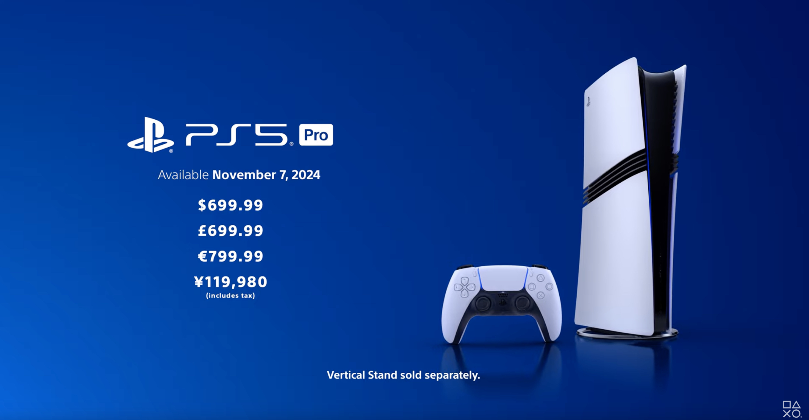
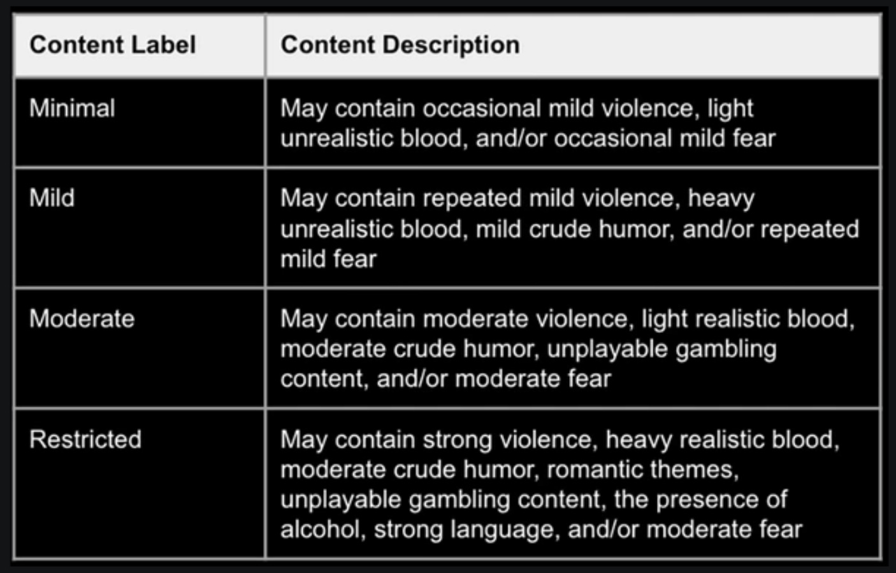

+++
title = "On vide le backlog de la semaine : un monde sans Xbox, l'effort de Roblox pour protéger les jeunes joueurs, toujours de la vie chez PlayStation mobile"
date = 2024-11-23T06:55:32+01:00
draft = false
author = "Mickael"
tags = ["XXL"]
image = "https://nostick.fr/articles/vignettes/novembre/star-wars-outlaws-lando.jpg"
+++

L’actualité du jeu vidéo ne s’arrête pas à la poignée d’articles publiés sur *Nostick* ! Histoire de rattraper le retard accumulé, voici un retour rapide sur quelques unes des infos les plus importantes (ou insignifiantes) de la semaine.

## Les chiffres de la semaine : Farming Simulator 25, Pokémon JCC Pocket, Mouthwashing

 

C'est le *Call of Duty* de la simulation de ferme : quoi qu'il arrive, *Farming Simulator* fera un carton, et l'édition 2025 ne  déroge pas à la règle. Le jeu de Giants Software a [dépassé](https://www.pcgamer.com/games/sim/farming-simulator-25-harvested-a-crop-of-2-million-players-in-its-first-week/) les 2 millions de copies en une semaine, ce qui en fait le plus gros succès de la franchise. *FS 22* s'était contenté, si on peut dire, de 1,5 million d'exemplaires sur le même laps de temps. La série a vendu pour plus de 40 millions de copies. Ça en fait des agriculteurs en herbe !

*Pokémon JCC Pocket* poursuit sur sa lancée. Le jeu de cartes/gacha/drogue dure de la Pokémon Company continue de faire les poches des dresseurs amateurs : trois semaines après son lancement, l'app a [dépassé](https://www.pocketgamer.biz/pokmon-trading-card-game-pocket-surges-past-100-million-in-17-days/) les 120 millions de dollars de revenus selon AppMagic ! Et dire qu'avec tout ça, je n'ai toujours pas complété mon Cartodex…

 

Le très sympathique (et court, [lire notre test](https://nostick.fr/articles/2024/novembre/0611-ca-va-faire-votre-soiree-moutwashing/)) jeu d'horreur *Mouthwashing* a une excellente bande son. À tel point qu'elle a dépassé le million de streams sur Spotify et les autres plateformes de streaming ! Les royalties sont si élevées que Martin Halldin, le designer son du jeu, peut [s'offrir](https://x.com/siarate/status/1857861976510079106) royalement… deux (2) hot-dogs. Impossible de se plaindre franchement.

## La grosse info de la semaine : à quoi ressemblerait un monde sans Xbox ?

Qu'on se rassure, « *nous continuerons à construire des consoles à l'avenir, c'est certain* », [affirmait](https://www.rollingstone.com/culture/rs-gaming/xbox-console-future-cloud-ceo-phil-spencer-1235166597/) Phil Spencer la semaine dernière à *Rolling Stones*. Le grand patron de l'activité jeux chez Microsoft rassurait les joueurs de la team green, légitimement inquiets de la tournure que prennent les choses chez le constructeur depuis un an ou deux. 

Certes, il y a cette console portable qui [n'arrivera « *pas avant plusieurs années* »](https://nostick.fr/articles/2024/novembre/1311-xbox-portable-pas-avant-plusieurs-annes/), et Sarah Bond, la présidente de Xbox, a fait [miroiter](https://news.xbox.com/en-us/2024/02/15/xbox-promise-bring-more-games-to-more-players/?ocid=BlogSupport_soc_omc_xbo_tw_Link_lrn_2.15.2) un futur boîtier bénéficiant du « *plus grand saut technique* » dans une nouvelle génération de console de salon. Malgré [l'absence d'une Series X « pro »](https://nostick.fr/articles/2024/novembre/1511--xbox-series-x-pro-arrivera-jamais/) à même d'en remontrer à la PS5 Pro, Microsoft n'a donc pas abandonné l'idée de faire du matos. 

 

Mais ça n'est visiblement plus une priorité. [Dans un monde où « tout est une Xbox »](https://nostick.fr/articles/2024/novembre/1411-tout-est-une-xbox-maintenant/) comme le martèle la nouvelle campagne de pub pour la plateforme, pourquoi diable vouloir s'acheter une « vraie » Xbox ? Les résultats financiers du dernier trimestre montrent clairement que [ce sont les jeux, et non les consoles, qui constituent la vache à lait de Xbox](https://nostick.fr/articles/2024/octobre/3110-xbox-vend-plus-jeux-moins-conosles/), les ventes de ces dernières ne cessant de chuter. 

Cela dit, il faudra attendre prudemment les chiffres de fin d’année : jusqu’à présent, les comparaisons se faisaient avec un Microsoft sans Activision. Le quatrième trimestre sera le premier où les performances de l’éditeur seront pleinement intégrées dans les comptes. Quoi qu'il en soit, les futures consoles Xbox répondront à deux besoins bien identifiés : les joueurs mobiles, et ceux qui veulent le top du top technique avec tous les acronymes qui vont bien (8K, 120 FPS, HDR, VRR…), peu importe le prix.

Pour le gros du marché, celui du salon de monsieur et madame tout le monde, Microsoft semble bien avoir fait son deuil. Plus que jamais, l'entreprise mise sur le Game Pass, Xbox Cloud Gaming et les jeux multiplateforme pour faire son beurre. Et aucune exclusivité Xbox ne sera épargnée : le même Phil Spencer a expliqué qu'[il n'y avait aucune ligne rouge, pas même pour *Halo*](https://nostick.fr/articles/2024/novembre/1311-xbox-portable-pas-avant-plusieurs-annes/).

C'est évidemment positif pour les joueurs, qui profiteront de ces licences au-delà du PC et de la Xbox. En revanche, la disparition plus ou moins programmée du matos Xbox risque de provoquer un mouvement des plaques tectoniques sous le paysage de la console. Sony, et dans une moindre mesure Nintendo qui ne joue pas vraiment sur le même terrain, vont se retrouver au coude à coude. 

Sony a déjà montré [des signes inquiétants d'abus de position dominante](https://nostick.fr/articles/2024/septembre/1409-backlog-ps5-pro-destiny-2-the-crew-2/#la-grosse-info-de-la-semaine--le-retour-de-lhubris-de-playstation). Le prix de la PS5 Pro est significativement plus élevé en Europe (800 €) et au [Japon](https://www.japantimes.co.jp/commentary/2024/09/18/japan/ps5-pro-price-sticker-shock/) (119 980 yens, soit environ 740 €) où les tarifs sont TTC, en comparaison des États-Unis (700 $, soit à peu près 665 €). Certes, outre Atlantique il faut ajouter des taxes de vente, mais elles sont généralement beaucoup moins élevées qu'ailleurs. 

Si la nouvelle console est plus abordable (toutes proportions gardées) aux États-Unis, la raison est simple : Xbox fait de la résistance sur son marché domestique. La concurrence y est (un peu) plus forte que dans d'autres pays, obligeant Sony à ravaler un peu de ses marges. Mais le jour où Microsoft ne s'adressera plus qu'à deux marchés de niche — les joueurs mobiles et les fans hardcore —, Sony sera pratiquement seul en piste, sans concurrence.

On pourrait penser que l'espace laissé vacant par Microsoft créera un appel d'air pour que d'autres se lancent. Google, Amazon, éventuellement Apple[^1] ou Disney, pourraient s'intéresser à ce marché… Mais existe-t-il une raison valable pour se lancer ? 

Les investissements pour concevoir une console de salon sont colossaux, d'abord en termes matériel avec des retours financiers très modestes (les marges sont si faibles que les consoliers vendent souvent à perte). Surtout, il ne suffit pas de lancer une console : il faut aussi des jeux dont les budgets et les temps de développement ont explosé. Qui serait assez fou pour se lancer dans une telle entreprise ?

Et des jeux, Microsoft en a. À tel point que l'éditeur peut se permettre de repousser à février prochain un triple A terminé — *Avowed* — initialement prévu en fin d'année. Le groupe compte plus de 40 studios grâce à l'acquisition d'Activision Blizzard King, et le plus gros hit du secteur, *Call of Duty*.

Xbox sera ravi de vendre ses jeux sur les consoles concurrentes, à commencer par *Call of* : Microsoft s'est engagé à livrer le FPS pendant 10 ans aussi bien chez PlayStation que sur la future Switch. Et probablement au-delà, car après tout ce serait bien bête de perdre de l'argent. Si on voit mal Sony et Nintendo ouvrir leurs portes au Game Pass, les joueurs de ces plateformes ne seront pas privés des franchises Xbox : les prochains *Doom* et *Indy* sortiront sur PS5, et en fonction des capacités techniques de la Switch 2, il n'est pas interdit de penser que la prochaine console hybride y aura droit elle aussi.

 

Sur les autres plateformes, qu'il s'agisse des smartphones, des télés connectées, des sticks TV, ou de tout appareil équipé d'un navigateur web, Xbox Cloud Gaming est déjà au rendez-vous avec [des performances plus que décentes](https://nostick.fr/articles/2024/juillet/2907-xbox-cloud-gaming-fire-tv-stick-test/), même s'il est toujours possible de faire mieux notamment au niveau de la latence. Et Microsoft a étendu son service de cloud gaming au-delà du Game Pass, avec [la possibilité de streamer les jeux de sa bibliothèque Xbox](https://reloaded.nostick.fr/nostick-express-des-nouvelles-de-control-2-xcloud-vous-laisse-streamer-vos-jeux/).

Si la transition est douloureuse, et la feuille de route pour le moins brumeuse, Microsoft est peut-être en train de sauver Xbox… et ça ne passera pas par les consoles.

## Les relous de la semaine : Roblox fait enfin des changements pour protéger les joueurs les plus jeunes

Contraint et forcé par [une enquête dévastatrice parue mi-octobre](https://nostick.fr/articles/2024/octobre/1210-backlog-silent-hill-2-roblox-little-big-planet-3-alarmo-balatro/#les-chelous-de-la-semaine--pédophilie-et-chiffres-bidonnés-roblox-sous-le-feu-des-critique), Roblox a finalement [pris](https://corp.roblox.com/newsroom/2024/11/major-updates-to-our-safety-systems-and-parental-controls) quelques mesures pour renforcer la sécurité des plus jeunes joueurs qui sont aussi la cible principale de la plateforme… et des prédateurs qui y pullulent. 

Les utilisateurs de moins de 13 ans ne peuvent plus accéder à la plupart des fonctions de la messagerie. Les résultats de recherche et les recommandations excluront les jeux qui n'affichent pas d'étiquettes d'âge. Des étiquettes qui vont changer, elles indiqueront le « *type de contenu auquel les utilisateurs doivent s'attendre* ». Selon Roblox, cette modification devrait fournir aux parents « *une plus grande clarté pour faire des décisions informées sur ce qui est approprié pour leurs enfants* ».

Les utilisateurs de moins de 9 ans seront restreints aux contenus portant l'étiquette « minimal » ou « léger ». Le contenu « modéré » leur sera accessible, mais uniquement avec l'accord des parents. Les développeurs ont jusqu'au 3 décembre pour mettre à jour leurs jeux en vue de respecter ce nouvel étiquetage. Sinon, leurs jeux seront automatiquement interdits au moins de 13 ans.

Un nouveau type de compte parent est aussi en place : après une procédure de vérification (en fournissant une pièce d'identité ou une carte de crédit), le parent pourra lier son compte avec celui de son enfant. Cela lui donnera accès à la liste d'amis et au temps passé dans *Roblox*. Des limites de temps pourront aussi être imposées.

 

*Roblox* est dans l'eau chaude après ce fameux rapport de Hindenburg Research. Trois accusations majeures sont pointées : un manque de protection des enfants, avec la présence de contenus inappropriés sur la plateforme ; des chiffres d’utilisateurs et d’engagement potentiellement gonflés depuis son entrée en bourse ; et la prise en compte de bots et de comptes multiples dans ses statistiques. 

Roblox réfute ces allégations, affirmant avoir investi dans la sécurité et respecté ses obligations financières, mais le rapport soulève des préoccupations sérieuses, d’autant plus que la plateforme a déjà été critiquée pour des manquements similaires.

## Le soulagement de la semaine : la division jeux mobiles de PlayStation donne signe de vie

Vous allez voir ce que vous allez voir, un jour PlayStation va se lancer dans les jeux mobiles et ça rigolera moins… En attendant, c'est vrai que ça se moque : ça fait des années que Sony tente de structurer son activité mobile, sans aucun résultat probant… ni même de jeux, pour dire la vérité.

Et pourtant, il se passe des choses ! Olivier Courtemarche est [devenu](https://mobilegamer.biz/playstation-has-a-new-head-of-mobile/) cette semaine le patron de l'activité mobile au sein des studios PlayStation. Le précédent boss, Nicola Sebastiani, avait quitté le navire en juin 2023, deux ans après la naissance de cette division. Celle-ci était depuis gérée par Courtemarche en tandem avec un autre dirigeant, Kris Davis, qui a laissé sa place.

Le chantier mobile de PlayStation ressemble à un poulet sans tête : ça court dans tous les sens et ça s'agite, mais sans suivre de stratégie très claire. Hermen Hulst, le CEO des studios PlayStation, a affirmé encore récemment que le jeu mobile restait « *un secteur prioritaire de croissance* », mais à un stade « *très précoce* » (ça fait quand même presque 4 ans que c'est lancé…).

Des déclarations faites [lors de la fermeture en octobre des studios Firewalk (*Concord*)](https://nostick.fr/articles/2024/octobre/2910-firewalk-studios-ferme-ses-portes/) et Neon Koi, anciennement Savage Game Studios, que Sony avait justement acheté pour étendre son activité dans le jeu mobile. Bref, c'est encore un peu du n'importe quoi pour le moment et ça devrait se poursuivre pour encore un bon bout de temps.

 

Seul projet connu de la division mobile de PlayStation : *WipEout Rush*, un jeu de cartes (!) qui devait sortir en 2022. Aucune nouvelle depuis, et ça vaut peut-être mieux comme ça.

## On n'a pas eu le temps cette semaine, mais on pense à eux

 

Ubisoft ne l'a pas eu facile avec *Star Wars Outlaws*, dont le lancement fin août n'a pas connu le succès escompté. L'éditeur espère relancer la machine avec une grosse mise à jour qui améliore les points faibles du jeu, une sortie sur [Steam](https://store.steampowered.com/app/2842040/Star_Wars_Outlaws/) avec un rabais de 25 %, et un DLC, « Wild Card », qui met en scène nul autre que Lando Calrissian. Si avec tout ça Ubisoft n'est pas sauvé !

 

Après *Virtua Fighter 2*, qui remonte à 2010 tout de même, un nouveau jeu de bagarre *Virtua Fighter* a fait son apparition dans [Steam](https://store.steampowered.com/app/3112260/Virtua_Fighter_5_REVO/) ! Sega et le développeur Ryu Ga Gotoku Studio ont en effet lancé *Virtua Fighter 5 R.E.V.O.* à l'assaut des wishlists des fans du genre. Cet épisode reprend les bases du 5e épisode de 2006 en s'appuyant surtout sur *Virtua Fighter  5 Ultimate Showdown* de 2021. Selon Sega, il s'agit de « *l'édition ultime* »… [avant le remake](https://nostick.fr/articles/2024/novembre/0611-virtua-fighter-revenir-morts-sega/) !

 

Les joueurs en manque de *Paper Mario* vont pouvoir se tourner vers *Bug Fables: The Everlasting Sapling*… ou plutôt revenir vers ce RPG, sorti il y a 5 ans sur [PC](https://store.steampowered.com/app/1082710/Bug_Fables_The_Everlasting_Sapling/) et Switch. Pour fêter cet anniversaire, le studio Moonsprout Games a posté une grosse mise à jour avec de nouvelles batailles de boss, 11 médailles supplémentaires à débloquer, une nouvelle bande son et un mini-jeu de pêche, parce que évidemment. Il y a aussi des améliorations « quality of life » bienvenues. Comptez une vingtaine d'euros pour le jeu au complet (la mise à jour est gratuite).

## osef

Microsoft va [ouvrir](https://www.theguardian.com/business/2024/nov/19/minecraft-theme-park-deal-uk-us-merlin-entertainments) des parcs d'attraction *Minecraft*.

## Dans le reste de l'actu déchaînée

- *Mario & Luigi : l'Épopée fraternelle* aurait pu sortir en octobre. Ou en septembre. Ou cet été. Ou au printemps. Ou même en début d'année ! [Lisez pourquoi dans cette actu](https://nostick.fr/articles/2024/novembre/1811-mario-luigi-epopee-fraternelle-pret-un-an/).
- Maintenant que le scénario du prochain (et ultime) épisode de *Final Fantasy 7* est bouclé, le travail continue : il faut maintenant développer le jeu et [ça s'annonce pas facile](https://nostick.fr/articles/2024/novembre/1811-scenario-prochain-final-fantasy-7-boucle/).
- *Avowed* sortira en février, mais si vous acceptez de raquer un peu plus, vous pourrez vous lancer dans cette nouvelle aventure quelques jours plus tôt. [Une bonne idée ?](https://nostick.fr/articles/2024/novembre/1811-qui-veut-jouer-avowed-avance/)
- Ça ne se passe pas aussi bien que prévu du côté de la PS5 Pro : plusieurs jeux, et pas des moindres, ont des problèmes graphiques pénibles. [À lire dans cette actu](https://nostick.fr/articles/2024/novembre/1811-serieux-problemes-graphiques-ps5-pro/).
- Utiliser une manette avec des jeux qui ont quelques années, c'est pas facile ? [Sauf quand on a lu notre excellent tutotal](https://nostick.fr/articles/2024/novembre/1811-jouer-vieux-jeux-pc-steam-input/) !
- Incroyable mais vrai, la fournée de jeux VR pour la fin de l'année [vaut le coup d'œil dans cette actu](https://nostick.fr/articles/2024/novembre/1911-noel-jeux-vr-mare-trombone-champ-alien-rogue-incursion/).
- Les jeux Pokémon ramassent la mise, même quand ils sont un peu pourris comme c'est le cas d'*Écarlate/Violet*. [À lire par ici](https://nostick.fr/articles/2024/novembre/1911-pourri-pokemon-jeux-cartonnent/).
- Sony prépare un gros coup : le constructeur pourrait avaler la maison-mère de FromSoftware qui pourrait devenir un nouveau studio PlayStation. [Un coup de maître ou un coup pour rien](https://nostick.fr/articles/2024/novembre/1911-sony-acquisition-fromsoftware-elden-ring/) ?
- Il n'y avait que Nintendo pour lancer un réveil-matin ! L'Alarmo n'est pas un mauvais produit, mais c'est vraiment trop cher pour ce que c'est. [On vous en propose un test](https://nostick.fr/articles/2024/novembre/1911-test-alarmo-reveil-nintendo/).
- Valve pourrait bien remettre au goût du jour sa fameuse manette Steam Controller avec une 2e générations dans les tuyaux. [De nouvelles rumeurs à lire par ici](https://nostick.fr/articles/2024/novembre/1911-valve-steam-controller-2/).
- Grosse mise à jour cette semaine pour le PlayStation Portal, qui se donne des airs de véritable console portable (presque). [À découvrir par là](https://nostick.fr/articles/2024/novembre/2011-portal-acceder-directement-cloud-gaming-ps5/).
- Microsoft a raté deux des plus gros lancements de jeux Xbox de l'année : *Flight Simulator 2024* a rencontré [de très sérieux problèmes de serveur](https://nostick.fr/articles/2024/novembre/2011-decollage-catastrophe-flight-simulator-2024/), et *STALKER 2* est [bourré de bugs](https://nostick.fr/articles/2024/novembre/2111-stalker-2-choucroute-radioactive-studio-promet-ameliorations/). Une semaine à oublier très vite…
- Le plus étonnant, c'est que *Final Fantasy XIV* ait attendu si longtemps pour se décliner sur les smartphones. Réjouissons-nous tout de même [dans cette actu](https://nostick.fr/articles/2024/novembre/2011-final-fantasy-xiv-mobile/).
- Sans surprise, *Call of Duty: Black Ops 6* sera le carton de la fin d'année au vu des chiffres de ventes en Europe. [C'est à lire par ici](https://nostick.fr/articles/2024/novembre/2111-call-of-duty-gagne-fin/).
- Ne cherchez pas, il n'y aura pas de DLC ou d'extension pour *Final Fantasy 7: Rebirth*. Square Enix préfère se concentrer sur le développement du troisième épisode de la saga… [C'est par ici que ça se passe](https://nostick.fr/articles/2024/novembre/2111-pas-dlc-ff7-rebirth/).
- Steam a serré les boulons sur les Season Pass, en couchant noir sur blanc les obligations des développeurs et des éditeurs. On s'en parle [dans cette actu](https://nostick.fr/articles/2024/novembre/2211-steam-pression-dlc-proteger-joueurs/).
- Baldur's Gate 3 est toujours aussi populaire, et gagne même des joueurs dans les coins les plus inattendus. [Comme au Vatican](https://nostick.fr/articles/2024/novembre/2211-baldurs-gate-3-toujours-plus-joueurs-vatican/) !

[^1]: OK je rigole.