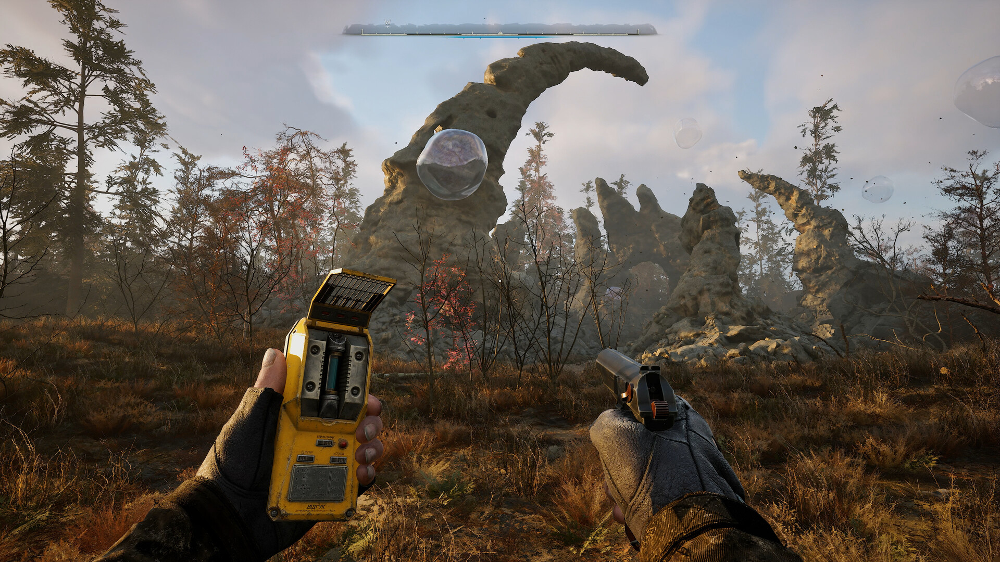
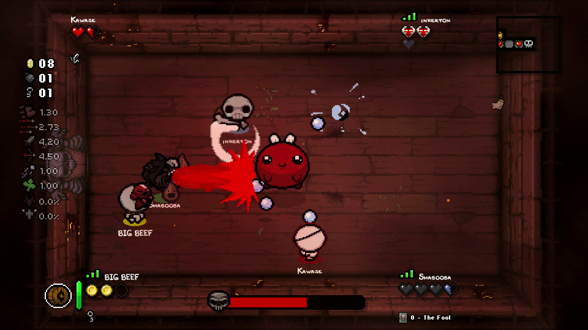

+++
title = "S.T.A.L.K.E.R 2, Flight Simulator 2024 : le récap des sorties de la semaine (24/11)"
date = 2024-11-24T07:19:02+01:00
draft = false
author = "Félix"
tags = ["C’est dispo"]
image = "https://nostick.fr/articles/2024/novembre/2411-les-sorties-de-la-semaine/stalker.jpg"
+++

 

*Entre la garderie, les courses et votre nuit blanche à attendre que Flight Sim 2024 finisse de charger, vous n’avez peut-être pas eu le temps de vous intéresser aux nouveautés du moment. Qu’à cela ne tienne : voici les sorties de ces derniers jours qui ont retenu notre attention.* 

## Stalker à t'y mettre

La grosse sortie de la semaine était évidemment ***S.T.A.L.K.E.R 2***, un FPS radioactif des Ukrainiens de GSC Game World. Il se déroule dans une Zone de Tchernobyl fantasmée remplie de mutants, d’anomalies dangereuses, de bandits et d’aventuriers venus faire fortune à la recherche de bricoles surnaturelles. On avait de quoi se faire du souci : le jeu a été annoncé en 2018 et devait sortir en 2021, mais le lancement a été repoussé plusieurs fois à cause de la guerre en Ukraine. Heureusement c’est plutôt réussi d’après les premiers retours, qui notent que la Zone conserve son atmosphère lugubre et dévastée qui a fait le succès des premiers opus. Ce jeu de survie hardcore va vous demander d’arpenter une map de 64 km², et ce de manière totalement libre étant donné qu’il vous lâche complètement dans la nature après un prologue scripté. J’y ai joué quelques heures et c’est du *S.T.A.L.K.E.R* pur jus : les gunfights sont un peu mous et ça reste brut de décoffrage, mais l’exploration et l’ambiance dingue contrebalancent largement. Attention toutefois, car comme les trois premiers opus, c’est très buggé et certains se tapent de gros problèmes de performances. Les fans de première heure peuvent foncer, les autres auront mieux fait d’attendre un ou deux patchs avant de lâcher 60 balles [sur Steam](https://store.steampowered.com/app/1643320/STALKER_2_Heart_of_Chornobyl/), PS5 ou Xbox (ou d’y jouer « gratos » dans le Game Pass).

## Asobo dans une zone de turbulence

**‌Flight Simulator 2024** est sorti cette semaine et… ouch, quel [lancement catastrophique](https://nostick.fr/articles/2024/novembre/2011-decollage-catastrophe-flight-simulator-2024/). Les serveurs étaient dans les choux le jour J, forçant un paquet de joueurs a attendre des heures avant de décoller : ils ont donc copieusement *review-bombé* la page Steam du jeu, qui affiche des critiques « plutôt négatives ». Cette nouvelle version streame une bonne partie de ses données depuis les serveurs de Microsoft, ce qui la rend logiquement plus sujette aux problèmes du genre. Quatre jours après sa sortie, difficile de savoir si le jeu est bon étant donné que quasiment personne n’a publié de test complet. Sur le papier, cette cuvée 2024 propose des environnements plus beaux, de nombreux ajouts pour une expérience plus réaliste et un mode carrière avec différentes missions (transport de VIP, évacuation médicale…). Le titre se base sur des fondations solides et les fans ont de toute façon déjà sorti la CB, mais si vous êtes un amateur et que vous avez envie de vous lancer, vous pouvez largement attendre plusieurs semaines le temps qu’Asobo serre les derniers boulons. 80 € [sur Steam](https://store.steampowered.com/app/2537590/Microsoft_Flight_Simulator_2024/), aussi dispo sur Xbox Series et dans le Game Pass.

 

## L’aventure, mais pas trop

Mis à part ça on ne va pas se mentir, la semaine a été plutôt calme. Il y a bien eu ***‌Towers of Aghasba*** qui est entré en early-access sur PC, mais ça a l’air encore un peu tôt pour s’y intéresser. Son pitch eco-friendly invite à redonner un peu de couleur à une Terre ravagée par une force mystérieuse ce qui va se traduire par la construction de colonies et la plantation d’arbres. Ce jeu d’aventure à la troisième personne se démarque surtout par ses très jolis environnements et son monde foisonnant de choses à découvrir. On va principalement y créer des jardins, reconstruire des bâtiments et escalader des trucs avec un système rappelant fortement *Breath of the Wild*. Malheureusement, de nombreux bugs et un gros manque d'optimisation viennent noircir le tableau, en plus de problèmes d’UI et d’un inventaire mal foutu. Les tests décrivent un système de craft lourdingue et des soucis d’équilibrage qui viennent quand même sacrément entraver l’aventure. Rien qui ne pourra pas être corrigé par des patchs, mais en l’état vous feriez mieux de garder précieusement [vos 29 balles](https://store.steampowered.com/app/2178070/Towers_of_Aghasba/) et de repasser une tête dans 6 mois.



## Trauma à quatre

Ce n’est pas vraiment une sortie, mais sachez que **‌The Binding of Isaac** dispose maintenant d’un mode co-op en ligne. Pour les quelques uns qui ne connaissent pas, cette légende du roguelike sorti il y a 10 ans (!) invite à venir à bout d’une suite de niveaux grâce à des équipements aléatoires récupérés sur chaque étage, donnant des combinaisons aussi farfelues que jouissives. Jusqu’à 4 joueurs en simultané peuvent désormais partir à l’aventure, le studio Nicalis ayant procédé à quelques ajustements donnant par exemple plus d’objets au fil de l’eau et permettant de rejoindre une partie en cours sans être trop désavantagé. Malheureusement, le lancement est difficile : les joueurs se plaignent de gros lags et du fait que ce DLC ne prend pas en charge les mods. Il y a un badge « bêta » et le projet a le temps de s’améliorer, mais en l'état ça a l’air encore assez expérimental. Les curieux devront obligatoirement posséder le jeu de base ([15 €](https://store.steampowered.com/app/250900/The_Binding_of_Isaac_Rebirth/)) et le DLC *Repentance* et *Afterbirth* avant de pouvoir télécharger gratuitement [cette nouvelle extension](https://store.steampowered.com/app/3353470/The_Binding_of_Isaac_Repentance/).

 

## Mais aussi

Mis à part ça, EA a dépoussiéré la franchise ***MySims*** avec un ***‌Cozy Bundle*** pour Switch [vendu 40 €](https://www.nintendo.com/fr-fr/Jeux/Jeux-Nintendo-Switch/MySims-Collection-cosy-2640109.html) comprenant deux vieux jeux Wii : pas de quoi se relever la nuit, mais ça devrait faire le taf si vous avez fait le tour d’*Animal Crossing*. Le sympathique free-to-play ***Genshin Impact*** est désormais dispo [sur Xbox](https://www.xbox.com/fr-FR/games/genshin-impact) tandis que ***Stray*** a fini par trouver le chemin de la Swich [(25 €)](https://www.nintendo.com/fr-fr/Jeux/Jeux-Nintendo-Switch/Stray-2695008.html). Un peu plus original, ***Loco Motive*** est un point n’ click inspiré des vieux jeux Lucas Art visiblement bien fichu vendu 16,19 € [pour PC](https://store.steampowered.com/app/1709880/Loco_Motive/) et Switch. 
[Pour un demi menu kebab](https://store.steampowered.com/app/2600720/Cloudy_Valley/), **‌Cloudy Valley** pourra vous changer les idées si vous en avez déjà marre de la neige et du froid. Terminons en évoquant la sortie d’un nouveau ***Inspector Waffles***, un jeu d’enquête parodiant les films noirs développé pour être autant joué [sur PC](https://store.steampowered.com/app/2614580/Inspector_Waffles_Early_Days/?curator_clanid=37116334) que sur GameBoy Color et qui a l’air plutôt rigolo (9 €).

