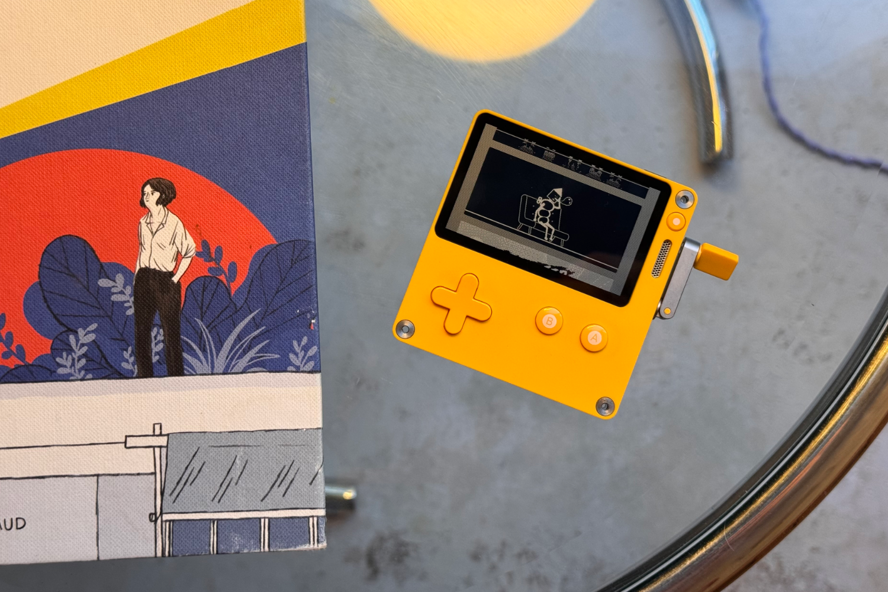
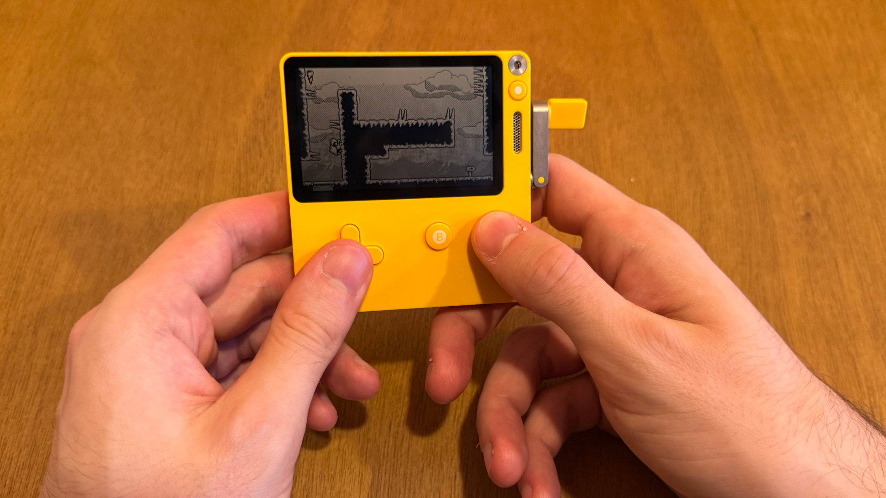
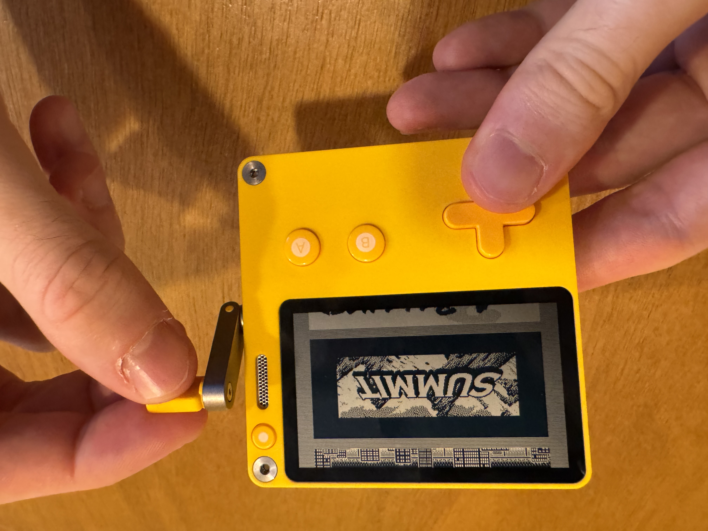
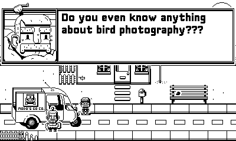
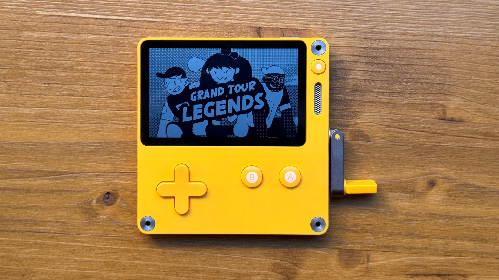
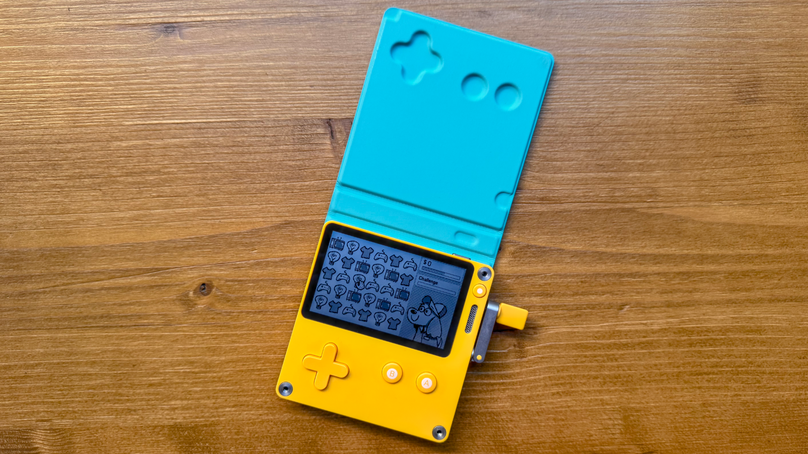
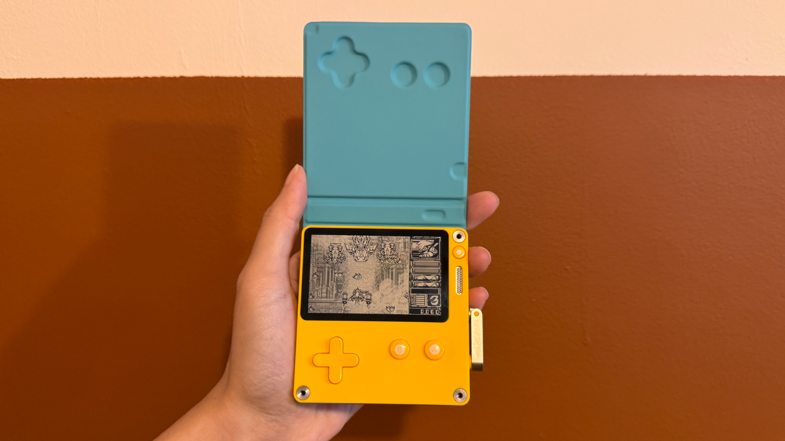
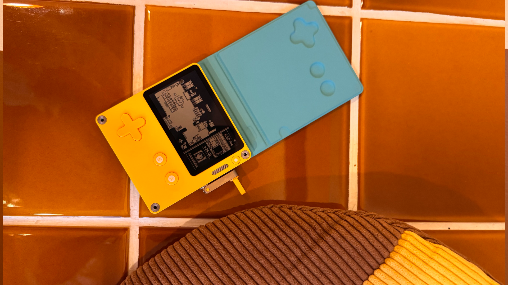

+++
title = "Test de la PlayDate : fin 2024, ça tourne toujours ?"
date = 2024-11-20T08:00:01+01:00
draft = false
author = "Félix"
tags = ["Test"]
type = "une"
image = "https://nostick.fr/articles/2024/novembre/2011-test-de-la-playdate/playdate6.jpeg"
+++

 
Cela fait maintenant plus de 5 ans que Panic a présenté la Playdate, une console portable jaune à la promesse simple : être fun. La machine ne brille pas par sa fiche technique, mais par son coloris flashy et sa petite manivelle, promesse de gameplay rigolos et de jeux-concepts. [Vendue 200 $](https://play.date), mais revenant à environ 250 € avec les taxes et la livraison en France, faut-il casser sa tirelire pour en acheter une ? Après quelques mois de test, petit retour d’expérience.

## Jaune citron

La Playdate ne cherche pas à faire rougir la Switch, ni même la 3DS ou la DS originelle : elle n’embarque qu’une dalle en noir et blanc, un processeur anémique (168 MHz) et 16 Mo de RAM. Autant vous dire qu’on est plus proche de la grosse calculette graphique que des consoles d’émulation chinoises qui inondent le marché depuis des mois. À l’avant, seuls une croix directionnelle et deux boutons se trouvent sous une touche « menu » située au niveau de l’écran. Un bouton d’alimentation au sommet sert à allumer et déverrouiller la machine. La bécane se recharge en USB-C et il est même possible de brancher des écouteurs grâce à un jack 3.5 mm.

En sortant la machine de sa boîte, on a de quoi être surpris par rapport aux visuels du site tant la Playdate est petite. Elle fait la taille d’un bloc de notes autocollantes et ne pèse que 86 grammes, ce qui est vraiment minus si vous avez de grandes mains. Cet aspect jouet se perd légèrement dès lors que l’on glisse la Playdate dans son étui officiel, qui dispose de petits picots magnétiques venant habilement se clipser dans la console. Si elle n’est pas grande, la Playdate a l’avantage de pouvoir se glisser facilement dans un sac ou une poche de blouson. Panic annonce 8 heures d’autonomie, bien que ça soit un peu moins que ça dans la pratique.

La mise en route se fait en douceur, Panic ayant créé un mini-jeu pour faciliter le premier contact. Cette introduction d’une minute met tout de suite dans l’ambiance avec des animations bon enfant superbement bien rendue sur l’écran 1 bit qui peut monter jusqu’à 50 i/s. On est très loin des GameBoy et de leurs gros pixels visibles, tout étant ici beaucoup plus fluide et défini. Les petits haut-parleurs crachent une musique rythmée tandis que l’on est invité à sortir la manivelle, jusqu’à présent restée dans sa petite encoche sur la tranche. Contrairement à ce que l’on pourrait croire, celle-ci n’est pas crantée et glisse de manière fluide entre les doigts.

## Indé-modable

Ne cherchez pas de navigateur ou d’apps préinstallées : la Playdate se veut volontairement minimaliste avec son écran d’accueil se limitant à une liste de jeux en plus d’une app de réglages pour bidouiller deux trois trucs (heure, Wi-Fi…). La console est vendue avec une « Saison 1 » contenant 24 jeux. Afin de faire durer le plaisir, ceux-ci sont distribués deux par deux chaque semaine. [Une boutique](https://play.date/games/) est également disponible, les tarifs oscillant entre 1 et 10 $ par titre. 

Les genres proposés sont variés, allant du jeu de rythme à la plateforme en passant par les puzzles, les RPG ou les jeux de bagnoles. Les plus fans pourront passer une tête sur itch.io, qui dispose aussi d’une grosse collection de projets amateurs qu’il est très facile de sideloader. À cause de son format pocket et des limitations techniques, on tombe rarement sur des jeux longs ou profonds. Cela se ressent bien sur la « Saison 1 » incluse, dont voici quelques exemples de jeux :

- **[Whitewater Wipeout](https://play.date/games/whitewater-wipeout/)** : un jeu de surf dans lequel on doit survivre le plus longtemps en faisant un maximum de figures.
- **[Pick Pack Pup](https://play.date/games/pickpackpup/)** : un match-3 dans lequel les combos ne disparaissent pas immédiatement.
- ***[Executive Golf DX](https://play.date/games/executive-golf/)*** : un jeu dans lequel il faut envoyer une balle de golf tout en haut d’une tour de bureaux.
- ***[Casual Birder](https://play.date/games/casual-birder/)*** : un RPG inspiré d’*Earthbound* dans lequel on incarne un fana d’oiseaux.
- ***‌[Omaze](https://play.date/games/omaze/)*** : un jeu d’adresse dans lequel on doit emmener une bille à la fin d’un circuit.

L’utilisation de la manivelle diffère selon les jeux. Certains comme *Omaze* ou *Whitewater Wipeout* en font leur mécanique principale (on tourne la manivelle pour déplacer son perso) là où d’autres s’en servent de façon plus anecdotique, par exemple pour choisir l’objet d’un menu ou une action occasionnelle. Si certains développeurs n’en tirent pas du tout parti, la plupart jouent le jeu : elle peut servir à faire défiler du texte, faire l’appoint d’un appareil photo, avancer ou reculer le temps, tirer une bière…

Le bilan de cette première saison est assez contrasté. Il y a bien quelques titres sympathiques comme le jeu d’aventure *[Saturday Edition](https://play.date/games/saturday-edition/)* ou l’espèce de visual-novel *[Lost Your Marbles](https://play.date/games/lost-your-marbles/)*, mais il y a aussi pas mal de loupés ou de concepts vite testés vite oubliés. Je pense par exemple aux adaptations de grands classiques comme le casse-brique, *Snake* ou *Asteroids* qui lassent après quelques minutes, voire à certains jeux à scores qui ne sont pas horribles, mais qui peineront à vous captiver après une journée de boulot. On prend globalement du plaisir à tout tester, mais forcément dans une sélection de 24 jeux bigarrés, la totalité ne fait pas mouche.

## La GameBoy des années 2020

On finit donc par se tourner vers la boutique, qui propose un large choix avec quelques perles. J’ai par exemple beaucoup apprécié le visual-novel *[Bloom](https://play.date/games/bloom/)*, dont l’intrigue avance en temps réel ou le RPG *Casual Birder*. Des jeux concepts comme *[Root Bear](https://play.date/games/root-bear/)* ou *[A Balanced Brew](https://play.date/games/a-balanced-brew/)* m’ont occupé quelques soirées. Le jeu de conduite de train *[Zero Zero: Perfect Stop](https://play.date/games/zero-zero/)* ou le visual novel *[Echoes of the Emergent](https://play.date/games/echoes-of-emergent/)* ont un aspect rétro grâce à l’écran noir et blanc qu’ils n’auraient pas sur une grosse TV couleur.

Deux ans après sa sortie, le suivi de Panic a été… moyen. Si l’entreprise a bien ajouté une boutique de jeux en parallèle de quelques mises à jour, elle tarde à activer le Bluetooth et a [mis en pause](https://nostick.fr/articles/2024/octobre/1810-stero-dock-playdate-ca-sent-pas-bon/) le développement de son dock de bureau. Une saison 2 a été annoncée, mais elle n'arrivera que [l'année prochaine](https://nostick.fr/articles/2024/octobre/3110-la-playdate-va-avoir-droit-a-une-saison-2/). Panic a dû cravacher pour rattraper le rythme des précommandes et n’a visiblement pas eu les reins suffisamment solides pour réaliser tous ses projets. Pas d’inquiétude pour les clients : la console étant déjà obsolète techniquement, une V2 ne ferait pas vraiment sens. La boîte peut donc prendre son temps et améliorer son bébé sur le long terme.

Côté développeur, c’est un peu plus enthousiasmant. Lukas Pope a publié son *[Mars After Midnight](https://play.date/games/mars-after-midnight/)*, le schmup *[‌Gun Trails](https://play.date/games/gun-trails/)* a reçu les louanges des joueurs et va être adapté sur consoles tandis que Frédérick Raynal (*Alone in the Dark, Little Big Adventure*) a lancé son runner *[Skew](https://play.date/games/skew/)*. Des jeux continuent d’être publiés régulièrement sur la boutique de la Playdate, Panic en hébergeant désormais plus de 180. C’est sûr que ce n’est rien par rapport à Steam, mais en y ajoutant les quelque 1 000 jeux trouvables [sur itch.io](https://itch.io/games/tag-playdate), on a quand même de quoi s’amuser en fouinant un peu. 

## Carton jaune

Faut-il acheter une Playdate ? Vendue plus cher qu’une Switch Lite, il est évident que le produit ne s’adresse qu’aux joueurs curieux cherchant des expériences rafraichissantes et pas forcément profondes. Les titres stars commencent à être nombreux, mais ne vous occuperont pas plus de quelques semaines si vous y revenez souvent. Les jeux amateurs sont légion, mais encore faut-il avoir le courage (et le temps !) d’aller faire du tri. Beaucoup de titres me rappellent les jeux en flash, avec des concepts forts et originaux sur lesquels on ne s’éternise pas. 

Aussi attachante soit-elle, la Playdate a quelques défauts évidents, et notamment son écran qui n’est pas rétroéclairé.  S’il est chouette à regarder en pleine lumière, vous pouvez oublier les parties au fond du lit ou lors des soirs d’hiver dans un salon mal éclairé. Il est vite énervant de devoir tordre sa lampe de chevet pour pouvoir jouer le soir, et c’est un défaut impardonnable au vu du prix.

Ajoutez à cela un tarif costaud et un catalogue de jeux courts qui finissent par revenir chers, et vous comprendrez qu’il m’est assez difficile de conseiller cette machine au joueur lambda. D’un point de vue personnel de joueur curieux et pas allergique aux indés, je dois bien admettre que la Playdate a du mal à concurrencer ma ROG Ally ou ma tour gaming quand j’arrive à dégager un peu de temps pour jouer. Les développeurs amateurs pourront y trouver leur compte, la console disposant d’une communauté active et d’outils [accessibles aux néophytes](https://play.date/dev/#cardPulp).

- La Playdate coûte 199 $ [sur le site de Panic](https://play.date), soit environ 250 € avec les frais de port et les taxes.  

