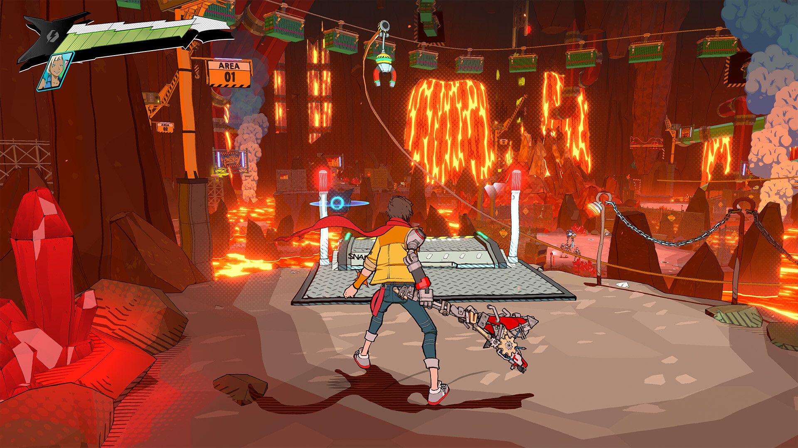

+++
title = "Krafton donne des détails sur Hi-Fi Rush 2"
date = 2024-10-01T17:30:00+01:00
draft = false
author = "Félix"
tags = ["Actu"]
image = "https://nostick.fr/articles/2024/octobre/0110-des-nouvelles-dhifi-rush/hifi.jpg"
+++

 

L’éditeur coréen Krafton a racheté le studio derrière *Hi-Fi Rush* [dans le courant de l’été](https://nostick.fr/articles/2024/aout/1208-krafton-a-la-rescousse-de-tango/) et vient de donner quelques infos sur le futur de la licence [à GamesIndustry.biz](https://www.gamesindustry.biz/we-dont-want-to-just-replicate-successful-games-behind-kraftons-acquisition-of-tango-gameworks). On y apprend qu’une suite était en développement depuis 6 mois lorsque Microsoft a décidé de tirer le rideau et que Krafton compte bien aller au bout du projet. « *Nous ne nous précipiterons pas sur le marché simplement pour livrer une suite. Nous voulons nous assurer qu'elle atteindra un niveau de qualité qui dépassera les attentes de la communauté* », a confié Maria Park, responsable du développement de Krafton. Voilà qui est rassurant.

Sur les 100 employés de Tango Gameworks, entre 70 et 80 vont revenir dans le « nouveau » studio sous l’aile de Krafton. Certains ont trouvé du travail entre temps, ce qui explique quelques départs. Maria Park affirme que les postes les plus importants seront remplacés par de nouvelles têtes. La plupart de l’équipe avait déjà migré au mois d’août, à la date de l’interview. Les droits sur les autres jeux de Tango (*The Evil Within* et *Ghostwire Tokyo*) resteront chez Microsoft, les démarches pour les rapatrier ayant été jugées trop complexes.

Quelques détails sont donnés sur la suite : les développeurs veulent apparemment miser sur des niveaux un peu plus ouverts sortant des traditionnelles usines, en plus d’une meilleure technologie pour rendre le mix gameplay/musique plus efficace. Le projet a été mis en pause pendant l’été, le temps que la licence soit transférée. En attendant, Krafton fait miroiter un futur DLC ainsi que d’éventuels portages sur d’autres plateformes. 