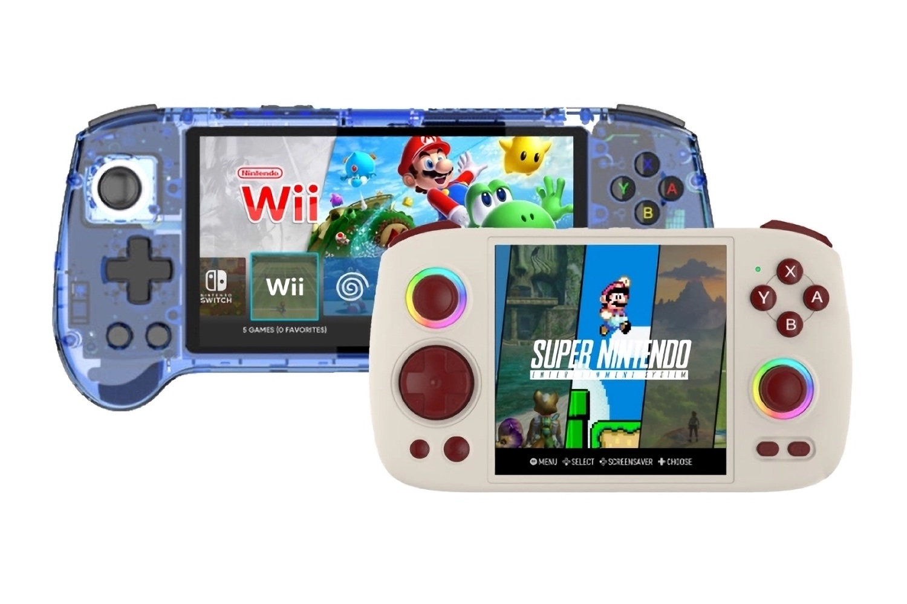

+++
title = "Nintendo frappe une chaîne YouTube spécialisée dans l'émulation"
date = 2024-10-01T17:47:32+01:00
draft = false
author = "Mickael"
tags = ["Actu"]
image = "https://nostick.fr/articles/vignettes/octobre/emu-nintendo.jpg"
+++

Nintendo poursuit sa croisade contre l'émulation. Après avoir demandé et obtenu la peau de l'émulateur Yuzu il y a quelques mois, le constructeur s'attaque désormais aux chaînes YouTube spécialisées dans l'émulation. [Retro Game Corps](https://retrogamecorps.com), une des chaînes en question parmi les plus populaires, a fait l'objet d'une demande de retrait d'une vidéo provenant directement de Nintendo.

 

« *Il semble bien que mes pires craintes se confirment, et que je sois spécifiquement visé par Nintendo* », explique Russ, l'animateur de la chaîne. « *Ma vidéo sur la Wii U a été supprimée et j'ai reçu un autre avertissement pour atteinte aux droits d'auteur, même si cette vidéo de présentation n'était pas différente de toutes les démos techniques et critiques que j'ai réalisées précédemment sur cette chaîne* ».

S'il pense avoir le bon droit avec lui — il s'agissait de la vidéo d'une console qui n'est plus en vente depuis longtemps —, Russ a tout de même décidé de ne pas répliquer, de peur de provoquer une réaction encore plus courroucée de Nintendo. En l'occurrence, une plainte en bonne et due forme.

Retro Game Corps a donc décidé de ne plus montrer de jeux Nintendo dans ses vidéos pour le moment. Et tout le contenu en lien avec Nintendo sera flouté, « *même des contenus anodins comme des jeux NES* ». La chaîne a déjà fait l'objet de deux « strikes » provenant de l'entreprise, la première concernant une vidéo montrant comment dumper des jeux Switch sur ordinateur.

Le fait est que les appareils testés par Retro Game Corps sont souvent fournis avec des centaines de ROMs à la légalité plus que douteuse. En même temps, Nintendo ne vend plus certains de ces jeux sous aucune forme. Bref, comme toujours le débat fait rage et Nintendo a choisi la voie la plus agressive.