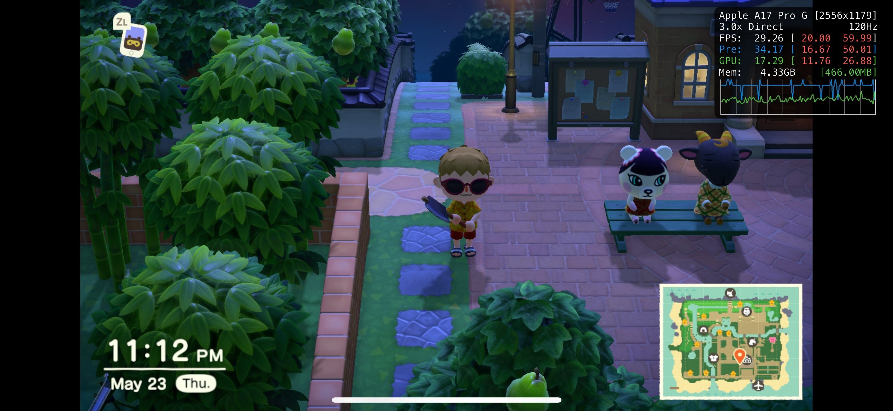

+++
title = "Émulateurs Switch : après Yuzu, Nintendo fait la peau à Ryujinx"
date = 2024-10-01T18:47:32+01:00
draft = false
author = "Mickael"
tags = ["Actu"]
image = "https://nostick.fr/articles/vignettes/octobre/ryujinx.jpg"
+++

.")

Après avoir eu la peau de Yuzu en avril dernier, Nintendo continue d'accrocher les émulateurs à son tableau de chasse avec une nouvelle grosse prise. Ryujinx tombe donc à son tour, alors que c'était à peu près le dernier émulateur Switch performant et complet. Le principal développeur du projet, gdkchan, a été contacté par Nintendo pour « *proposer un accord afin d'arrêter de travailler sur le projet* », selon un post Discord de riperiperi, un autre développeur, [partagé](https://x.com/RyujinxEmu/status/1841188744126480428) par le compte Twitter officiel de Ryujinx.

Cet accord impose le « *retrait de l'organisation et de tous les assets* ». Pour le moment, le [site](https://ryujinx.org) du projet est toujours en ligne, mais il n'est plus possible de télécharger l'émulateur sur aucune des plateformes compatibles (Windows, macOS et Linux). Le projet GitHub a également disparu du [répertoire](https://github.com/gdkchan) de gdkchan.

Le développement de Ryujinx a débuté en septembre 2017, quelques mois après le lancement de la Switch. 500 contributeurs payants ont apporté leur obole. Plus de 3 000 jeux sont jouables sur l'émulateur que Nintendo ne devait pas voir d'un très bon œil. riperiperi explique aussi qu'une version iOS de l'émulateur — jamais sortie officiellement — fonctionnait « *vraiment bien* », mais que l'app n'avait ni interface, ni activation simple de la compilation Javascript JIT dans une app iOS (indispensable pour obtenir de bonnes performances).

 

Un portage Android était aussi dans les tuyaux, et celui-ci avait une interface. Mais des problèmes de perfs et des bugs ont empêché de sortir l'application. La nature open source de Ryujinx va probablement faire en sorte que le projet va renaître quelque part, et même dans plusieurs moutures différentes. Nintendo n'en a donc pas terminé du jeu du chat et de la souris, mais pour ce qui concerne le Ryujinx originel, c'est terminé.