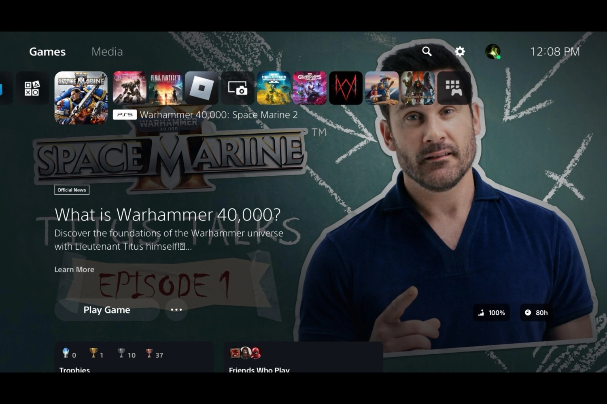
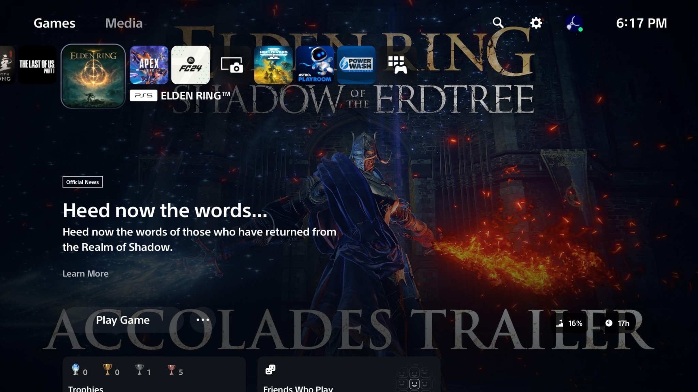
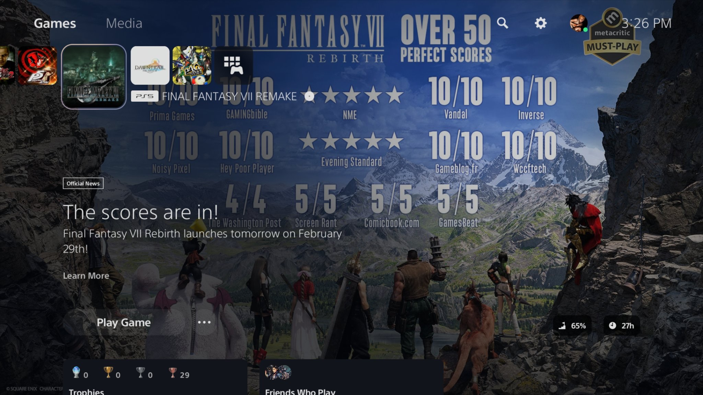

+++
title = "Sony transforme (temporairement) l'accueil PS5 en panneau publicitaire"
date = 2024-10-01T08:01:32+01:00
draft = false
author = "Mickael"
tags = ["Actu"]
image = "https://nostick.fr/articles/vignettes/octobre/ps5-pub-accueil.jpg"
+++

Ouf, ce n'était qu'un bug. Les joueurs PlayStation ont eu la surprise plus ou moins agréable de se faire servir non plus les jolies images de leurs jeux quand ils les sélectionnent dans le menu, mais la dernière actualité en lien avec le titre. 

Résultat, plutôt qu'un somptueux artwork de *Elden Ring*, le fond d'écran [affiche](https://x.com/alfredobofa/status/1840189326883262655) la vignette moche de la dernière bande annonce YouTube de *Shadow of the Erdtree*. Ou encore le visuel d'un type qui va expliquer c'est quoi *Warhammer 40,000* quand on choisit *Space Marine 2*… C'est bien simple, on se croirait chez Roku avec des images moches et des bouts d'interface qui rendent la navigation extrêmement confuse.

Pire encore, certaines de ces actus ressemblent à de la pub : c'est le jeu *LEGO Horizon Adventures* qui apparait plein écran lors de la sélection de *Horizon Zero Dawn*. Il arrive aussi ces infos soient complètement dépassées : la vignette consacrée à *Spider-Man: Miles Morales* fait la promo du film *Across the Spider-Verse* qui « *arrivera bientôt* »… même s'il est sorti en juin 2023.

Qu'on se rassure. Même si ce changement a été observé ces dernières semaines, il s'agit d'un bug comme l'a [confirmé](https://x.com/AskPlayStation/status/1840874460099784888) le support officiel de PlayStation. En fait, les visuels normaux sont revenus depuis cette nuit. On respire !