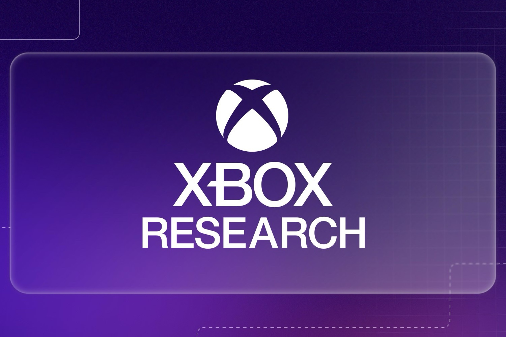

+++
title = "Microsoft veut savoir ce qui cloche entre Xbox et les développeurs"
date = 2024-10-02T16:11:32+01:00
draft = false
author = "Mickael"
tags = ["Actu"]
image = "https://nostick.fr/articles/vignettes/octobre/xbox-research.jpg"
+++

 

Tout le monde aura pu remarquer que Xbox ne peut guère s'enorgueillir d'être la plateforme chouchou des développeurs. Déjà parce que Microsoft a plus ou moins lâché l'affaire pour promouvoir la console, en dehors du marché américain : pourquoi s'entêter à développer pour des appareils que personne n'achète ? Et puis il faut bien dire que Microsoft a souvent été pris au dépourvu ces derniers mois.

On l'a encore vu tout récemment avec *Enotria: The Last Song* : le studio Jyamma a dû se plaindre en public, sur les réseaux sociaux, qu'il attendait la certification du jeu depuis des mois, un processus indispensable géré par la plateforme. Il a fallu que [Phil Spencer lui-même s'en mêle](https://nostick.fr/articles/2024/septembre/0509-phil-spencer-enotria-the-last-song-xbox/) pour secouer cette maison de fous qu'est Xbox.

Et les exemples se multiplient à l'infini ou presque : *Baldur's Gate 3* retardé de plusieurs mois sur Xbox pour un problème technique lié à la Series S ; les collections de jeux de baston de Capcom qui [sortiront finalement beaucoup plus tard sur Xbox](https://nostick.fr/articles/2024/septembre/0409-xbox-compilations-capcom/) ; *Black Myth: Wukong*, pourtant prévu sur Xbox et qui n'est toujours pas dispo… Bref, il y a quelque chose de pourri au royaume de Microsoft.

Pour déterminer ce qui ne va pas entre Xbox et les développeurs, l'éditeur lance un nouveau programme géré par l'équipe [Xbox Research](https://developer.microsoft.com/en-us/games/resources/xbox-research/). Ouvert à tous les membres d'un studio, pas uniquement les dévs, il permettra à tout ce petit monde de communiquer avec Microsoft sur leurs problèmes avec la plateforme : soucis techniques et d'optimisation bien sûr, mais aussi de marketing, de gestion, de communauté…

Le programme s'adresse aux studios qui créent des jeu Xbox, mais aussi aux autres. « *Si vous n'êtes pas sur Xbox, nous aimerions savoir pourquoi* », [explique](https://developer.microsoft.com/en-us/games/articles/2024/09/how-xbox-research-is-shaping-the-future-of-game-development/) Deborah Henderson, chercheuse principale pour Xbox. « *Et honnêtement, si vous utilisez les produits de nos concurrents, vous avez probablement une perspective intéressante dont nous pourrions tirer des enseignements !* », ajoute-t-elle.

L'exercice est intéressant, mais il est un peu inquiétant de voir que Microsoft a besoin d'un tel programme pour comprendre ce qui ne va pas ente Xbox et les développeurs tiers.