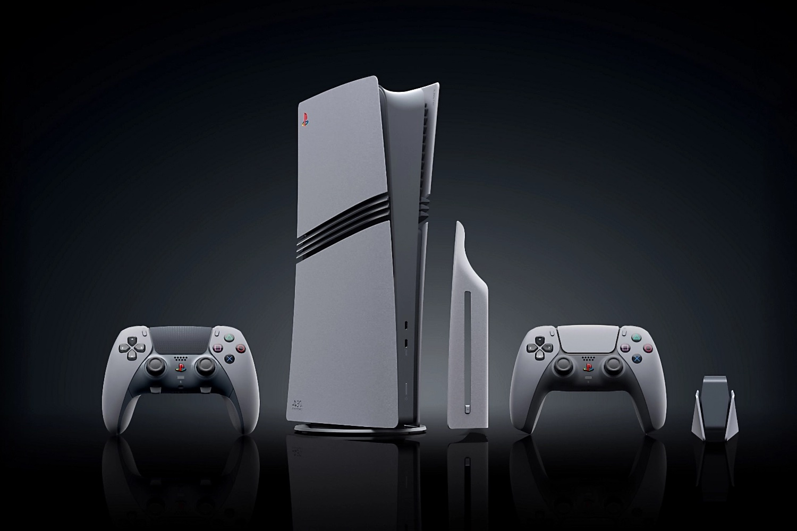

+++
title = "Il faut montrer patte blanche au Japon pour acheter la PS5 Pro 30e anniversaire"
date = 2024-10-02T08:07:32+01:00
draft = false
author = "Mickael"
tags = ["Actu"]
image = "https://nostick.fr/articles/vignettes/octobre/ps5-pro-bundle.jpg"
+++

Si vous faites partie des très rares à avoir pu sécuriser un [bundle PS5 Pro du 30e anniversaire](https://nostick.fr/articles/2024/septembre/1909-ps5-30e-anniversaire/), vous êtes soit très chanceux, soit un scalper. Sony a fait l'effort de ne pas être trop gourmand au niveau du prix — 1 099 €, quasiment une bonne affaire ! —, en revanche le constructeur a bizarrement décidé d'en faire une édition très limitée : 12 300 unités seulement pour le monde entier.

Évidemment, les scalpers se sont précipités sur l'aubaine, [épuisant les stocks à vitesse grand V le 26 septembre](https://nostick.fr/articles/2024/septembre/2609-bundle-ps5-pro-en-vente/). Ça a été d'autant plus facile pour les revendeurs du marché gris que les barrières mises en place par Sony pour éviter le pillage généralisé étaient un peu ridicules : il fallait simplement avoir un compte PSN et prendre son mal en patience dans la file d'attente.

Néanmoins, au Japon les choses ont été un peu différentes, comme l'explique le site *[Automaton](https://automaton-media.com/en/news/to-battle-ps5-pro-30th-anniversary-edition-scalpers-sony-imposes-conditions-for-ordering-the-console-but-only-in-japan/)*. Pour pouvoir prétendre à l'achat d'une PS5 Pro du 30e anniversaire, Sony [exige](https://www.playstation.com/ja-jp/local/campaigns/ps5-30th-register-to-pre-order/) en effet que le compte ait enregistré au moins 30 heures de jeux cumulées PS4/PS5 entre février 2014 et septembre 2024 ! Avouons-le, ce n'est pas très difficile surtout au vu de la période visée, mais il y a de quoi repousser les opportunistes et les scalpers.

En revanche, les nouveaux venus vraiment intéressés par la plateforme PlayStation, ou les vieux de la vieille qui avaient lâché PlayStation après la PS2, ne peuvent pas acheter cette édition spéciale. Ils devront se contenter d'une PS5 ou d'une PS5 Pro « standard ».