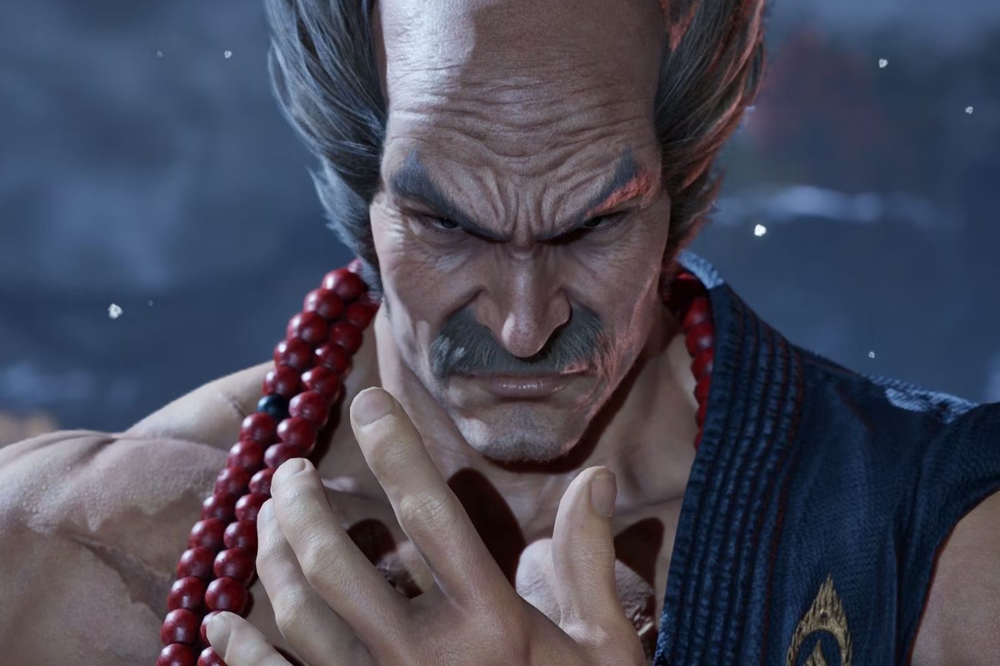
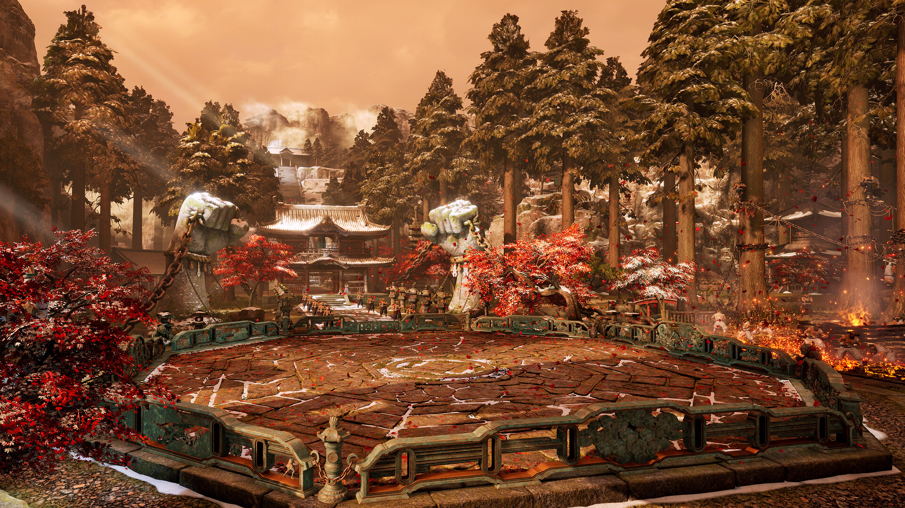

+++
title = "Tekken 8 : un stage payant qui fait mauvais genre"
date = 2024-10-02T08:50:32+01:00
draft = false
author = "Mickael"
tags = ["Actu"]
image = "https://nostick.fr/articles/vignettes/octobre/tekken-8-Heihachi-Mishima.jpg"
+++

Les joueurs de *Tekken 8* apprécient assez peu d'être pressurés comme des citrons. À l'occasion de l'arrivée de Heihachi Mishima dans le season pass Year 1, Bandai Namco a eu l'idée de gratter trois francs six sous supplémentaires en vendant le stage lié au personnage, à savoir le temple Genmaji, au prix de 5 €.

Premier problème : ce stage n'est pas compris dans l'édition Deluxe ni Ultimate du jeu, qui intègrent pourtant le pass de la première année avec les quatre combattants en plus. Deuxième problème : la précédente combattante du DLC, Lidia Sobieska, a été fournie avec son niveau sans frais supplémentaires. Et pourquoi pas avec Heihachi Mishima ?

Évidemment, ça [râle](https://www.reddit.com/r/Tekken/comments/1ftamvb/the_fact_that_you_have_to_pay_to_get_the_new/) et à [raison](https://www.reddit.com/r/Tekken/comments/1ftmqdg/so_what_was_the_point_of_selling_these/). Ce qui a poussé Katsuhiro Harada, le patron de *Tekken 8*, à [publier](https://x.com/Harada_TEKKEN/status/1841125282264363441) une longue explication sur Twitter dans laquelle il rappelle que le season pass n'inclut normalement aucun stage, même si ça a finalement été le cas avec Lidia Sobieska.



Pour comprendre ce qui s'est passé, il faut savoir que *Tekken 8* est géré par deux entités séparées : le studio de développement d'un côté, l'éditeur responsable des ventes de l'autre. Katsuhiro Harada, qui a passé la majeure partie de son temps au sein du studio pour s'assurer de la qualité du jeu, était censé faire l'interface entre ces deux organisations.

« *Je n'ai pas pu participer correctement au processus de décision de l'édition (ventes)* », s'excuse-t-il. « *En conséquence, je pense qu'il y a eu des aspects du processus qui n'ont pas pris en compte l'avis de la communauté Tekken* ». Il admet avoir « *échoué* » dans son rôle d'écoute de la communauté et refléter les demandes des joueurs non seulement dans le jeu, mais aussi dans ce qui passe autour du jeu.

Harada promet des changements : « *À partir de maintenant, je vais revoir cette structure et la modifier pour qu'elle accorde à nouveau de l'importance à la communauté, comme cela était le cas par le passé* ». Ça ne dit rien concernant le sort du fameux stage, mais on sent bien qu'il va rester payant. Pour l'avenir cependant, les choses pourraient changer, dans le bon sens.